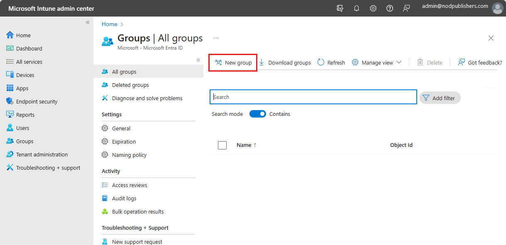

Intune uses Azure Active Directory (Azure AD) groups to organize and manage devices and users. As an Intune admin, you can set up groups to suit your organizational needs. For instance, you can create groups to organize users or devices by geographic location, department, or hardware characteristics. Also, you can use groups to manage tasks at scale. For example, you can set policies for many users or deploy apps to a set of devices based on groups.

You can add the following types of groups in Intune:

- **Assigned groups** - Manually add users or devices into a static group.
- **Dynamic groups** (Requires [Azure AD Premium](/azure/active-directory/fundamentals/active-directory-get-started-premium)) - Automatically add users or devices to user groups or device groups based on an expression you create. For example, when a user is added with the manager title, the user is automatically added to an **All managers** users group. Or, when a device has the iOS/iPadOS device OS type, the device is automatically added to an **All iOS/iPadOS devices** group.

## Add a new group

Use the following steps to create a new group:

1. Sign in to the [Microsoft Endpoint Manager admin center](https://go.microsoft.com/fwlink/?linkid=2109431).
2. Select **Groups** > **New group**:

   

3. In **Group type**, choose one of the following options:

    - **Security**: Security groups are used to assign apps, resources, and licenses to group members. Group members can be users, devices, service principals, and other groups. Security groups are recommended for your groups in Intune. You can create groups for users, such as **All Charlotte employees** or **Remote workers**. Or, create groups for devices, such as **All iOS/iPadOS devices** or **All Windows 10 student devices**.
    - **Microsoft 365**: Microsoft 365 groups collaboration opportunities by members access to a shared mailbox, calendar, files, SharePoint sites, and more. Group members can only be users. This option also lets you give people outside of your organization access to the group. For more information, see [Learn about Microsoft 365 Groups](https://support.office.com/article/learn-about-office-365-groups-b565caa1-5c40-40ef-9915-60fdb2d97fa2).

    > [!TIP]
    > The users and groups created can also be seen in the [Microsoft 365 admin center](https://admin.microsoft.com), [Azure Active Directory admin center](https://aad.portal.azure.com), and [Microsoft Intune in the Endpoint Manager admin center](https://go.microsoft.com/fwlink/?linkid=2090973). In your organization tenant, you can create and manage groups in all these areas.
    >
    > If your primary role is device management, we recommend you use the [Microsoft Endpoint Manager admin center](https://go.microsoft.com/fwlink/?linkid=2109431).

4. Enter a **Group name** and **Group description** for the new group.
5. Select whether Azure AD roles can be assigned to the group. If you choose **Yes**, you can assign a cloud group to Azure AD built-in roles. With this feature, you can use groups to grant admin access in Azure AD with minimal effort from your Global and Privileged role admins. Once set, the group's eligibility for role assignment is permanent.​ For more information, see [Use cloud groups to manage role assignments in Azure Active Directory](/azure/active-directory/roles/groups-concept).
6. Select the **Membership type**. Your options include the following choices:

    - **Assigned**: Administrators manually assign users or devices to this group, and manually remove users or devices.
    - **Dynamic User**: Administrators create membership rules to automatically add and remove members.
    - **Dynamic Device**: Administrators create dynamic group rules to automatically add and remove devices.

    > [!NOTE]
    > In this admin center, when you create users or groups, you might not see the **Azure Active Directory** branding. But, that's what you're using.
7. Choose whether you want to add owners and members at this time.
8. Click **Create** to add the new group. Your group is shown in the list.

You can create a wide variety of dynamic user and device groups you, such as:
- All Students in Contoso high school
- All Android Enterprise devices
- All iOS 11 and older devices
- Marketing
- Human Resources
- All Charlotte employees
- All WA employees

## Groups and policies

Access to your organization's resources are controlled by users and groups you create.

When you create groups, consider how you'll apply [compliance policies](/mem/intune/protect/device-compliance-get-started?azure-portal=true) and [configuration profiles](/mem/intune/configuration/device-profiles?azure-portal=true). For example, you might have:

- Policies that are specific to a device operating system.
- Policies that are specific to different roles in your organization.
- Policies that are specific to organizational units you defined in Active Directory.

To create the basic compliance requirements of your organization, you can create a default policy that applies to all groups and devices. Then, create more specific policies for the broadest categories of users and devices. For example, you might create email policies for each of the device operating systems.