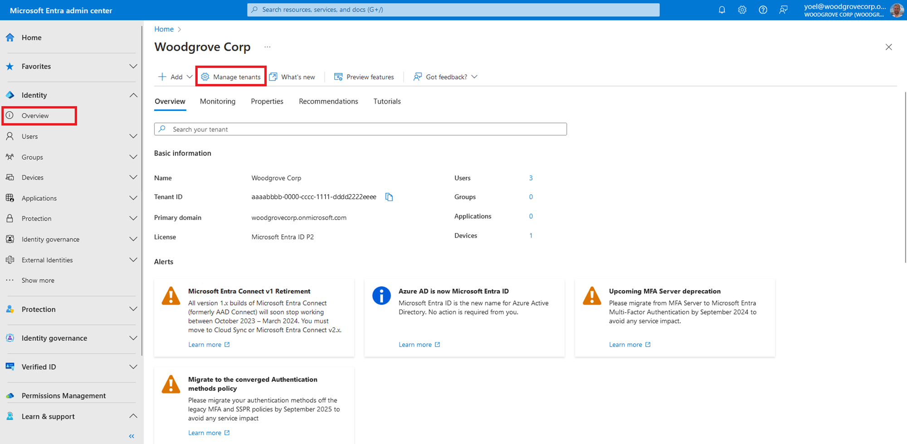
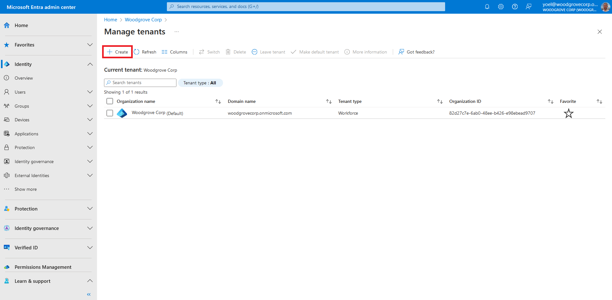
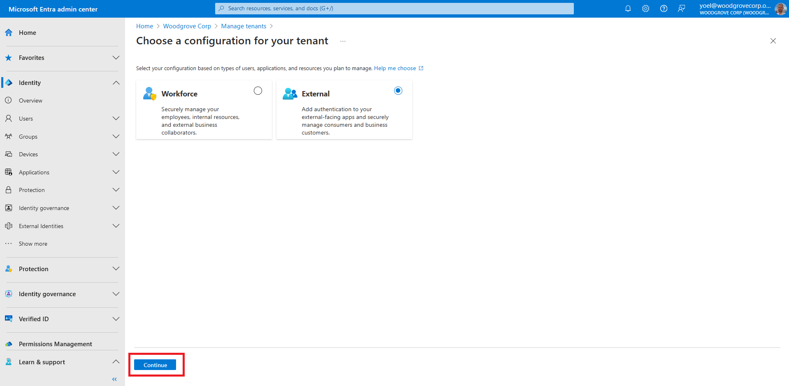
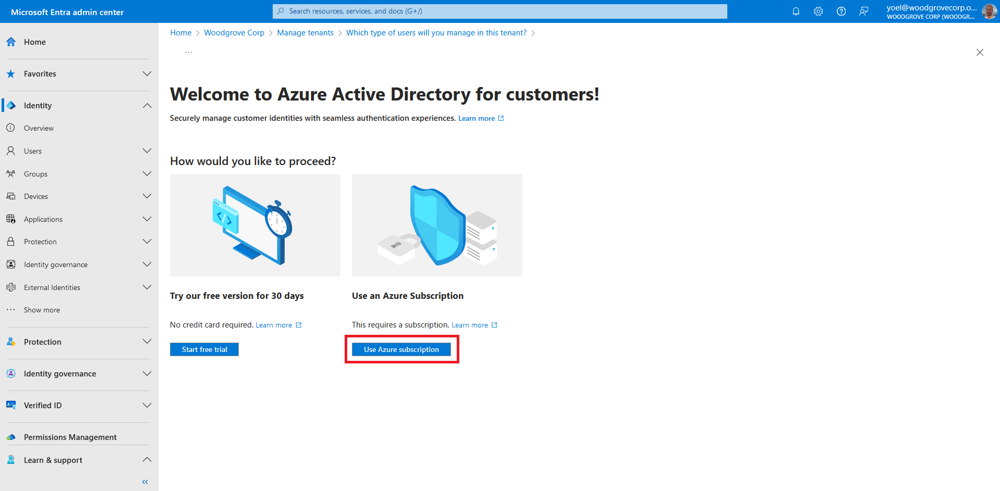
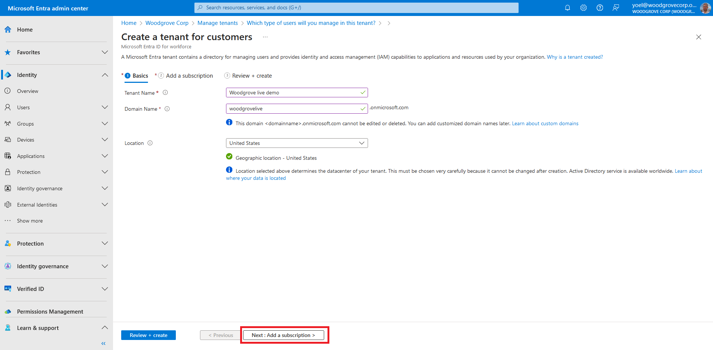
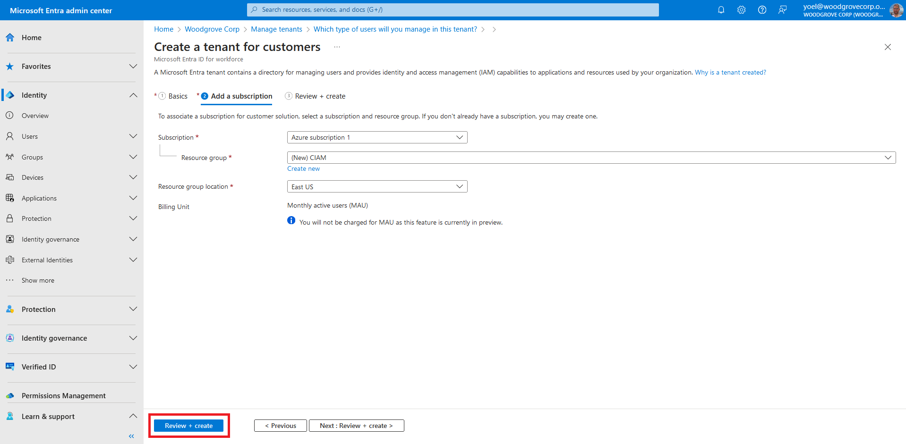
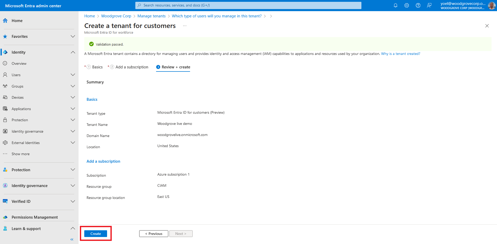
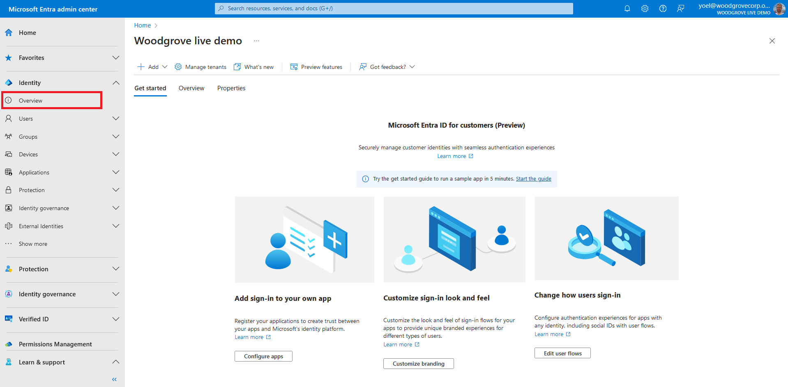
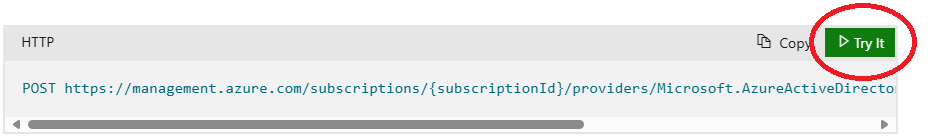

## Exercise - Create an external tenant

You'll need to create a tenant with external configuration in the [Microsoft Entra admin center](https://entra.microsoft.com/) to get started. Once the tenant with external configuration is created, you can access it in both the Microsoft Entra admin center and the Azure portal.

::: zone pivot="microsoft-entra-admin-center"

1. To create a tenant, sign in to the [Microsoft Entra admin center](https://entra.microsoft.com/) and browse to **Identity** > **Overview** . Then, select **Manage tenants**.
   
1. On the **Manage tenants**, select **Create**.
   
1. Select **Customer**, and then select **Continue**.
   
1. Select Use an **Azure Subscription**.
   
1. On the **Basics** tab, in the **Create a tenant for customers** page, enter the following information: Type your desired **Tenant Name** (for example Woodgrove live demo). Type your desired **Domain Name** (for example woodgrovelive). Select your desired **Location**. This selection can't be changed later. Then, select **Next: Add a subscription**.
   
1. On the **Add a subscription** tab, enter the following information: Next to **Subscription**, select your subscription from the menu. Next to **Resource group**, select a resource group from the menu. If there are no available resource groups, select Create new, add a name, and then select OK. If **Resource group location** appears, select the geographic location of the resource group from the menu. Then, select **Review + Create**.
   
1. If the information that you entered is correct, select **Create**. The tenant creation process can take up to 30 minutes.
   
1. You can monitor the progress of the tenant creation process in the **Notifications** pane. Once the tenant is created, you can access it in both the Microsoft Entra admin center and the Azure portal.
   
1. Use the **Settings** icon in the top menu to **Switch** to your customer tenant you created from the **Directories + subscriptions** menu. If the tenant you created doesn't appear in the list, refresh the page (using the web browser refresh button).
   
1. Browse to **Home** > **Tenant overview** to start configuring your tenant.
   
    ***Well done!** At this point, the Microsoft Entra External ID tenant is ready to use.*
::: zone-end

::: zone pivot="graph-api"

Graph API tutorial coming soon.

::: zone-end
