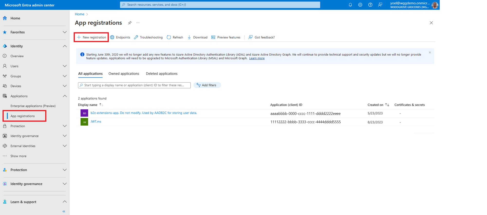
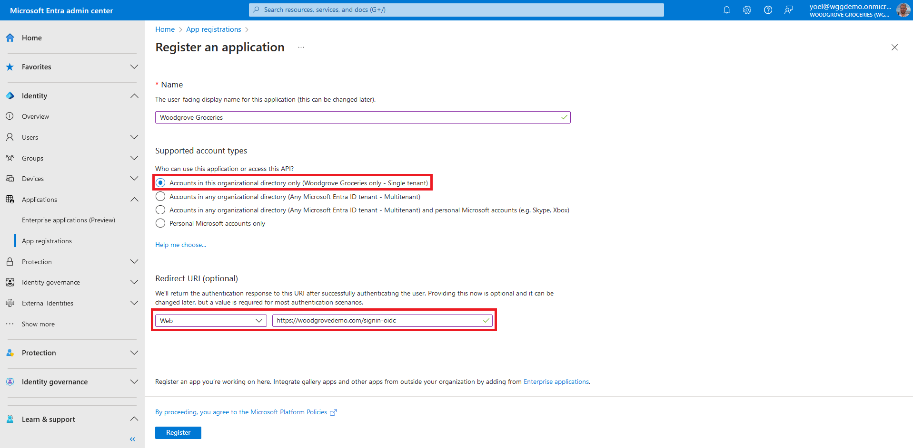
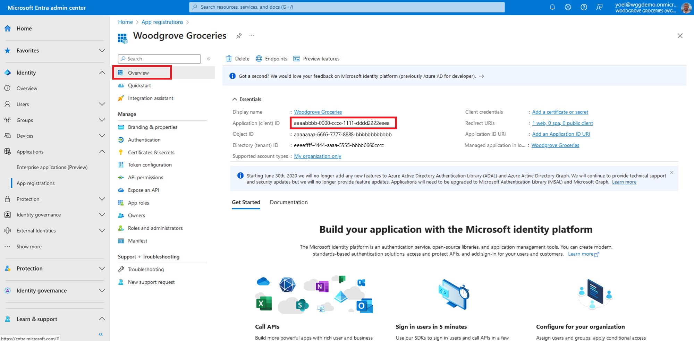
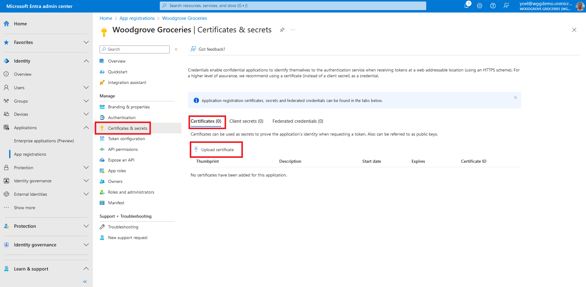
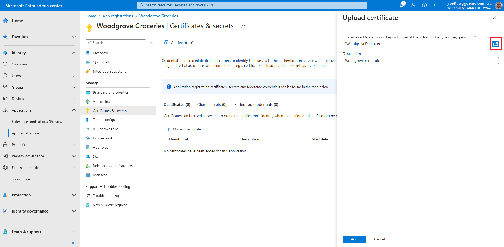
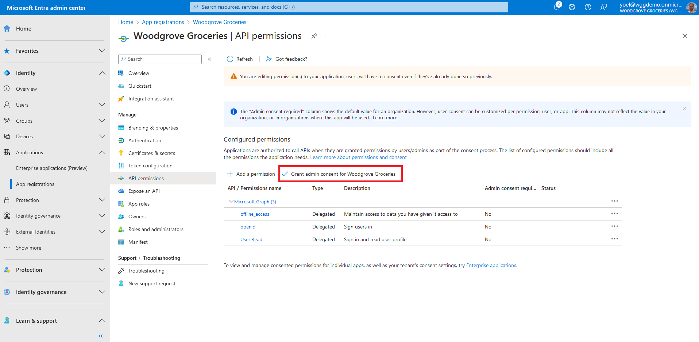

## Exercise - Register an application

To enable your app to sign in with Microsoft Entra External ID, you need to register the application in the directory.

::: zone pivot="microsoft-entra-admin-center"

1. To register your own application, sign in to the [Microsoft Entra admin center](https://entra.microsoft.com/) and browse to **Applications** > **App registrations**. Then, select **+ New registration**.
   
1. In the **Register an application** page that appears, enter a meaningful application **Name** that is displayed to users of the app. For example, **Woodgrove Groceries**. Under **Supported account types**, select **Accounts in this organizational directory only**. In the **Platform** select the **Web** option and enter your app **Redirect URI**. The redirect URI is the endpoint to which users are redirected by Microsoft Entra external ID after their authentication with Microsoft Entra ID external is completed.
   
1. The application's **Overview** pane displays upon successful registration. Record the **Application (client) ID** to be used in your application source code.
   
1. To add more **Redirect URIs**, or **Front-channel logout URL**, under **Manage** select **Authentication**. The **Front-channel logout URL** is where we send a request to have the application clear the user's session data. This is required for single sign-out to work correctly.
   
1. For a web application (confidential client) to acquire an access token, it needs a credential to prove its identity to Microsoft Entra ID. You can add certificates, client secrets (a string), or federated identity credentials as credentials to your confidential client app registration. For the groceries website, we will use a certificate. To add a certificate, select **Certificates & secrets** > **Certificates** > **Upload certificate**.
   
1. Select the file you want to upload. It must be one of the following file types: .cer, .pem, .crt. then select **Add**.
   
1. In the following steps, you will add the required permission for the web application. Under **Manage**, select **API permissions**, then select **Add a permission**.
   
1. In **Request API permissions**, select **Microsoft APIs** tab and then **Microsoft Graph**.
   
1. Select the **Delegated permissions** option. Then, under **Select permissions** section, search for and select both **openid** and **offline_access** permissions. To complete, select **Add permissions**.
   
1. At this point, you've assigned the permissions correctly. However, since the tenant is an external tenant, the consumer users themselves can't consent to these permissions. You as the admin must consent to these permissions on behalf of all the users in the tenant: Select **Grant admin consent for `<your tenant name>`**, then select **Yes**.
   
    ***Well done!** Now your application is ready to use.*

::: zone-end

::: zone pivot="graph-api"

#### 1\. Register an application

[To register a web application](/graph/api/application-post-applications?view=graph-rest-1.0&tabs=http), use the Graph request below and replace the following values.
- Value of **displayName** with your app displayed name. For example, *Woodgrove Groceries*.
- Values of the **redirectUris** with the redirect URI of your application. For example, *<https://woodgrovedemo.com/signin-oidc>*

    ```json
    POST https://graph.microsoft.com/v1.0/applications
    {
        "displayName": "Woodgrove Groceries",
        "description": "Woodgrove Groceries live demo application",
        "signInAudience": "AzureADMyOrg",
        "api": {
            "acceptMappedClaims": true,
            "requestedAccessTokenVersion": 2
        },
        "requiredResourceAccess": [
            {
                "resourceAppId": "00000003-0000-0000-c000-000000000000",
                "resourceAccess": [
                    {
                        "id": "00000000-0000-0000-0000-000000000000",
                        "type": "Scope"
                    },
                    {
                        "id": "00000000-0000-0000-0000-000000000000",
                        "type": "Scope"
                    }
                ]
            }
        ],
        "web": {
            "redirectUris": [
                "https://woodgrovedemo.com/signin-oidc"
            ],
            "implicitGrantSettings": {
                "enableAccessTokenIssuance": false,
                "enableIdTokenIssuance": false
            }
        }
    }
    ```

##### 1.1 Copy the application ID

From the response, copy the value of the **appId**. For example:

```json
{
    "@odata.context": "https://graph.microsoft.com/v1.0/$metadata#applications/$entity",
    "id": "12345678-0000-0000-0000-000000000000",
    "appId": "22222222-0000-0000-0000-000000000000",
    "displayName": "Woodgrove Groceries",
    "description": "Woodgrove Groceries live demo application",
    ...
}      
```

#### 2\. Create a service principal for your application

After you register your application, [create a service principal](/graph/api/serviceprincipal-post-serviceprincipals?view=graph-rest-1.0&tabs=http). The following Graph call creates a service principal. Replace the **{appId}** with the app **appId** from the previous call (not the object ID).

```json
POST https://graph.microsoft.com/v1.0/servicePrincipals
{
    "appId": "{appId}"
}
```

##### 2.1 Copy the service principal ID

From the response, copy the value of the **id**. For example:

```json
{
    "@odata.context": "https://graph.microsoft.com/v1.0/$metadata#servicePrincipals/$entity",
    "id": "44444444-0000-0000-0000-000000000000",
    "displayName": "Woodgrove Groceries",
    "description": "Woodgrove Groceries live demo application",
    ...
}
```

#### 3\. Consent to the required permissions

Since the tenant is an external tenant, the consumer users themselves can't consent to these permissions. You as the admin must [consent to these permissions](/graph/api/oauth2permissiongrant-post?view=graph-rest-1.0&tabs=http) on behalf of all the users in the tenant.

##### 3.1 Get the Microsoft Graph's service principal ID

Run the following GET request and cope the **id** from the response:

```json
GET https://graph.microsoft.com/v1.0/servicePrincipals(appId='00000003-0000-0000-c000-000000000000')
{
    "id": "66666666-0000-0000-0000-000000000000"
    "appDisplayName": "Microsoft Graph",
    "appId": "00000003-0000-0000-c000-000000000000",
}
```

##### 3.2 Grant the required permissions

Replace the **{service-principal-id}** with the service-principal **id** you copied in the previous step. Replace the **{graph-service-principal-id}** with the service-principal **id** you copied in the last step.

```json
POST https://graph.microsoft.com/v1.0/oauth2PermissionGrants
{
    "clientId": "{service-principal-id}",
    "consentType": "AllPrincipals",
    "resourceId": "{graph-service-principal-id}",
    "scope": "openid offline_access"
}
```

#### 4\. (Optional) Add a client secret

Credentials enable confidential applications to identify themselves to the authentication service when receiving tokens. For a higher level of assurance, we recommend using a [certificate](/graph/api/application-addkey?view=graph-rest-1.0&tabs=http) (instead of a client secret) as a credential. To obtain the [client secret](/graph/api/application-addpassword?view=graph-rest-1.0&tabs=http), run the following request. Replace the **{graph-service-principal-id}** with the **appId** with the appId from the first step.

```json
POST https://graph.microsoft.com/v1.0/applications(appId='appId')/addPassword
{
    "passwordCredential": {
        "displayName": "My app client secret"
    }
}
```

From the response, copy the value of the **secretText**:

```json
{
    "@odata.context": "https://graph.microsoft.com/v1.0/$metadata#microsoft.graph.passwordCredential",
    "displayName": "My app client secret",
    "endDateTime": "2026-05-23T15:16:42.,
    "hint": "iqi",
    "keyId": "98765432-0000-0000-0000-000000000000",
    "secretText": "Copy this value",
    "startDateTime": "2024-05-23T15:16:42"
}
```

::: zone-end
