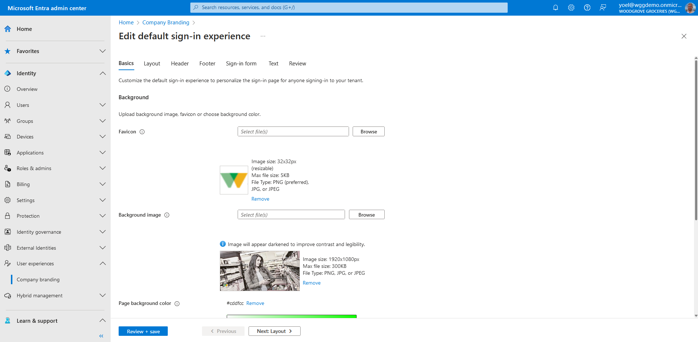
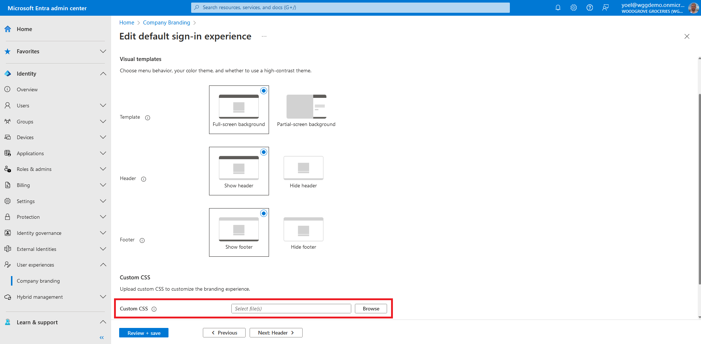
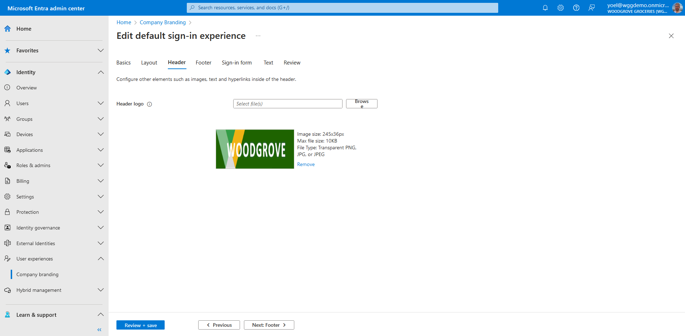
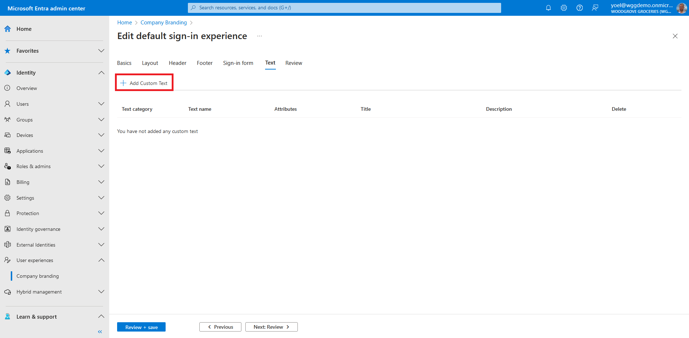
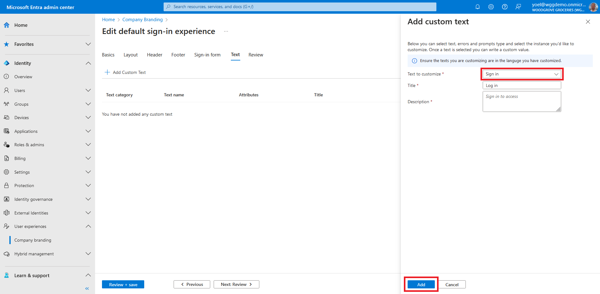
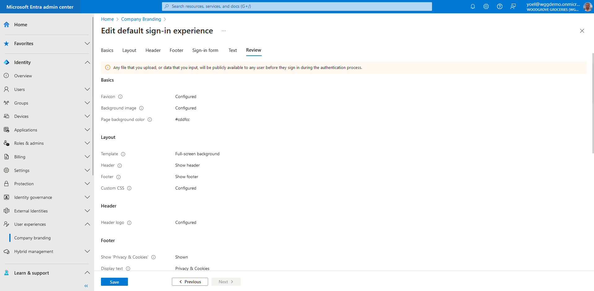

## Exercise - Customize the look and feel of your flows

After creating a new external tenant, you can customize the end-user experience. Create a custom look and feel for users signing in to your apps by configuring Company Branding settings for your tenant. With these settings, you can add your own background images, colors, company logos, and text to customize the sign-in experiences across your apps. You can create a personalized [default](/entra/external-id/customers/how-to-customize-branding-customers) sign-in experience for users who sign in. Or create a personalized [per language](/entra/external-id/customers/how-to-customize-languages-customers) sign-in experience, for a specific browser language by customizing the branding elements for that browser language.

::: zone pivot="microsoft-entra-admin-center"

1. To create or update your tenant company branding (default or per language), sign in to the [Microsoft Entra admin center](https://entra.microsoft.com/) and browse to **User experiences** > **Company Branding**. If you can't find it, select the **... Show more**.
On the **Company Branding** page, you can choose to edit the **Default sign-in experience**, or **Customize by browser language**. For our grocery website, we'll edit the default one. If you select the **Customize by browser language**, you will have to select the language to customize.
    
1. On the **Basics** tab, modify any of the background elements. Then select **Next**.
    - **Favicon** - The icon that displays in the web browser tab.
    - **Background image** - The large image that displays on the sign-in page. If you upload an image, it will scale and crop to fill the browser window.
    - **Page background color** - The color that replaces the background image whenever the image can’t be loaded, for example due to connection latency.
    
1. On the **Layout** tab, select the placement of web page elements on the sign-in page. Then select **Next**.
    - **Template** - Full screen background
    - **Header** - Show
    - **Footer** - Show
    - **Custom CSS** - Upload your own CSS file to replace default Microsoft styling with your own styling for: color, font, text size, position of elements, and displays for different devices and screen sizes.
    
1. On the **Header** tab, select the **Header logo** to display in the header of the sign-in page. Then select **Next**.
    
1. On the **Footer** tab, you can customize the URLs and link display text for the privacy and terms of use that appear in the footer of the sign-in page.
    - **Privacy & Cookies** - Select the checkbox next to Privacy & Cookies to display this hyperlink in the footer. The Microsoft default privacy link will display unless you enter your own hyperlink display text and URL.
    - **Terms of Use** - Select the checkbox next to Terms of Use to display this hyperlink in the footer. The Microsoft terms of use link will display unless you enter your own hyperlink display text and URL.
    
1. On the **Sign-in form** tab, configure elements of the sign-in form.
    - **Banner logo** - Displays on the sign-in page and in the user’s access panel
    - **Sign-in page text** - Appears at the bottom of the sign-in and sign-up pages.
    - **Show self-service password reset** - Yes
    
    Scroll down for more options.
    
1. To customize some of the labels, on the **Text** tab select **Add Custom Text**.
    
1. Select the text you want to customize, and in **Title**, enter a new label. Select **Add**.
    
1. Select **Review** and review all your modifications. Then select **Save** if you'd like to save your changes or **Previous** if you want to continue customizing.
    
    ***Well done!** You completed configuring your company branding.*

::: zone-end

::: zone pivot="microsoft-graph-api"

#### Update the default company branding

To update (not create) the properties of the default localization, run the following Microsoft Graph request. Replace the **{Tenant-ID}** with your tenant ID.

```json
PATCH https://graph.microsoft.com/v1.0/organization/{Tenant-ID}/branding/localizations/0
{
    "id": "0",
    "backgroundColor": "#cddfcc",
    "customAccountResetCredentialsUrl": null,
    "customCannotAccessYourAccountText": null,
    "customCannotAccessYourAccountUrl": null,
    "customForgotMyPasswordText": null,
    "customPrivacyAndCookiesText": "Privacy & Cookies",
    "customPrivacyAndCookiesUrl": "https://woodgrovedemo.com/Privacy",
    "customResetItNowText": null,
    "customTermsOfUseText": "Terms of Use",
    "customTermsOfUseUrl": "https://woodgrovedemo.com/TOS",
    "headerBackgroundColor": null,
    "signInPageText": "Welcome to the **Woodgrove groceries** online store. Sign-in with your credentials, or create a new account. You can also sign-in with your *social accounts*, such as Facebook or Google. For help, please [contact us](https://woodgrovedemo.com/help).",
    "squareLogoRelativeUrl": null,
    "squareLogoDarkRelativeUrl": null,
    "usernameHintText": null,
    "loginPageTextVisibilitySettings": {
        "hideCannotAccessYourAccount": null,
        "hideAccountResetCredentials": false,
        "hideTermsOfUse": false,
        "hidePrivacyAndCookies": false,
        "hideForgotMyPassword": null,
        "hideResetItNow": null
    },
    "loginPageLayoutConfiguration": {
        "layoutTemplateType": "default",
        "isHeaderShown": true,
        "isFooterShown": true
    }
}
```

::: zone-end
