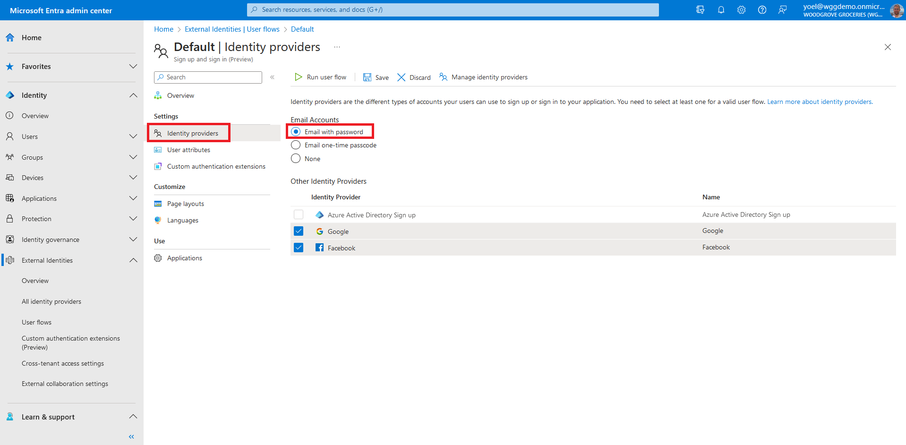

## Exercise - Enable email with password sign-in

Email with password sign-in allows new users to sign-up and sign-in using an email address as the sign-in name and a password as their first-factor authentication method. Note that you can also enable [Email one-time passcode](/entra/external-id/customers/how-to-user-flow-sign-up-sign-in-customers). For the purposes of our groceries website, we will enable email with password sign-in.

::: zone pivot="microsoft-entra-admin-center"

1. To enable email with password sign-in, login to the [Microsoft Entra admin center](https://entra.microsoft.com/) and browse to **External Identities** > **User flows**. Then, select the user flow where you want to configure email with password sign-in.
    
1. Under **Settings**, select **Identity providers**. Then, under **Email Accounts**, select **Email with password** and save the changes.
    
    ***Well done!** You successfully enabled email with password sign-in for your user flow.*

::: zone-end

::: zone pivot="graph-api"

Graph API tutorial coming soon.

::: zone-end
