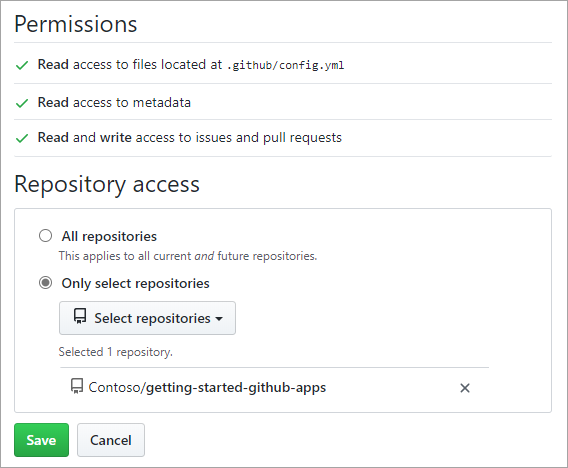
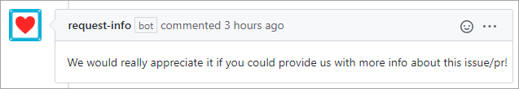

Here, we discuss what GitHub Apps are, how they work, and how you can use them to improve your workflows. Whether you're adopting a solution built by someone else or developing one to meet your exact needs, there's always room to improve your processes.

## Extending the platform through the GitHub API

GitHub provides a [robust API](https://developer.github.com/v3/?azure-portal=true) that enables developers to do just about anything on the platform. It's exposed via REST endpoints, so it's easy to integrate with from any platform or programming language. But the API access doesn't stand on its own. Developers wanting to share their features with others still need to package it up as an app and publish it before anyone can use it.

### Granting access and permissions

One of the most important considerations for allowing an app to access a GitHub repository is the permissions it requires to operate. Some apps are easy to trust, but others may be suspect. Always be sure that you're comfortable with the permissions you grant an app.

> [!NOTE]
> Every app uses a unique API key to make requests for the data in your repository. When you authorize access, it's the key you're authorizing. You may revoke access to an app's key at any time from your repository settings.

## What are GitHub Apps?

With the universe of apps that use the GitHub API there is a special subset known as **GitHub Apps**. These app distinguish themselves from other apps in that they operate under their own identity. In other words, the app doesn't act *on behalf* of a GitHub user; it *is* a GitHub user. All other apps are **OAuth Apps**, whether authorized using the OAuth browser flow or a personal access token.

### GitHub Apps vs. OAuth Apps

There are many subtle [differences between GitHub Apps and OAuth Apps](https://developer.github.com/apps/differences-between-apps/?azure-portal=true). However, for the purposes of this unit, we'll discuss their  primary difference at an app consumer level.

The main difference you'll notice is that GitHub Apps are *installed*, whereas OAuth apps are *authorized*. Installing a GitHub App grants it the requested permissions so that it can interact with GitHub and create or modify content like any other user. For example, it can post comments like this one:

If this app was instead an OAuth App, then it would need to first be authorized to post by a GitHub user. The comment would also appear as though the authorizing user themselves had posted it.

## Reacting to events

GitHub Apps are designed to be passive. They wait for something to happen, and then react, usually via the GitHub API. When waiting for events to happen on GitHub, there are two approaches: webhooks and polling.

> [!NOTE]
> GitHub Apps aren't limited to working with GitHub data. You can just as easily wait on events that happen from other sources or perform actions that update other services.  

### Using GitHub webhooks

Webhooks are the preferred approach for event handling. When something happens on GitHub within the scope of a webhook, it's raised immediately. They push notifications that your app can listen for and process in real-time. You can configure webhooks in your repository settings, including the types of events, authentication, and way the HTTP notifications are delivered.

Learn more about [GitHub webhooks](https://developer.github.com/webhooks?azure-portal=true).

### Polling

Sometimes webhooks aren't an option. Your app might need to live behind a corporate firewall where it can't be directly reached by GitHub. In that case, an alternative is to poll for the data you're tracking by using the GitHub API. 

Still, you should make every effort to use webhooks if possible. Learn more about the benefits of [webhooks over polling](https://github.community/t/scalable-continuous-integration-ci-patterns/13501?azure-portal=true).

### Webhook relaying

An alternative to polling for apps behind a firewall is to use a webhook forwarding service, like [smee.io](https://smee.io/?azure-portal=true). With this approach, the public service will subscribe to the repository's webhook and then relay incoming data to a client service running behind the firewall. That client service then pushes the notifications to your running app as though they came from the original source.

## Building GitHub Apps with Probot

Probot is an app framework for building GitHub Apps. It abstracts out all of the overhead associated with configuring webhooks and a GitHub client so that you can focus purely on app logic. There are [many apps](https://probot.github.io/apps/?azure-portal=true) already built on Probot, including:

- [Pull](https://probot.github.io/apps/pull/?azure-portal=true), which helps keep your forks up to date.
- [Delete merged branch](https://probot.github.io/apps/delete-merged-branch/?azure-portal=true), which automatically deletes branches after merging.
- [Release Drafter](https://probot.github.io/apps/release-drafter/?azure-portal=true), which generates release notes based on pull request titles.

Learn more about building your own [GitHub Apps with Probot](https://probot.github.io/?azure-portal=true).

