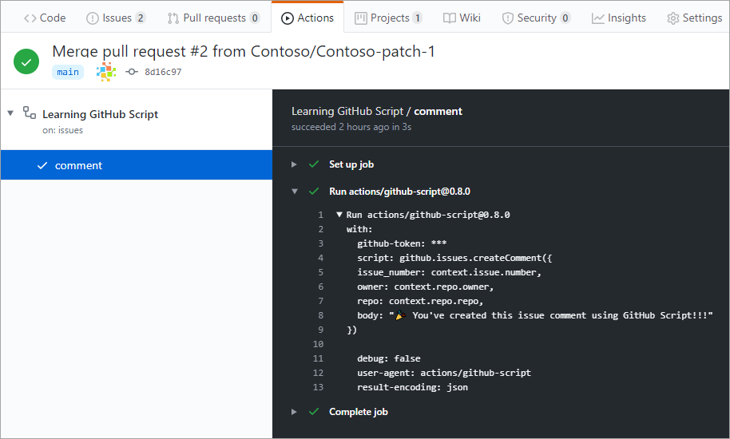

Here, we discuss how GitHub Script enables you to automate common GitHub processes using GitHub Actions workflows.

## What is GitHub Script? 

[GitHub Script](https://github.com/actions/github-script?azure-portal=true) an action that provides an authenticated [octokit](https://octokit.github.io/rest.js/v17?azure-portal=true) client and allows JavaScript to be written directly in a workflow file. It runs in [Node.js](https://nodejs.org/?azure-portal=true), so you have the power of that platform available when writing scripts.

## What is octokit?

octokit is the official collection of clients for the GitHub API. One of these clients, rest.js, provides JavaScript access to GitHub's REST interface.

You've always been able to automate the GitHub API via octokit/rest.js, although it could be a chore to properly set up and maintain. One of the great advantages to using GitHub Script is that it handles all of this overhead so you can immediately start using the API. You don't need to worry about dependencies, configuration, or even authentication.

### What can octokit/rest.js do?

The short answer is that it can do virtually anything with respect to automating GitHub. Not only do you have access to commits, pull requests, and issues, but you also have access to users, projects, and organizations. You can retrieve lists of commonly used files like popular licenses or `.gitignore` files. You can even render Markdown.

If you're building something that integrates GitHub, the odds are good that you will find what you're looking for in [the full octokit/rest.js documentation](https://octokit.github.io/rest.js/v17?azure-portal=true).

### How is using GitHub Script different from octokit/rest.js?

The main difference in usage is that GitHub Script provides you with a pre-authenticated octokit/rest.js client named `github`. 

So instead of:

`octokit.issues.createComment({`

You would use:

`github.issues.createComment({`

In addition to the `github` variable, the following variables are also provided:

- `context` is an object containing the [context of the workflow run](https://github.com/actions/toolkit/blob/master/packages/github/src/context.ts?azure-portal=true)
- `core` is a reference to the [@actions/core](https://github.com/actions/toolkit/tree/master/packages/core?azure-portal=true) package
- `io` is a reference to the [@actions/io](https://github.com/actions/toolkit/tree/master/packages/io?azure-portal=true) package

## Building a workflow that uses GitHub Script

GitHub Script actions fit into a workflow like any other action. As a result, you can even mix them in with existing workflows, such as those you may already have set up for CI/CD. To illustrate its convenience, we now construct a complete workflow that uses GitHub Script to automatically post a comment to all newly created issues.

We start off with a `name` and an `on` clause that specifies that this workflow runs when issues are opened.

```yaml
name: Learning GitHub Script

on:
  issues:
    types: [opened]
```

Next, a job named `comment` is defined that runs on Linux with a series of steps.

```yaml
jobs:
  comment:
    runs-on: ubuntu-latest
    steps:
```

In this case, there is only one step: the GitHub Script action.

```yaml
      - uses: actions/github-script@0.8.0
        with:
          github-token: ${{secrets.GITHUB_TOKEN}}
          script: |
            github.issues.createComment({
              issue_number: context.issue.number,
              owner: context.repo.owner,
              repo: context.repo.repo,
              body: "🎉 You've created this issue comment using GitHub Script!!!"
            })
```

### Using actions/github-script@0.8.0

The `actions/github-script@0.8.0` action, also known as GitHub Script, does all the heavy lifting for our integration with the GitHub API. 

This action requires a `github-token` that will be provided at runtime so that requests are authenticated. This is automatically done for you, so you can use that code as-is.

The `script` parameter can be virtually any JavaScript that will use the octokit/rest/js client stored in `github`. In this case, it's just one line (split across multiple lines for readability) that creates a hardcoded comment.

After the workflow is run, GitHub Script will log the code it executed for review on the **Actions** tab.



### Running from a separate file

Sometimes you may need to use a lot of code to fulfill your GitHub Script scenario. When that happens, you can keep the script in a separate file and reference it from the workflow instead of putting all the script inline. 

Here is an example of a simple workflow that does this:

```yaml
on: push

jobs:
  echo-input:
    runs-on: ubuntu-latest
    steps:
      - uses: actions/checkout@v2
      - uses: actions/github-script@v2
        with:
          script: |
            const path = require('path')
            const scriptPath = path.resolve('./path/to/script.js')
            console.log(require(scriptPath)({context}))
```

Check out [more GitHub Script examples](https://octokit.github.io/rest.js/v17?azure-portal=true).