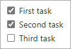

Here, we'll discuss the structure and syntax of Markdown. We'll also cover features of GitHub-Flavored Markdown (GFM), which are syntax extensions that allow you to integrate GitHub features into content.

> [!NOTE]
> This unit is intended to give you a taste of what Markdown is about. For a more in-depth review, reference [Markdown syntax description](https://daringfireball.net/projects/markdown/syntax?azure-portal=true) or [GitHub-Flavored Markdown Spec](https://github.github.com/gfm/?azure-portal=true).

## What's Markdown?

Markdown is a markup language that offers a lean approach to content editing by shielding content creators from the overhead of HTML. While HTML is great for rendering content exactly how it was intended, it takes up a lot of space and can be unwieldy to work with, even in small doses. The invention of Markdown offered a great compromise between the power of HTML for content description and the ease of plain text for editing.

### Emphasize text

The most important part of any communication on GitHub is usually the text itself, but how do you show that some parts of the text are more important than others?

Using italics in text is as easy as surrounding the target text with single asterisks (`*`) or single underscores (`_`). Just be sure to close an emphasis with the same character with which you opened it. Be observant how you combine the use of asterisks and underscores. Here are several examples:

```markdown
This is *italic* text.
This is also _italic_ text.
```

> This is *italic* text.
> This is also _italic_ text.

Create bold text by using two asterisks (`**`) or two underscores (`__`).

```markdown
This is **bold** text.
This is also __bold__ text.
```

> This is **bold** text.
> This is also __bold__ text.

You can also mix different emphases.

```markdown
_This is **italic and bold** text_ using a single underscore for italic and double asterisks for bold.
__This is bold and *italic* text__ using double underscores for bold and single asterisks for italic. 
```

>_This is **italic and bold** text_ using a single underscore for italic and double asterisks for bold.
> __This is bold and *italic* text__ using double underscores for bold and single asterisks for italic. 

To use a literal asterisk, precede it with an escape character; in GFM, that's a backslash (`\`). This example results in the underscores and asterisks being shown in the output.

```markdown
\_This is all \*\*plain\*\* text\_.
```

> \_This is all \*\*plain\*\* text\_.

### Declare headings

HTML provides content headings, such as the `<h1>` tag. In Markdown, this is supported via the # symbol. Just use one # for each heading level from 1-6.

```markdown
###### This is H6 text
```

> ###### This is H6 text

### Link to images and sites

Image and site links use a similar syntax.

```markdown

```

> 

```markdown
[Link to Microsoft Training](/training)
```

> [Link to Microsoft Training](/training)

### Make lists

You can define ordered or unordered lists. You can also define nested items through indentation.

* Ordered lists start with numbers.
* Unordered lists can use asterisks or dashes (`-`).

Here's the Markdown for an ordered list:

```markdown
1. First
1. Second
1. Third
```

Result:

> 1. First
> 1. Second
> 1. Third

```markdown
- First
  - Nested
- Second
- Third
```

Here's the Markdown for an unordered list:

> - First
>   - Nested
> - Second
> - Third

### Build tables

You can construct tables using a combination of pipes (`|`) for column breaks and dashes (`-`) to designate the prior row as a header.

```markdown
First|Second
-|-
1|2
3|4
```

> First|Second
> -|-
> 1|2
> 3|4

### Quote text

You can create blockquotes using the greater than (`>`) character.

```markdown
> This is quoted text.
```

> > This is quoted text.


### Fill the gaps with inline HTML

If you come across an HTML scenario not supported by Markdown, you can use that HTML inline.

```markdown
Here is a<br />line break
```

> Here is a<br />line break

### Work with code

Markdown provides default behavior for working with inline code blocks delimited by the backtick (\`) character. When decorating text with this character, it's rendered as code.

```markdown
This is `code`.
```

> This is `code`.

If you have a code segment spanning multiple lines, you can use three backticks (\`\`\`) before and after to create a fenced code block.

    ```markdown
    var first = 1;
    var second = 2;
    var sum = first + second;
    ```

> ```
> var first = 1;
> var second = 2;
> var sum = first + second;
> ```

GFM extends this support with syntax highlighting for popular languages. Just specify the language as part of the first tick sequence.

    ```javascript
    var first = 1;
    var second = 2;
    var sum = first + second;
    ```

> ```javascript
> var first = 1;
> var second = 2;
> var sum = first + second;
> ```

### Cross-link issues and pull requests

GFM supports various shortcode formats to make it easy to link to issues and pull requests. The easiest way to do this is to use the format `#ID`, such as `#3602`. GitHub automatically adjusts longer links to this format if you paste them in. There are also additional conventions you can follow, such as if you're working with other tools or want to specify other projects/branches.

| Reference type | Raw reference | Short link |
| -------------- | ------------- | ---------- |
| Issue or pull request URL | `https://github.com/desktop/desktop/pull/3602` | [#3602](https://github.com/desktop/desktop/pull/3602) |
| `#` and issue or pull request number | #3602 | [#3602](https://github.com/desktop/desktop/pull/3602) |
| `GH-` and issue or pull request number | GH-3602 | [GH-3602](https://github.com/desktop/desktop/pull/3602) |
| `Username/Repository#` and issue or pull request number | desktop/desktop#3602 | [desktop/desktop#3602](https://github.com/desktop/desktop/pull/3602) |

For more information, see [Autolinked references and URLs](https://help.github.com/articles/autolinked-references-and-urls/).

### Link specific commits

You can link to a commit by either pasting in its ID or simply using its secure hash algorithm (SHA).

| Reference type | Raw reference | Short link |
| -------------- | ------------- | ---------- |
| Commit URL | https://github.com/desktop/desktop/commit/
8304e9c271a5e5ab4fda797304cd7bcca7158c87 | [8304e9c](https://github.com/desktop/desktop/commit/8304e9c271a5e5ab4fda797304cd7bcca7158c87) |
| SHA | 8304e9c271a5e5ab4fda797304cd7bcca7158c87 | [8304e9c](https://github.com/desktop/desktop/commit/8304e9c271a5e5ab4fda797304cd7bcca7158c87) |
| User@SHA | desktop@8304e9c271a5e5ab4fda797304cd7bcca7158c87 | [desktop@8304e9c](https://github.com/desktop/desktop/commit/8304e9c271a5e5ab4fda797304cd7bcca7158c87) |
| Username/Repository@SHA | desktop/desktop@8304e9c271a5e5ab4fda797304cd7bcca7158c87 | [desktop/desktop@8304e9c](https://github.com/desktop/desktop/commit/8304e9c271a5e5ab4fda797304cd7bcca7158c87)|

### Mention users and teams

Typing an `@` symbol followed by a GitHub username sends a notification to that person about the comment. This is called an "@mention", because you're mentioning the individual. You can also `@mention` teams within an organization.

```markdown
@githubteacher
```

[@githubteacher](https://github.com/githubteacher)

For more information, see [Receiving notifications about activity on GitHub](https://help.github.com/categories/receiving-notifications-about-activity-on-github/).

### Track task lists

You can create task lists within issues or pull requests using the following syntax. These can be helpful to track progress when used in the body of an issue or pull request.

```markdown
- [x] First task
- [x] Second task
- [ ] Third task
```



### Slash Commands

Slash commands can save you time by reducing the typing required to create complex Markdown.

You can use slash commands in any description or comment field in issues, pull requests, or discussions where that slash command is supported.

| Command | Description |
| -------------- | ------------- |
| `/code` | Inserts a Markdown code block. You choose the language. |
| `/details`| Inserts a collapsible detail area. You choose the title and content. |
| `/saved-replies` | Inserts a saved reply. You choose from the saved replies for your user account. If you add `%cursor%` to your saved reply, the slash command places the cursor in that location. |
| `/table` | Inserts a Markdown table. You choose the number of columns and rows. |
| `/tasklist`| Inserts a tasklist. This slash command only works in an issue description. |
| `/template`| Shows all of the templates in the repository. You choose the template to insert. This slash command works for issue templates and a pull request template.|
