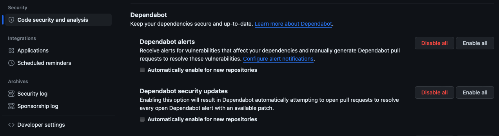

In the previous unit, you learned about the different GitHub tools that work together to enable dependency management and how Dependabot helps to automate some of these processes. Now, you'll learn about Dependabot alerts. 

Dependabot alerts tell you that your code depends on a package that is insecure.

If your project relies on external dependencies, then you can use valuable resources trying to monitor them. This monitoring process is important because you have to be aware of changes or vulnerabilities in the code. It can also be challenging because this code isn't a part of your project. GitHub helps to automate this process by monitoring your dependencies and then sending Dependabot alerts when it detects a vulnerable dependency used by your repository.

Dependabot alerts are generated for vulnerable dependencies when:

- A new advisory is added to the GitHub Advisory Database.
- The dependency graph for a repository changes.

As Dependabot alerts rely on the dependency graph, the ecosystems that are supported by Dependabot alerts are the same as those supported by the dependency graph. It is important to keep your manifest and lock files up to date. If the dependency graph doesn't accurately reflect your current dependencies and versions, then you could miss alerts for insecure dependencies that you use. You may also get alerts for dependencies that you no longer use.

GitHub also reviews pull request attempts to merge changes into the default branch that contain dependency changes. A Dependabot alert is generated if this change would introduce a vulnerability. This proactive mechanism allows a maintainer to spot and deal with vulnerable dependencies before, rather than after, they reach the main codebase.

:::image type="content" source="../media/dependabot-alert.png" alt-text="Screenshot of dependency alerts in the GitHub Security tab.":::

>[!NOTE]
> GitHub's security features do not claim to catch all vulnerabilities. Though we are always trying to update our vulnerability database and generate alerts with our most up-to-date information, we will not be able to catch everything or tell you about known vulnerabilities within a guaranteed time frame. These features are not substitutes for human review of each dependency for potential vulnerabilities or any other issues, and we recommend consulting with a security service or conducting a thorough vulnerability review when necessary.

## Enable Dependabot alerts

You can enable or disable Dependabot alerts for:
- Your personal account
- Your repository
- Your organization

Dependabot alerts aren't enabled for public or private repositories by default. Repository administrators and owners can enable Dependabot alerts for public repositories, private repositories, and for some GitHub Enterprise Server repositories. Enabling these features grants GitHub permission to perform read-only analysis of those specific repositories.

### Enable Dependabot alerts for your repositories

To enable Dependabot alerts for public and private repositories, you need to enable both the dependency graph and Dependabot alerts. Follow the steps below for each feature:

1. Sign in to your GitHub account and select your profile photo from the upper right.
2. Select **Settings**, then select **Code security and analysis** under **Security** in the left-side menu.
3. Select **Enable all** to the right of the feature you want to enable.
4. If you would like these settings to be applied to all new repositories, then select the **Automatically enable for new repositories** checkbox.
5. Select **Enable FEATURE** to enable the feature for all the repositories you own.

### Enable Dependabot alerts for organizations

If you are an organization owner, then you can enable the dependency graph and Dependabot alerts for all repositories in your organization at once:

1. Sign in to your GitHub account and select your profile photo from the upper-right.
2. Select **Your organizations.**
3. Go to **Settings** for the organization you would like to enable Dependabot alerts.
4. Select **Code security and analysis** under **Security** in the left-side menu.
5. Select **Enable all** to the right of the feature you want to enable.
6. If you would like these settings to be applied to all new repositories in your organization, select the **Automatically enable for new repositories** checkbox.
7. Select **Enable FEATURE** to enable the feature for all the repositories in your organization.

### Enable Dependabot alerts for enterprise

If you are an enterprise owner, then you can enable or disable Dependabot alerts for all current and future repositories owned by organizations in your enterprise. Your changes affect all repositories.

>[!NOTE]
> When Dependabot alerts are enabled or disabled at the enterprise level, it overrides the organization and repository level settings for Dependabot alerts.

1. Sign in to your GitHub account and select your profile photo from the upper-right.
2. Go to **Settings** for the enterprise you would like to enable Dependabot alerts.
3. Select **Code security and analysis** under **Security** in the left-side menu.
4. Select **Enable all** to the right of the feature you want to enable.
5. If you would like these settings to be applied to all new repositories owned by organizations in your enterprise, select the **Automatically enable for new repositories** checkbox.
6. Select **Enable FEATURE** to enable the feature for all the repositories owned by organizations in your enterprise.

### Enable Dependabot alerts for GitHub Enterprise Server with GitHub Connect 

GitHub Enterprise customers can also enable Dependabot alerts. If you're a GitHub Enterprise owner who is also an owner of the connected GitHub Cloud organization or enterprise account, you can use GitHub Connect to enable the dependency graph and Dependabot alerts for your GitHub Server instance. GitHub Connect lets you share certain features and data between your GitHub Enterprise Server instance and your GitHub Enterprise Cloud organization or enterprise account on GitHub.com.

For more information, see Managing GitHub Connect[5].

## Grant access to Dependabot alerts

Dependabot alerts for a repository are available to people with write, maintain, or admin access to the repository. Also, if the repository is part of an organization, Dependabot alerts are available to the organization owners. Administrators and owners can also grant other teams and users with access to the repository, permissions to view and dismiss Dependabot alerts by following these steps:
1. Go to the main page of the repository.
2. Select **Settings**, then select **Code security and analysis** under **Security** in the left-side menu.
2. In the `Access to alerts` section, type the name of the person or team that you would like to be able to manage Dependabot alerts in the search bar. Make your selection.
4. Select **Save changes**.

## View Dependabot alerts

Repository administrators, organization owners, and people with write or maintain access to a repository can view and update dependencies, as well as users and teams with explicit access.

Dependabot alerts are displayed in the **Security** tab for the repository and you can click into specific alerts for more details. You can sort the list of alerts and you can filter alerts by package, ecosystem, manifest, or severity. Each alert includes a link to the affected file in the project and identifies the vulnerable dependency package, affected versions, and patched version if available. 

:::image type="content" source="../media/dependabot-alert-detail.png" alt-text="Screenshot of a portion of a Dependabot alert.":::

## Understand Dependabot alert metadata

As shown in the previous screenshot, Dependabot alerts also include: 
- Severity rating and score
- Common Vulnerability Scoring System (CVSS) base metrics
- Weaknesses identified by Common Weakness Enumeration (CWE)
- CVE ID from the Common Vulnerabilities and Exposures (CVE) system
- GHSA ID for the specific advisory in the GitHub Advisory Database

Common Weakness Enumeration (CWE) is a community-developed list of software and hardware weakness types. It serves as a common language for describing software security weaknesses, serves as a standard measuring stick for software security tools targeting these weaknesses, and provides a common baseline standard for weakness identification, mitigation, and prevention efforts. The Common Vulnerabilities and Exposures (CVE) system is a list of publicly disclosed security flaws. Every entry in these lists is given a unique, common identifier. These two systems are often used in conjunction to provide a detailed understanding of the security issue at hand.

For example, a Dependabot alert indicates which package your code is using that has a known vulnerability (referenced by a CVE ID). The alert also provides the associated CWE ID, which describes the type of software weakness that led to the vulnerability. This information can help you understand the nature of the vulnerability, its potential impact, and steps for remediation.

To resolve Dependabot alerts often involves updating the vulnerable dependency to a newer, secure version. If an update is not available, other mitigation strategies might include using a different dependency or adjusting your code to avoid the vulnerable functionality. It’s also possible to dismiss the alert if it’s determined that the vulnerability is not applicable or poses no risk in the context of your project3.

Potential steps to resolve a Dependabot alert could include:
1. Review the details of the alert and understand the impact of the vulnerability.
2. If an automated security update is available, review and merge the pull request created by Dependabot.
3. If no automated update is available, manually update the dependency to a version that resolves the vulnerability.
4. If an update is not possible, consider whether the vulnerability is exploitable in the context of your application, and if necessary, apply other mitigations to prevent its exploitation.

## Resolve Dependabot alerts

After Dependabot alerts are enabled, you should create a process to regularly review and resolve them.

The following steps explain how to resolve Dependabot alerts:

1. Go to the main page of the repository.
2. Select the **Security** tab for the repository.
3. Select **Dependabot** under **Vulnerability alerts** in the left-side menu. A list of the Dependabot alerts for the repository will display.
4. Select the alert you would like to view. 
5. Review the alert details. In some cases, the alert may contain a pull request with an automated security update. 
6. Resolve the alert by taking one of the following actions:
   - Review and merge the pull request.
   - Select **Create Dependabot security update** to manually fix the vulnerability.
   - Select the **Dismiss alert** dropdown and choose a reason for dismissing the vulnerability.

## Data-driven decision and resolution

As you work to address alerts, remember the goal is to reduce the risk in your application while minimizing disruption to your project. Each alert should be considered on its own merits, and the decision to dismiss or remediate should be made based on the specific circumstances of each case. While the decision-making process isn't identical across organizations or teams, general guidance is:
1. **Review the Alert:** The first step is to understand the nature of the vulnerability. This includes understanding the potential impact of the vulnerability on your application and the likelihood of it being exploited.
2. **Evaluate the Risk:** Consider the context of your application. Is the vulnerable functionality used in a way that exposes your application to risk? Is it a false positive? Can it be reproduced? 
3. **Decide Action Based on Data:** Use data to inform your decision. This could include data about the vulnerability itself (such as CVSS scores), data about the usage of the dependency in your application, and data about the potential impact of an exploit.
4. **Document the Decision:** If you decide to dismiss the alert, it's important to document this decision. GitHub allows you to provide a reason when dismissing an alert. This could be because you've determined the vulnerability is not exploitable in the context of your application, the risk is acceptable, or because you've applied other mitigations.
5. **Implement Remediation:** If the decision is to remediate, this could involve updating the vulnerable dependency, implementing a workaround, removing the flawed elements, or making changes to your code.
6. **Close the Alert:** Once the vulnerability has been addressed or dismissed, close the related alerts or issues. This signals that the finding has been resolved and no further action is required. GitHub will automatically close alerts where possible. 
7. **Monitor Alerts:** Software security is an ongoing process. Continuously monitor your alerts and record your decisions to address them. A decision to dismiss an alert today may need to be revisited as your project evolves.
