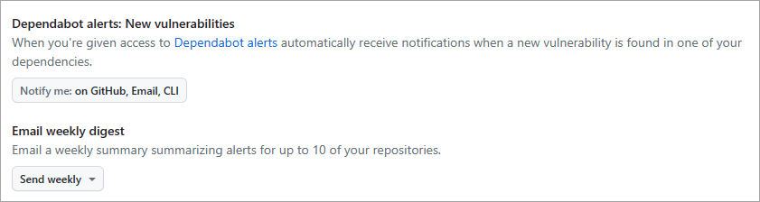
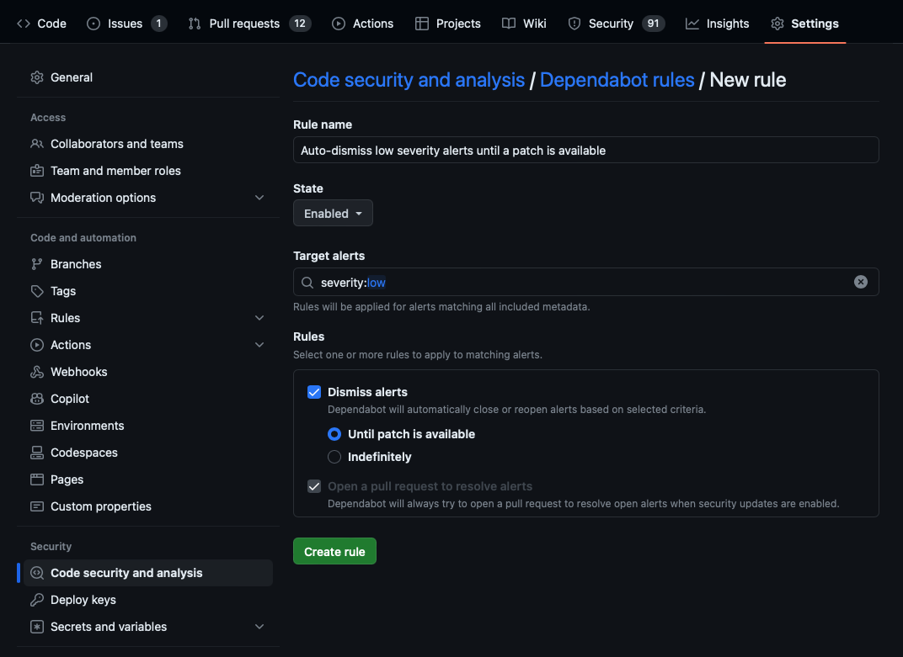

In this unit, you'll learn how to manage your Dependabot notifications. Properly managing these notifications will help you better secure your repository and make sure that important issues are promptly noticed by the right people.

You can always view information about vulnerable dependencies in your repository's **Security** tab. GitHub also notifies repository owners and users with admin permissions by default anytime a new alert is detected. To receive a Dependabot alert, admins must be watching the repository, have enabled notifications for security alerts or all activity on the repository, and must not be ignoring the repository. The Dependabot alerts unit explained how admins can also grant other users access to view Dependabot alerts.

GitHub never publicly shares vulnerability information for any repository. This information is only available to repository owners, people with admin permissions, and users who have been granted the appropriate access as explained in the Dependabot alerts unit.

By default, users receive notifications in the following manner:

- **By email**: An email is sent when Dependabot is enabled for a repository, when a new manifest file is committed to the repository, and when a new vulnerability with a critical or high severity is found (**Email** option).
- **In the user interface**: A warning is shown in your repository's file and code views if there are any vulnerable dependencies.
- **On the command line**: Warnings are displayed as callbacks when you push to repositories with any insecure dependencies (**CLI** option).
- **In your inbox**: As web notifications. A web notification is sent when Dependabot is enabled for a repository, when a new manifest file is committed to the repository, and when a new vulnerability with a critical or high severity is found (**On GitHub** option).
- **On GitHub Mobile**: As web notifications.

>[!NOTE]
> The email and web/GitHub Mobile notifications are:
>
> - *Per repository* when Dependabot is enabled on the repository, or when a new manifest file is committed to the repository.
> - *Per organization* when a new vulnerability is discovered.
> - Sent when a new vulnerability is discovered. GitHub doesn't send notifications when vulnerabilities are updated.

>[!Tip]
> You can sync your web and mobile notifications so that taking action on a notification in one inbox will automatically change its status in the other. For example, reading a notification on mobile would change its status to *Read* for the web inbox as well. To sync your web and mobile inboxes, make sure that your email client can view images from `notifications@github.com`.

## Configure notifications for Dependabot alerts

You can also further customize these notifications by selecting your profile picture, then selecting **Settings** > **Notifications**. In the **Dependabot alerts** section, you can choose how you'd like to be notified whenever a new vulnerability is found for a repository that you're watching. You can also choose to subscribe to the weekly or daily digest email, which provides a summary of alerts for up to 10 of your repositories.



The security email digest is also a good way to reduce noise from notifications about vulnerable dependencies. If you're concerned about receiving too many notifications, you can turn off notifications from the **Dependabot alerts** section and instead choose to receive the weekly security digest. You can still view your Dependabot alerts in your repository's **Security** tab. Be sure to select your preferred default notifications email in the **Default notifications email** section.

## Triage notifications

You can use the notifications inbox on GitHub and GitHub Mobile to triage your notifications. To use the inbox, you must enable web and mobile notifications from your notifications settings:

1. Select your profile photo from the upper-right.
2. Select **Settings** > **Notifications**.
3. Select **On GitHub** from the **Watching** section.

Select the **Notifications** icon in the upper-right to open the notifications inbox. The following options are available for triaging your notifications:

- Triage multiple notifications at once.
- Mark completed notifications as **Done** and remove them from your inbox. To view all of your notifications marked as **Done**, use the  `is:done` query.
- Save a notification to review later. Saved notifications are flagged in your inbox and kept indefinitely. To view all of your saved notifications, use the `is:saved` query.
- Unsubscribe and remove a notification from your inbox.
- Preview the issue, pull request, or team discussion where the notification originates on GitHub.com from within the notifications inbox.
- See one of the latest reasons you're receiving a notification from your inbox with a `reasons` label.
- Create custom filters to focus on different notifications when you want.
- Group notifications in your inbox by repository or date to get a quick overview with less context switching.

## Dependabot auto-triage rules

Dependabot auto-triage rules allow you to instruct Dependabot to automatically triage Dependabot alerts. You can use auto-triage rules to automatically dismiss or snooze certain alerts, or specify the alerts for which you want Dependabot to open pull requests.

There are two types of Dependabot auto-triage rules:

1. **GitHub presets**: Curated by GitHub and available for all repositories.
1. **Custom auto-triage rules**: Create your own rules to automatically dismiss or reopen alerts.

For example, to create a custom Dependabot rule to auto-dismiss low severity alerts until a patch is available:

1. Go to your repository and select **Settings**.
1. Select **Code security and analysis** under **Security** in the left-side menu.
1. Select the **gear** icon for **Dependabot rules** under **Dependabot alerts**.
1. Select **New rule**.
1. Enter a **Rule name**; for example, "Auto-dismiss low severity alerts until a patch is available."
1. Select whether the rule should be enabled or disabled in the **State** drop-down menu.
1. Enter `severity:low` for **Target alerts**.
1. Select **Dismiss alerts** and **Until a patch is available** in the **Rules** section.
1. Select **Create rule**.



## View dependency information with the GraphQL API

Finally, you can also use the GraphQL API to retrieve and export Dependabot alert information. The GraphQL API allows you to export a list of your dependencies that you can save as a CSV and then import into a Business Intelligence tool for analysis. You can use the API to quickly audit the known vulnerabilities of dependencies across your organizations.

You'll need to create an OAuth token with the following scopes to communicate with the GraphQL server:

- `user`
- `public_repo`
- `repo`
- `repo_deployment`
- `repo:status`
- `read:repo_hook`
- `read:org`
- `read:public_key`
- `read:gpg_key`

The GraphQL API has a single endpoint that doesn't change:

`https://api.github.com/graphql`

### GraphQL Explorer

The GraphQL Explorer is the recommended tool for communicating with the GraphQL API. The GraphQL Explorer is a "graphical interactive in-browser GraphQL IDE". The Explorer is an instance of [GraphiQL App](https://github.com/skevy/graphiql-app?azure-portal=true).

After downloading the GraphiQL app, follow these instructions to configure it:

1. Get a properly configured OAuth token.
2. Open GraphiQL.
3. In the upper-right corner of GraphiQL, select **Edit HTTP Headers**.
4. In the **Key** field, enter 'Authorization'. In the **Value** field, enter `Bearer <token>`, where `<token>` is your generated OAuth token.
5. Select the checkmark to the right of the token to save it. 
6. To return to the editor, select outside of the **Edit HTTP Headers** modal.
7. In the **GraphQL Endpoint** field, enter `https://api.github.com/graphql`.
8. In the **Method** drop-down, select **Post**.

### Write GraphQL queries

GraphQL queries return only the data you specify. When you're forming a query, you must specify fields within fields (also known as nested subfields) until you return only scalars (primitive values like integers, float, string, boolean, or GitHub object IDs).

Queries are structured like this:

```graphql
query {
  JSON objects to return
}
```

### Example API query

The following code block is an example of a complex API query that fetches the vulnerable dependency for a repository.

```graphql
query {
  repository(name: "${repo}", owner: "${org}") { 
    vulnerabilityAlerts(first: 100) {
      nodes { 
        createdAt 
        dismissedAt 
        securityVulnerability { 
          package { 
            name 
          } 
          severity 
          vulnerableVersionRange 
          advisory { 
            ghsaId 
            publishedAt 
            identifiers { 
              type 
              value 
            } 
          } 
        } 
      } 
    } 
  }
}
```

We'll explain the parts of this query in the following section.

`query`

Your goal is to read data from the server, not to modify it, query is the root operation. (If you don't specify an operation, query is also the default.)

`repository (name: "${repo}", owner: "${org}") {`

Begin the query by finding a repository object. The schema validation indicates this object requires an owner and a name argument.

`vulnerabilityAlerts(first: 100) {`

The `vulnerabilityAlerts` object accounts for all Dependabot alerts in the repository. Schema validation indicates this object requires a last or first number of results as an argument, this example uses 100.

`nodes {`

Retrieve the nodes at the end of the edge.

```graphql
createdAt 
dismissedAt 
securityVulnerability { 
  package { 
    name 
  } 
  severity 
  vulnerableVersionRange 
  advisory { 
```

For the nodes, specify the objects to return, in this case `createdAt`, `dismissedAt` and `securityVulnerability`.

```graphql
        ghsaId 
        publishedAt 
        identifiers { 
          type 
          value 
        } 
      } 
    } 
  } 
}
```

Specify the `ghsaId`, `publishedAt`, and `identifiers` fields of the `advisory` object. The `identifiers` field has the type `type` and `value`.

Information about resolved alerts isn't stored in the API and can't be retrieved.

You can also create GitHub Actions that automate the process of retrieving dependency information based on some event or at some interval.
