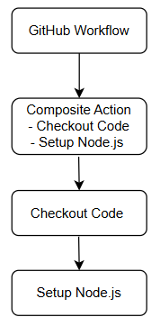
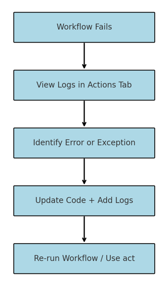

GitHub Actions is a powerful feature that helps you to go from code to cloud, all from the comfort and convenience of your own repository. Here, you'll learn about the different types of GitHub actions and the metadata, syntax, and workflow commands to create custom GitHub actions. 

## Types of GitHub actions

:::image type="content" source="../media/action-types.png" alt-text="Diagram that displays the three types of GitHub Actions; Docker, JavaScript, and composite run steps actions." border="false":::

Actions are individual tasks that you can use to customize your development workflows. You can create your own actions by writing custom code that interacts with your repository to perform custom tasks, or by using actions the GitHub community shares. Navigating through various actions, you'll notice that there are three different types of actions: _Docker container actions_, _JavaScript actions_, and _composite run steps actions_. Let's take a closer look at each action type.

### Docker container actions

Docker containers package the environment with the GitHub Actions code. This means that the action runs in a consistent and reliable environment because all of its dependencies are within that container. If the action needs to run in a specific environment configuration, Docker containers are a good way to go because you can customize the operating system and tools. The downside is that because the job has to build and retrieve the container, Docker container actions are often slower than JavaScript actions.

Before building a Docker container action, you should have some basic understanding of how to use environment variables and the Docker container filesystem. The steps to take to build a Docker container action are then minimal and straightforward:

1. Create a `Dockerfile` to define the commands to assemble the Docker image.
2. Create an `action.yml` metadata file to define the inputs and outputs of the action. Set the `runs: using:` value to `docker` and the `runs: image:` value to `Dockerfile` in the file.
3. Create an `entrypoint.sh` file to describe the docker image.
4. Commit and push your action to GitHub with the following files: `action.yml`, `entrypoint.sh`, `Dockerfile`, and `README.md`.

### JavaScript actions

JavaScript actions can run directly on the runner machine, and separate the action code from the environment that's used to run the action. Because of this, the action code is simplified and can execute faster than actions within a Docker container.

As a prerequisite for creating and using packaged JavaScript actions, you need to download Node.js, which includes npm. As an optional step (but one that we recommend) is to use GitHub Actions Toolkit Node.js, which is a collection of Node.js packages that allows you to quickly build JavaScript actions with more consistency.

The steps to build a JavaScript action are minimal and straightforward:

1. Create an `action.yml` metadata file to define the inputs and outputs of the action, as well as tell the action runner how to start running this JavaScript action.
2. Create an `index.js` file with context information about the Toolkit packages, routing, and other functions of the action.
3. Commit and push your action to GitHub with the following files: `action.yml`, `index.js`, `node_modules`, `package.json`, `package-lock.json`, and `README.md`.

### Composite run steps actions

Composite run steps actions allow you to reuse actions by using shell scripts. You can even mix multiple shell languages within the same action. If you have many shell scripts to automate several tasks, you can now easily turn them into an action and reuse them for different workflows. Sometimes it's easier to just write a shell script than using JavaScript or wrapping your code in a Docker container.


# Packaged Composite Action

Packaged composite actions are a way to bundle multiple steps into a reusable unit. These actions are defined in a repository and can be referenced in workflows across different repositories. By packaging a composite action, you can simplify workflows, reduce duplication, and improve maintainability.

When creating a packaged composite action, you define the steps in a single `action.yml` file. This file specifies the inputs, outputs, and the sequence of commands or actions to execute. Packaged composite actions are particularly useful for automating repetitive tasks or combining multiple shell commands into a single reusable action.

## Create a Composite Action

### 1. Set Up a Directory for the Composite Action

You must place your composite action in its own directory inside the repository.

**Example Directory Structure:**
.github/actions/my-composite-action/ ├── action.yml └── scripts/ └── my-script.sh

### 2. Define the `action.yml` File

Inside the **composite action directory**, create an `action.yml` file to define the action.

```yaml
name: "My Composite Action"
description: "A reusable composite action that checks out code and sets up Node.js"

inputs:
  node-version:
    description: "The Node.js version to use"
    required: true

runs:
  using: "composite"
  steps:
    - name: Checkout repository
      uses: actions/checkout@v4

    - name: Set up Node.js
      uses: actions/setup-node@v4
      with:
        node-version: ${{ inputs.node-version }}
```        
**Note:** The using: **"composite"** field indicates that this action is a composite action.

### 3. Using the Composite Action in a Workflow  
Once the composite action is created, it can be referenced in a GitHub Actions workflow.
```yaml
jobs:
  build:
    runs-on: ubuntu-latest
    steps:
      - name: Use my composite action
        uses: ./.github/actions/my-composite-action
        with:
          node-version: '18'
```
If your composite action is in **another repository**, reference it like this:
```
uses: owner/repository/.github/actions/my-composite-action@v1
```
## Adding Outputs to a Composite Action
Composite actions can define outputs that can be used in workflows.

### 1. Define an Output in action.yml

```yaml
outputs:
  script-result:
    description: "Result from the script"
    value: ${{ steps.run-script.outputs.result }}

runs:
  using: "composite"
  steps:
    - id: run-script
      run: echo "result=Success" >> $GITHUB_OUTPUT
      shell: bash
```
### 2. Access the Output in a Workflow
```yaml
jobs:
  test:
    runs-on: ubuntu-latest
    steps:
      - name: Run composite action
        id: my-action
        uses: ./.github/actions/my-composite-action

      - name: Display result
        run: echo "Script Result: ${{ steps.my-action.outputs.script-result }}"
```

## Best Practices for Composite Actions

| **Best Practice**       | **Description**                                                                 |
|--------------------------|---------------------------------------------------------------------------------|
| **Use Versioning**       | Use a `v1` tag to reference stable versions.                                   |
| **Keep Actions Modular** | Group related steps inside a composite action.                                 |
| **Document Inputs & Outputs** | Add descriptions for inputs/outputs in `action.yml`.                          |
| **Test Before Publishing** | Validate the composite action in a test repository.                           |

## Composite Action in a Workflow

 
## Benefits of Composite Actions:
- **Reusability** - Define actions once and use them in multiple workflows.  
- **Maintainability** - Reduce duplication by centralizing logic in a single action.  
- **Modularity** - Combine multiple shell commands or other actions into a single unit. 

# Develop an Action to Set Up a CLI on GitHub Actions Runners
Many CI/CD workflows need a **specific CLI tool** to interact with cloud services, manage infrastructure, or execute scripts.  
Instead of manually installing a CLI in every workflow, you can create a **reusable GitHub Action** that:

- Ensures consistent CLI installation across jobs.  
- Simplifies workflows by reducing repeated installation steps.  
- Optimizes caching for faster workflow execution.  

## How to Develop a CLI Setup Action

A **CLI setup action** is a **JavaScript-based action** that installs and configures a CLI on a GitHub runner.

### Steps to Create the Action:

### Step 1: Set Up the Action Directory

Create a new directory inside your GitHub repository:

```sh
mkdir my-cli-action
cd my-cli-action
```
### Step 2: Define the action.yml Metadata File
Create an action.yml file to describe the action.

``` yaml
name: "Setup MyCLI"
description: "Installs MyCLI and adds it to the PATH"
author: "Your Name"

inputs:
  version:
    description: "The CLI version to install"
    required: false
    default: "latest"

runs:
  using: "node16"
  main: "index.js"
```
Why use using: node16?
This action runs JavaScript code using Node.js 16.

### Step 3: Create a JavaScript Script to Install the CLI
In the same directory, create a file named index.js and add the following code:
```javascript
const core = require('@actions/core');
const { execSync } = require('child_process');

async function run() {
  try {
    const version = core.getInput('version') || 'latest';
    
    console.log(`Installing MyCLI version: ${version}...`);

    execSync(`curl -fsSL https://cli.example.com/install.sh | sh`, { stdio: 'inherit' });

    console.log("MyCLI installed successfully.");
  } catch (error) {
    core.setFailed(`Installation failed: ${error.message}`);
  }
}

run();
```
**Explanation:**
Uses core.getInput() to get the CLI version input.
Runs a curl command to download and install the CLI.
Uses core.setFailed() to fail the workflow if the installation fails.

### Step 4: Test the Action Locally
Before using the action in a workflow, test it on a GitHub-hosted runner.   
Create a workflow file (.github/workflows/test.yml) in your repository:
```yaml
name: Test MyCLI Setup

on: push

jobs:
  test:
    runs-on: ubuntu-latest
    steps:
      - name: Checkout repository
        uses: actions/checkout@v4

      - name: Install MyCLI
        uses: ./.github/actions/my-cli-action
        with:
          version: '1.2.3'

      - name: Check CLI Version
        run: mycli --version
```
**Caching the CLI Installation (Optimization)**
To speed up workflows, you can cache the CLI installation using the actions/cache action.
Modify test.yml:

```yaml
- name: Cache MyCLI
  uses: actions/cache@v4
  with:
    path: ~/.mycli
    key: mycli-${{ runner.os }}-${{ inputs.version }}
```

### Best Practices for CLI Setup Actions

| **Best Practice**         | **Description**                                                              |
|----------------------------|------------------------------------------------------------------------------|
| **Use Versioning**         | Allow users to specify a CLI version via `inputs.version`.                  |
| **Handle Errors Properly** | Use `core.setFailed()` to exit on errors.                                   |
| **Cache CLI Installation** | Optimize workflow performance using `actions/cache`.                       |
| **Provide Documentation**  | Explain usage and inputs in `README.md`.                                    |


# Troubleshoot JavaScript Actions

When working with JavaScript-based GitHub Actions, you may encounter unexpected behavior, errors, or failures during workflow execution. This unit provides techniques and tools to help you identify and resolve issues in your JavaScript actions.

## Common Troubleshooting Scenarios

| Problem | Possible Cause | Suggested Fix |
|--------|----------------|----------------|
| Action fails with a stack trace | Syntax or runtime error in `index.js` | Use `console.log()` and check logs |
| Inputs are `undefined` | Incorrect input name or missing input | Verify `action.yml` and how inputs are passed |
| Environment variables not set | `core.exportVariable` or `process.env` not used properly | Review the code setting the variables |
| File not found | Missing relative paths | Use `__dirname` or full paths to files |
| Cache is not restored | Wrong `key` or `path` values | Check cache configuration and keys |

## Use Logging for Debugging

### Log messages with `core.info`, `core.debug`, and `console.log`

```js
const core = require('@actions/core');

core.info("This is an info message");
core.debug("This is a debug message");
console.log("This is a raw console log");
```
✅ Use core.debug for debug logs — these only appear when ACTIONS_STEP_DEBUG is set to true.

### Enable Debug Logging
You can enable **step-level debug logs** by setting the following **secret**:
```
ACTIONS_STEP_DEBUG=true
```
To enable **runner diagnostic logs**, set:
```
ACTIONS_RUNNER_DEBUG=true
```

### How to Set Secrets for Debugging
1. Go to your GitHub repository.
2. Navigate to Settings > Secrets and variables > Actions.
3.Add new secrets named:
  . ACTIONS_STEP_DEBUG → true
  . ACTIONS_RUNNER_DEBUG → true

### Inspect Workflow Logs
When a workflow fails, click on the failed job in the Actions tab. Expand each step to:

. View detailed logs
. Check standard output (stdout)
. See the exit code of scripts
. Identify unhandled exceptions

🔍 Example Log Output
```plaintext
Error: Cannot find module '@actions/core'
Require stack:
- /home/runner/work/_actions/my-org/my-action/index.js
```
✅ Fix: Run npm install @actions/core and commit node_modules (or use ncc to bundle the action).

### Test Your Action Locally
Use act — a CLI tool to run GitHub Actions locally.
Example:
```sh
act -j test
```
🛠 Make sure to simulate your GitHub environment properly when testing locally.

### Handle Errors Gracefully
Catch exceptions and fail with helpful messages:

```js
try {
  // your logic
} catch (error) {
  core.setFailed(`Action failed with error: ${error.message}`);
}
```
🔁 This ensures GitHub stops the workflow on error and provides readable logs.

### Failure and Troubleshoot workflow




### Best Practices for Debugging JavaScript Actions

| **Practice**            | **Description**                                                              |
|--------------------------|------------------------------------------------------------------------------|
| **Use core.debug()**     | Hide verbose logs unless debugging is enabled.                              |
| **Validate action.yml**  | Ensure inputs and outputs are correctly defined.                            |
| **Bundle code**          | Use `@vercel/ncc` to compile JavaScript into a single file.                 |
| **Test with act**        | Simulate runs locally for faster iterations.                                |
| **Use try/catch**        | Prevent workflows from failing silently.                                    |


# Troubleshoot Docker Container Actions
Docker container actions are powerful for encapsulating complex tools and environments in GitHub Actions workflows. However, debugging these actions can be more challenging than JavaScript actions due to their isolated runtime environment. This unit will guide you through identifying, diagnosing, and resolving issues with Docker-based actions.

## Common Issues in Docker Container Actions

| Problem | Cause | Suggested Fix |
|--------|-------|----------------|
| Action fails to start | `ENTRYPOINT` or `CMD` misconfigured | Confirm Dockerfile uses `ENTRYPOINT` correctly |
| Missing dependencies | Dependencies not installed or misconfigured | Ensure all packages are installed in the image |
| Inputs not received | `INPUT_` environment variables not accessed | Use `process.env.INPUT_<INPUT_NAME>` (or shell equivalent) |
| File not found | Incorrect file path inside container | Use absolute paths or validate directory structure |
| Permission denied | File or script lacks execution permission | Add `RUN chmod +x <script>` in Dockerfile |
| Network-related failures | External services not accessible | Validate network settings and retry logic |

## Understand the Docker Action Lifecycle

Before troubleshooting, it's helpful to understand how Docker container actions run.
![
 (github-docker-workflow-blue.png)
]

 Note: Docker container actions run in a clean, isolated environment. File system state, installed tools, and environment variables must all be defined within the Dockerfile.

### Debugging Techniques
### 1. Add Logging
Use echo, printf, or logging statements in your entrypoint script:

```bash
echo "Starting Docker action..."
echo "Input VALUE: $INPUT_VALUE"
```
📌 Log all critical inputs and steps to diagnose where the failure occurs.

### 2. Build and Test Locally
Use Docker on your machine to simulate the container behavior:
```bash
docker build -t my-action .
docker run -e INPUT_NAME=value my-action
```
⚠️ Ensure environment variables mimic the ones GitHub sets.

### 3. Use the act CLI to Simulate GitHub Workflows
Install act to run your GitHub workflows locally:
```bash
act -j test-job
```
🧪 Great for testing Docker actions in workflows without pushing to GitHub.

### 4. Validate Dockerfile Configuration
Ensure you define either ENTRYPOINT or CMD.
Copy your scripts into the image and give them execute permission:
```dockerfile
COPY entrypoint.sh /entrypoint.sh
RUN chmod +x /entrypoint.sh
ENTRYPOINT ["/entrypoint.sh"]
```

### 5. Inspect GitHub Logs
Click on a failed workflow run, expand each step, and examine:
  - Docker build logs
  - Standard output and standard error from the container
  - Exit codes and stack traces
🔍 Logs often reveal missing packages, syntax issues, or permission errors.

### Example: Entry Point Error
```plaintext
Error: container_linux.go:380: starting container process caused "exec: \"/entrypoint.sh\": permission denied"
```
✅ Fix: Add RUN chmod +x /entrypoint.sh in your Dockerfile.

### Environment Variable Mapping
| **GitHub Input**         | **Docker Environment Variable**       |
|---------------------------|---------------------------------------|
| `with: name: test`        | `INPUT_NAME=test`                    |
| `GITHUB_WORKSPACE`        | Mapped into `/github/workspace`      |
| `GITHUB_EVENT_NAME`       | Event that triggered the workflow    |

```bash
echo "Input was $INPUT_NAME"
echo "Working dir: $GITHUB_WORKSPACE"
```
### Use Troubleshooting Secrets
Enable additional logging by adding these secrets to your repository or org:
| **Secret**              | **Description**                     |
|--------------------------|-------------------------------------|
| **ACTIONS_STEP_DEBUG**   | Enables debug logging              |
| **ACTIONS_RUNNER_DEBUG** | Enables runner diagnostics         |

### Best Practices for Docker Action Debugging

| **Best Practice**               | **Why**                                                   |
|----------------------------------|----------------------------------------------------------|
| **Use logging generously**       | Helps trace failure points                                |
| **Always set chmod +x**          | Avoid permission errors on shell scripts                 |
| **Validate inputs in your script** | Catch missing or malformed inputs early                  |
| **Minimize container dependencies** | Smaller images are easier to debug                      |
| **Test locally with docker run or act** | Faster iterations and immediate feedback               |

<!-- INFOMAGNUS UPDATES for 3.1.4 and 3.1.5 go here. Source Material for 3.1.4 : https://docs.github.com/en/enterprise-cloud@latest/actions/sharing-automations/creating-actions/creating-a-composite-action#creating-a-composite-action-within-the-same-repository

Source Material for 3.1.5 : https://docs.github.com/en/enterprise-cloud@latest/actions/sharing-automations/creating-actions/developing-a-third-party-cli-action ->

## Metadata and syntax needed to create an action

When creating or reviewing a GitHub action, a great first step is to review the `action.yml` file to assess which inputs, outputs, description, runs, and other configuration information the action needs. Some of these parameters are required, while others are optional. The `action.yml` file defines the following information about your action:

| Parameter   | Description                                                                                                                                            |      Required      |
| ----------- | ------------------------------------------------------------------------------------------------------------------------------------------------------ | :----------------: |
| Name        | The name of your action. Helps visually identify the action in a job.                                                                                 | yes |
| Description | A summary of what your action does.                                                                                                                    | yes |
| Inputs      | Input parameters enable you to specify data that the action expects to use during runtime. These parameters become environment variables in the runner. |         no         |
| Outputs     | Output parameters enable you to specify data that subsequent actions can use later in the workflow after the action that defines these outputs has run.                          |         no         |
| Runs        | The command to run when the action executes.                                                                                                           | yes |
| Branding    |  Color and Feather icon to use to create a badge to personalize and distinguish your action in GitHub Marketplace.                               |         no         |

### Inputs

Inputs are the parameters that allow you to specify data that the action expects to use during its runtime. GitHub stores these input parameters as environment variables.

Following is an example of a list of inputs for an action. The `firstNameStudent` input is optional, while the `studentGrade` input is required.

```yml
inputs:
  firstNameStudent:
    description: 'First name of student'
    required: false
    default: '1'
  studentGrade:
    description: 'Grade of the student'
    required: true
```

### Outputs

Outputs are the parameters that allow you to declare data. Keep in mind that actions that run later in a workflow can use the output data that was declared in a previously run action.

The following example is a simple output to declare the average grade of the students:

```yml
outputs:
  average:
    description: 'The average grade of the students'
```

### Runs

As you learned previously, your action needs to have a `runs` statement that defines the command necessary to execute your action. Depending on how you're creating your action—whether you're using a Docker container, JavaScript, or composite run steps—the `runs` syntax is defined differently.

#### `runs` for Docker actions

Docker container actions require the `runs` statement to configure the image the Docker action uses with the following arguments:

- `using`: Needs to be set to `docker` to run a Docker container action.
- `image`: Docker image used as the container to run the action.

```yml
runs:
  using: 'docker'
  image: 'Dockerfile'
```

#### `runs` for JavaScript actions

JavaScript actions require that the `runs` statement take the following two arguments:

- `using`: Application used to execute the code as defined in `main`.
- `main`: File that contains the action code; the application defined in `using` executes this file.

For example, here's a `runs` statement for a JavaScript action using Node.js:

```yml
runs:
  using: 'node12'
  main: 'main.js'
```

#### `runs` for composite run steps actions

Composite run steps actions require that the `runs` statement take the following three arguments:

- `using`: Needs to be set to `"composite"` to run a composite run step.
- `steps`: Run steps to run the action.
- `steps[*].run`: Command you want to run (can be inline or a script in your action repository).

For example, here's a `runs` statement for a composite run steps action that will run the script at filepath `/test/script/sh`:

```yml
runs:
  using: "composite"
  steps:
    - run: ${{ github.action_path }}/test/script.sh
      shell: bash
```

<!-- INFOMAGNUS UPDATES for 3.1.2 and 3.1.3 go here. Suggested Source Material : https://docs.github.com/en/actions/monitoring-and-troubleshooting-workflows/troubleshooting-workflows/about-troubleshooting-workflows ->

### Branding

An optional but fun feature is the ability to customize the badge of your action. The badge is displayed next to the action name in the [GitHub Marketplace](https://github.com/marketplace?type=actions). You can use a color and [Feather](https://feathericons.com/) icon to create the badge. For branding, you'll need to specify the icon and color you wish to use.

```yml
branding:
  icon: 'shield'  
  color: 'blue'
```

Here's an example of a Checkout action badge on the GitHub Marketplace:

:::image type="content" source="../media/actions-branding.png" alt-text="Screenshot that shows an action's branding on the GitHub Marketplace.":::

## Workflow commands

Creating a workflow is pretty straightforward as long as you can find the right actions for your steps. In some cases, you might need to create your own actions to achieve your desired outcomes, but you can use workflow commands to add another level of customization to your workflows.

Workflow commands allow you to communicate with the GitHub Actions runner machine by printing formatted lines of text to the console. You can use these workflow commands with shell commands or within your custom actions. Workflow commands are useful because they let you share information between workflow steps, print debug or error messages to the console, set environment variables, set output parameters, or add to the system path.

Most workflow commands use the `echo` command in the following specific format, while others can be invoked by writing to a file:

```bash
echo "::workflow-command parameter1={data},parameter2={data}::{command value}"
```

Following are some basic message-logging examples for printing a debug message, info message, error message, or warning message to the console:

```yml
- name: workflow commands logging messages
  run: |
    echo "::debug::This is a debug message"
    echo "This is an info message"
    echo "::error::This is an error message"
    echo "::warning::This is a warning message"
```

You can also create a message to print to the log with a filename (file), line number (line), and column (col) number where the error occurred. Warning messages appear in a yellow highlight with the text "warning," and error messages appear in a red highlight with the text "error."

```bash
echo "::error file=app.js,line=10,col=15::Something went wrong"
```

It's important to note that these workflow commands need to be on a single line. Characters that interfere with parsing, such as commas and line breaks, will need to be URL-encoded.

For example, the following text is a multi-line message:

```yml
This text spans
across multiple lines
```

This message should be encoded as shown here:

```yml
This text spans%0Aacross multiple lines
```

In addition to workflow commands, you can set exit codes to set the status of an action. This is important because when you're working with jobs in a workflow, a failed exit code will halt all concurrent actions and cancel any future actions. If you're creating a JavaScript action, you can use the actions toolkit `@actions/core` package to log a message and set a failure exit code. If you're creating a Docker container action, you can set a failure exit code in your `entrypoint.sh` script.
