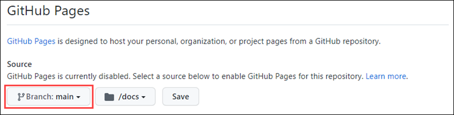
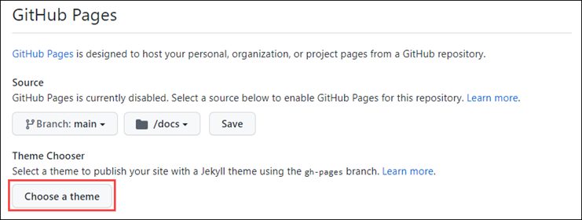
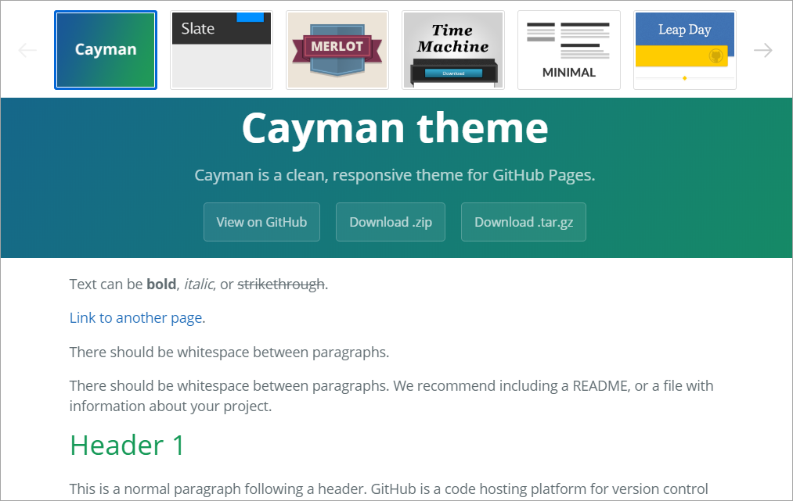

Here, we discuss the process of creating and maintaining a GitHub Pages web site.

GitHub Pages are static sites hosted directly from your GitHub repository. But they're more than just a collection of static files. By making use of site generation technologies like Jekyll and Liquid, developers define dynamic templates that are processed into complete static web sites. Every time a change is committed to the source branch associated with the site, it is re-generated using the latest updates and automatically published to the target URL.

Learn more about [Publishing sources for GitHub Pages sites](https://help.github.com/en/github/working-with-github-pages/about-github-pages#publishing-sources-for-github-pages-sites?azure-portal=true).

## Enabling GitHub Pages

The first step in using GitHub Pages is to enable it from your repository's **Settings** tab. You can opt to use the `master` branch, or specify the `docs` folder within it. If you ever want to disable GitHub Pages, you can do so here.



## Choosing a theme with Jekyll

**Jekyll** is the static site generator used by GitHub to build your web site from the contents of your repository. In addition to providing great content convenience, it also conforms to a standard design convention. This style standardization allows for swappable themes, which you can select from the **GitHub Pages** configuration.



There are a variety of themes provided by GitHub. There is also an array of commercial and open source themes available from the Jekyll community.



Learn more about [Jekyll Themes](https://jekyllrb.com/docs/themes/?azure-portal=true).

## Using YAML front matter

The term *front matter* refers to YAML metadata that prepends the content of a file. For Jekyll, this includes generator instructions to indicate the layout style of a Markdown page (`post`, `page`, and so on). It may also include page metadata, such as the document title, or page content variables, such as a blog post's author.

Below is a simple example that would use the `post` layout. This assumes there is a `_layouts/post.html` file that defines the container HTML. Other layout options may be offered by adding their respective HTML files in the `_layouts` folder.

```yml
---
layout: post
title: This is set as the document title.
---

This is visible body content, which may use Markdown, HTML, and Liquid templating.
```

Learn more about [Front Matter](https://jekyllrb.com/docs/front-matter/?azure-portal=true).

## Customizing your site

Once your site is up and running, you can customize details about your site via `_config.yml`. This file includes virtually all site-wide configuration options, including site metadata, navigation menus, theme colors, compiler options, and more.

Learn more about [_config.yml Configuration](https://jekyllrb.com/docs/configuration/?azure-portal=true).

## Creating and editing content

Creating and editing pages on your site follows the standard GitHub experience. The files you use for your GitHub Pages web site enjoy all of the same benefits as other files in your GitHub repository, so you can edit them with any tool, create and merge branches, and link with issues or pull requests.

In addition to Markdown and HTML, Jekyll supports the **Liquid** template language syntax. Liquid provides the ability for users to dynamically insert variables and basic logic flow constructs into their content files. When compiled, the final product is standard HTML.

The example below shows a combination of `for` looping and variable insertion.

```markdown
<ul>
  
    <li>
      <h2><a href="{{ post.url }}">{{ post.title }}</a></h2>
      {{ post.excerpt }}
    </li>
  
</ul>
```

Learn more about [Liquid template language](https://shopify.github.io/liquid/?azure-portal=true).

## Working with blog posts

Despite not having a database to work with, Jekyll still supports the concept of blogging using a specific convention: `_posts/2020-06-25-blog-post-name.md`. As you can likely infer, all blog posts are stored in the `_posts` folder and use the date and name convention as shown. During compilation, Jekyll processes the files in this folder to produce a list of HTML blog posts.

The example below illustrates the structure of a simple blog post. It includes metadata for `subtitle`, `tags`, and `comments`, which may or may not be supported by the theme you choose.

```markdown
---
layout: post
title: Blog post title rendered by theme
subtitle: Blog post subtitle rendered by theme
tags: welcoming
comments: true
---

This is the first line of rendered content in the post.
```

Learn more about [Adding content to your GitHub Pages site using Jekyll](https://help.github.com/en/github/working-with-github-pages/adding-content-to-your-github-pages-site-using-jekyll?azure-portal=true).