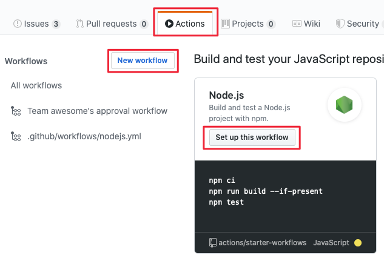
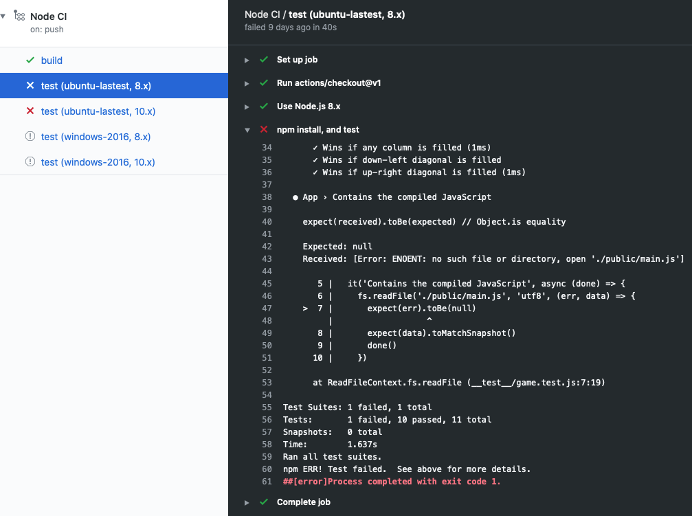

Here, you learn about GitHub Actions and workflows for continuous integration. 

You'll learn to:

- Create a workflow from a template in the GitHub portal
- Decipher the GitHub Actions logs
- Test against multiple targets
- Separate build and test jobs
- Save and access build artifacts
- Automate labeling a PR on review

## Create a workflow from a template

You can start writing a workflow by using a template. A template has common jobs and steps pre-configured for the automation you are wanting to accomplish. If you are not familiar with workflows, jobs and steps, check out the [Automate development tasks by using GitHub Actions](https://docs.microsoft.com/learn/github/github-actions-hello/?azure-portal=true) module. There, you are introduced to workflows.

Use the *Actions* tab to create a new workflow and choose from many workflow templates like *Node.js* to build and test a Node.js project, or *Python package* to create and test a Python package, or *Deploy Node.js to Azure Web App* to build and deploy a Node.js project to an Azure Web App.



Take a look at the Node.js template workflow below.

```yml
name: Node.js CI

on:
  push:
    branches: [ master ]
  pull_request:
    branches: [ master ]

jobs:
  build:

    runs-on: ubuntu-latest

    strategy:
      matrix:
        node-version: [10.x, 12.x]

    steps:
    - uses: actions/checkout@v2
    - name: Use Node.js ${{ matrix.node-version }}
      uses: actions/setup-node@v1
      with:
        node-version: ${{ matrix.node-version }}
    - run: npm ci
    - run: npm run build --if-present
    - run: npm test
```

Notice the ```on:``` attribute. This workflow is triggered on a push to the repository as well as when a pull request is made against the master branch.

There is one ```job``` in this workflow. Let's go over what it does.

The ```runs-on:``` attribute specifies that this be run on ```ubuntu-latest``` for the operating system. ```node-version:``` specifies that there will be two builds, one for Node version 10.x and one for Node version 12.x. We will discuss the ```matrix``` portion in depth later, when we customize the workflow.

The ```steps``` in the job use the action [actions/checkout@v2](https://github.com/actions/checkout?azure-portal=true) to get to the code from your repository into the virtual machine, and the [actions/setup-node@v1](https://github.com/actions/setup-node?azure-portal=true) action to set up the right version of Node.js. We will test two versions of Node.js here since we specify ```${{ matrix.node-version }}``` that points to the matrix we defined at the top of the file.

The last part of this step executes commands that Node.js projects use. ```npm ci``` installs dependencies from the *package-lock.json* file, ```npm run build --if-present``` runs a build script if it exists, and ```npm test``` runs the testing framework. Notice that build and test are all in the same job in this template.

To learn more about npm, check out the npm documentation:

- [npm install](https://docs.npmjs.com/cli/install?azure-portal=true) 
- [npm run](https://docs.npmjs.com/cli/run-script?azure-portal=true) 
- [npm test](https://docs.npmjs.com/cli/test.html?azure-portal=true)

## Action Logs for the build

When a workflow runs, it produces log information so that you can see the details on what the workflow executed and if there were any errors or test failures.
If there is an error or a test has failed, you see see a red X rather than a green check mark ✔️ in the logs. You can open the details of the error or failure to investigate what went wrong.



In the exercise, you have an opportunity to identify failed tests using the details in the logs from the Actions tab.

## Customizing workflow templates

Recall at the beginning of this module we set up a scenario where you are given the task of setting up continuous integration for your team. This template is a great start, but you want to customize it to better suit your team's continuous integration needs. You want to target different versions of Node and different operating systems. And you will likely want to separate the build and test steps into separate jobs.

Let's take a look at how you accomplish these customizations.

```yml
strategy:
matrix:
    os: [ubuntu-lastest, windows-2016]
    node-version: [8.x, 10.x]
```

Here, we configured a [build matrix](https://help.github.com/articles/configuring-a-workflow#configuring-a-build-matrix?azure-portal=true) for testing across multiple operating systems and language versions. This matrix will produce four builds, one for each operating system paired with each version of Node.

Four builds with their tests will produce quite a bit of log information that might be difficult to sort through. In the sample below, we show moving the test step to a dedicated test job to test against multiple targets and to better section out the log information.

```yml
test:
  runs-on: ubuntu-latest
  strategy:
    matrix:
      os: [ubuntu-lastest, windows-2016]
      node-version: [8.x, 10.x]
  steps:
  - uses: actions/checkout@v1
  - name: Use Node.js ${{ matrix.node-version }}
    uses: actions/setup-node@v1
    with:
      node-version: ${{ matrix.node-version }}
  - name: npm install, and test
    run: |
      npm install
      npm test
    env:
      CI: true
```

## What are artifacts?

When a workflow produces something other than log entries we call those *artifacts*. For example, the Node.js build will produce a Docker container that can be deployed. This artifact can be uploaded to storage using the action [actions/upload-artifact](https://github.com/actions/upload-artifact?azure-portal=true) and downloaded from storage using the action [actions/download-artifact](https://github.com/actions/download-artifact?azure-portal=true).

Storing an artifact helps to preserve it between jobs. Each job will use a fresh instance of a VM, so saving the artifact on the VM won't work between jobs. If you need your artifact in a different job, you can upload the artifact to storage in one job, and download it the other job.

## Artifact storage

Artifacts are stored in storage space on GitHub. The space is free for public repositories and some amount is free for private repositories depending on the account. Github will store your artifact for 90 days.

In the workflow snippet below, notice in the ```actions/upload-artifact@master``` action there is a ```path:``` attribute. This is the path to store the artifact. Here, we specify *public/* to upload everything to a directory. If it was just a file that we wanted to upload, we could use something like *public/mytext.txt*.

```yml
  build:
    runs-on: ubuntu-latest
    steps:
      - uses: actions/checkout@v1
      - name: npm install and build webpack
        run: |
          npm install
          npm run build
      - uses: actions/upload-artifact@master
        with:
          name: webpack artifacts
          path: public/
```

In order to download the artifact for testing, the build must have completed successfully and uploaded the artifact. Below, we specify that the test job depends on the build job.

```yml
test:
    needs: build
    runs-on: ubuntu-latest
```

In the workflow snippet below, you see we download the artifact. Now the test job can use the artifact for testing.

```yml
steps:
    - uses: actions/checkout@v1
    - uses: actions/download-artifact@master
      with:
        name: webpack artifacts
        path: public
```

For more information on using artifacts in workflows see [Persisting workflow data using artifacts](https://help.github.com/actions/configuring-and-managing-workflows/persisting-workflow-data-using-artifacts?azure-portal=true) in the GitHub documentation.

## Automate reviews in GitHub using workflows

So far, we talked about starting the workflow with GitHub events like *push* or *pull-request*. We could also run a workflow on a schedule or on some event outside of GitHub.

Sometimes we would like to run the workflow after something a human needs to do. For example, only run a workflow after a reviewer has approved the pull request review. For this scenario, we can trigger on ```pull-request-review```.

Another action we could take is to add a label to the pull request. In this case, we use the [pullreminders/label-when-approved-action](https://github.com/pullreminders/label-when-approved-action?azure-portal=true) community created action.

```yml
    steps:
     - name: Label when approved
       uses: pullreminders/label-when-approved-action@master
       env:
         APPROVALS: "1"
         GITHUB_TOKEN: ${{ secrets.GITHUB_TOKEN }}
         ADD_LABEL: "approved"
```

Notice the block called ```env:```. This is where you set the environment variables for this action. You can set the number of approvers needed. Here, it is one. The ```GITHUB_TOKEN``` variable is required because the action will need to make changes to your repository in the form of adding a label. Then, you supply the name of the label to add.

Adding a label could be an event that starts another workflow, perhaps a merge in this case. We will cover this in the next module TODO: (url here) on continuous delivery with GitHub Actions.
