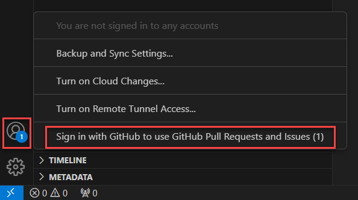

## Authenticate with your GitHub account

1. Make sure you have the latest version of VS Code installed. If you don't, select on the gear icon in the bottom of the activity bar and choose "Check for Updates..." and install the latest.

2. Select the extensions icon in the activity bar. Search for the "GitHub Pull Requests and Issues" extension and install it. 

3. Once you install the extension, you can select the gear icon at the bottom of the activity bar and select "Sign into use GitHub Pull Requests and Issues". A browser window will open and you'll be prompted to grant permission for VS Code to access GitHub.

   
4. Follow the prompt and select "Continue" to authorize VS Code to use GitHub. Your VS Code window will reopen and you'll be signed in! You can double check by selecting the account icon again and seeing your GitHub username.
