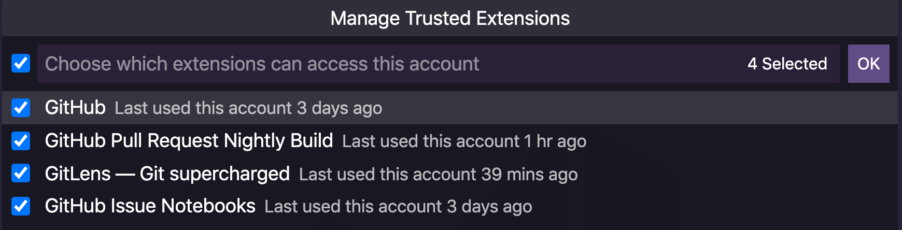

To bring that outer developer loop closer to your inner loop, you can authenticate with your GitHub account inside VS Code. 

## What is VS Code doing under the hood?

When you sign-in to your GitHub account in VS Code, there are various extensions or parts of VS Code that can now access your GitHub account information and provide specific features or streamlined experiences. After you have signed in, you can choose which VS Code extensions can use your GitHub authentication. When you click on the account icon and choose "Manage Trusted Extensions", you can see all the extensions that are using your GitHub account. "GitHub" refers to the built-in GitHub and source control features in VS Code, so you can leave that one checked. 

## What GitHub features does VS Code provide?

Because you've signed in, VS Code will now help you with initializing and publishing a repository to your GitHub account with a push of a button. It will also let you search for repositories you've created on GitHub so you can clone them locally. There are even more GitHub features in the GitHub Pull Requests and Issues extension, but in this module, we'll explore the built-in ones first.
