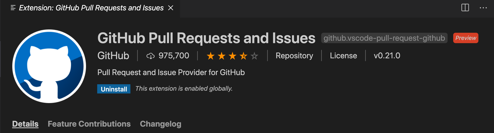

## Authenticate with your GitHub account

1. Make sure you have the latest version of VS Code installed. If you don't, click on the gear icon in the bottom of the activity bar and choose "Check for Updates..." and install the latest. 

2. Click on the extensions icon in the activity bar or go to View -> Extensions, and search for the "GitHub Pull Requests and Issues" extension and install it. 

1. Once you install the extension, you can click on the gear icon at the bottom of the activity bar and click on "Sign into use GitHub Pull Requests and Issues". This will open a browser window where you will be granting permission to VS Code to access GitHub.

   
4. Follow the prompt and click on "Continue" to authorize VS Code to use GitHub. This will re-open your VS Code window and you will be signed in! You can double check by clicking on the account icon again and seeing your GitHub username.
