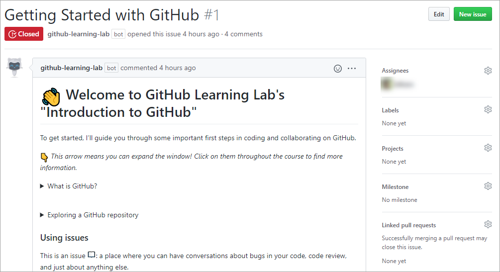
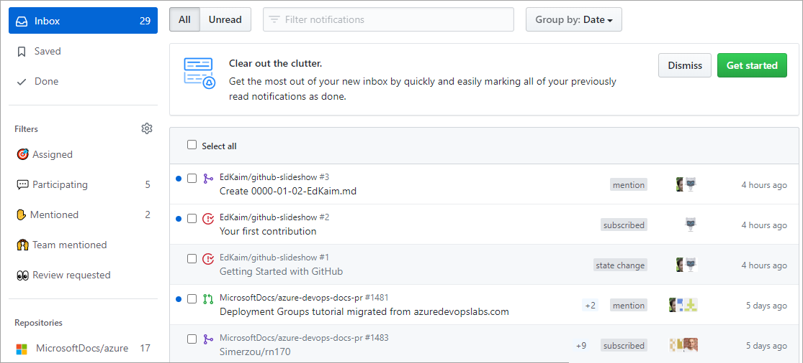
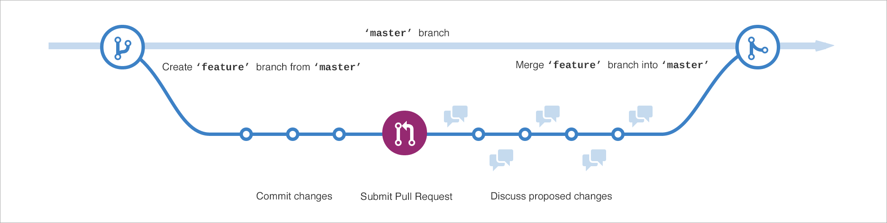
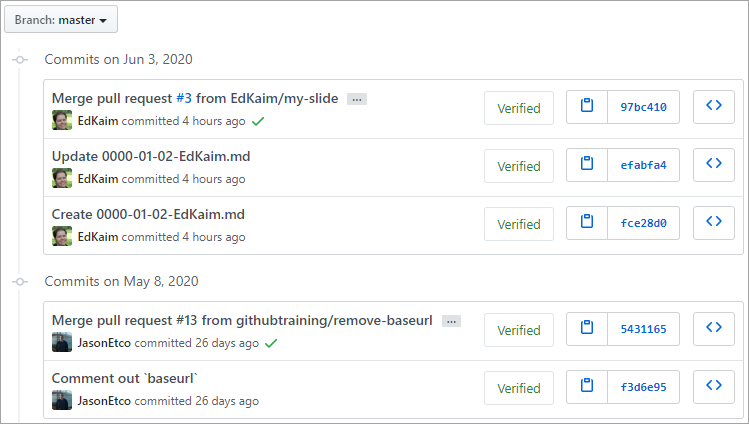
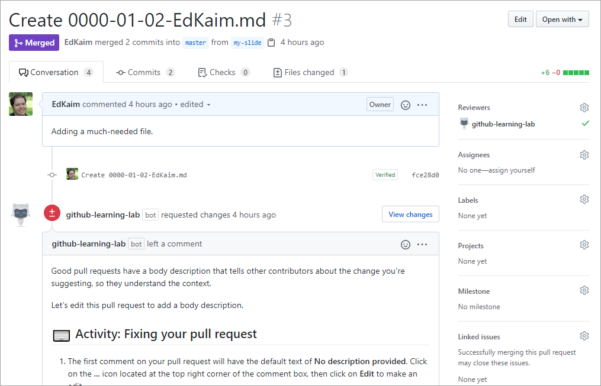
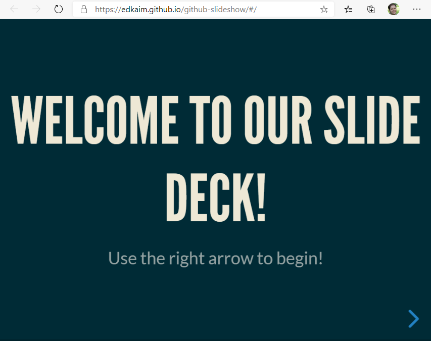

Here, we discuss the key GitHub features you use on a daily basis to manage and contribute to software projects. 

## The GitHub Flow

In addition to providing a platform for collaborative software development, GitHub also offers a prescribed workflow designed to optimize use of its various features. While this unit offers a cursory overview of important platform components, it is recommended that you first review [Understanding the GitHub flow](https://guides.github.com/introduction/flow/?azure-portal=true).

## Issues

**Issues** are where most of the communication between a project's consumers and development team occurs. An *issue* can be created to discuss a broad set of topics, including bug reports, feature requests, documentation clarifications, and more. Once an issue has been created, it can be assigned to owners, labels, projects, and milestones. You can also associate issues with pull requests and other GitHub items to provide future traceability.

To learn more about GitHub Issues, see [Mastering Issues](https://guides.github.com/features/issues/?azure-portal=true).

## Notifications

As a collaborative platform, GitHub offers **notifications** for virtually every event that takes place within a given workflow. These notifications can be finely tuned to meet your preferences. For example, you can subscribe to all issue creations and edits on a project, or you can just receive notifications for issues in which you are mentioned. You can also decide whether you receive notifications via email, web & mobile, or both. To keep track of all of your notifications across different projects, use the [GitHub Notifications dashboard](https://github.com/notifications?azure-portal=true).

To learn more about GitHub notifications, see [Configuring notifications](https://help.github.com/github/managing-subscriptions-and-notifications-on-github/configuring-notifications?azure-portal=true).

## Branches

**Branches** are the preferred way to create changes in [the GitHub flow](https://guides.github.com/introduction/flow/?azure-portal=true). They provide isolation so that multiple people may simultaneously work on the same code in a controlled way. This model enables stability among critical branches, such as `master`, while allowing complete freedom for developers to commit any changes they need to meet their goals. Once the code from a branch is ready to become part of the `master` branch, it may be merged via pull request.

To learn more about GitHub branches, see [About branches](https://help.github.com/github/collaborating-with-issues-and-pull-requests/about-branches?azure-portal=true).

## Commits

A **commit** is a change to one or more files on a branch. Every time a commit is created, it is assigned a unique ID and tracked, along with the time and contributor. This provides a clear audit trail for anyone reviewing the history of a file or linked item, such as an issue or pull request. 

To learn more about GitHub commits, see [Committing and reviewing changes to your project](https://help.github.com/desktop/contributing-to-projects/committing-and-reviewing-changes-to-your-project?azure-portal=true).

## Pull Requests

A **pull request** is the mechanism used to signal that the commits from one branch are ready to be merged into another branch. During creation, the developer will often request one or more reviewers who are in a position to verify the code and approve the merge. These reviewers have the opportunity to comment on changes, add their own, or use the pull request itself for further discussion. Once the changes have been approved (if approval is required in the project), then the pull request's source branch (the compare branch) may be merged in to the base branch. 

To learn more about GitHub pull requests, see [About pull requests](https://help.github.com/github/collaborating-with-issues-and-pull-requests/about-pull-requests?azure-portal=true).

## GitHub Pages

**GitHub Pages** is a hosting engine that's built right into your GitHub account. By following a few conventions, and enabling the feature, you can build your own static site generated from HTML and markdown code pulled directly from your repository. 

To learn more, see [GitHub Pages](https://pages.github.com/?azure-portal=true).