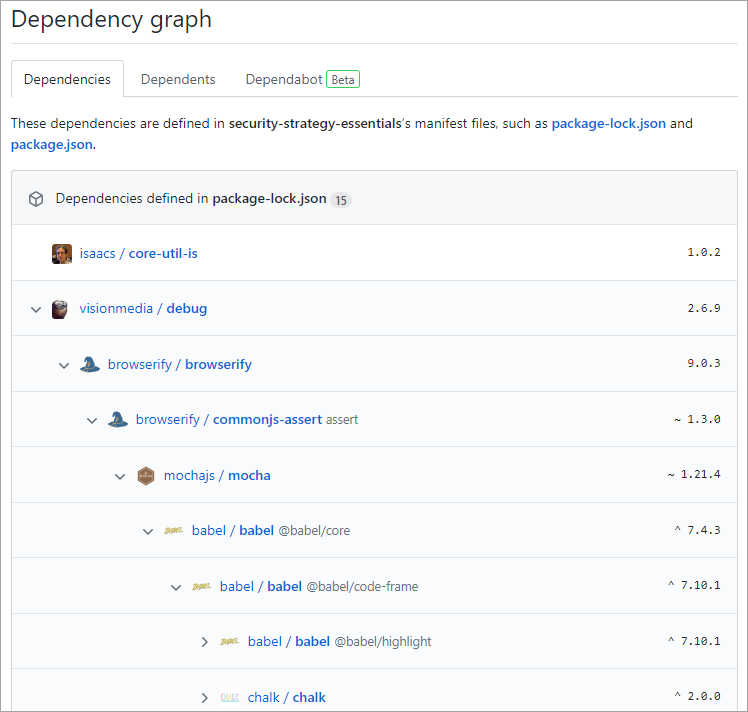
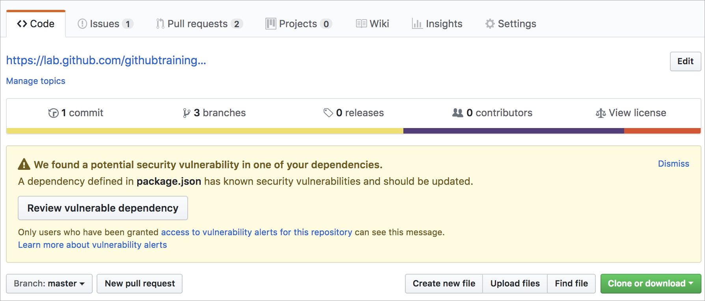

Here, we discuss some of the essential security tools and techniques available to GitHub repository administrators. This unit does not cover the fundamentals of writing secure code, but rather delves into some of the important considerations repository owners need to account for outside of the core development process. 

## The importance of a secure development strategy

It's now commonplace that security for applications is extremely important. News services frequently carry stories about some company's systems that have been breached and private company and customer data that was stolen.

So, what are the issues to think about when planning a secure development strategy? Clearly, we need to protect information from being disclosed to people that should not have access to it. But more importantly than that, we need to ensure that the information isn't inappropriately altered or destroyed, and that it is actually destroyed when it's supposed to be.

We need to make sure we properly authenticate who is accessing the data and that they have the correct permissions to do so. Through historical or archival data or logs, we need to be able to find evidence when something has gone wrong.

There are many aspects to building and deploying secure applications. Here are three things to consider:

- **There is a general knowledge problem.** Many developers and other staff members assume they understand security, but they don't. Cybersecurity is a constantly evolving discipline. A program of ongoing education and training is essential.

- **Code must be created correctly and securely.** We need to ensure that the code is created correctly, and securely implements the required features. We also need to make sure that the features were designed with security in mind in the first place.

- **Applications must comply with rules and regulations.** We need to ensure that the code complies with rules and regulations that it's required to meet. We have to test for compliance while building the code and retest periodically, even after deployment.

### Security at every step

:::image type="content" source="../media/shift-left-2.png" alt-text="Security is a part of every step.":::

Security isn't something you can just add to an application or a system later. Secure development must be part of every stage of the software development life cycle. This is even more important for critical applications and those that process sensitive or highly confidential information.

In practice, to hold teams accountable for what they develop, processes need to **shift left** earlier in the development lifecycle. By moving steps from a final gate at deployment time to an earlier step, fewer mistakes are made, and developers can move more quickly.

Application security concepts haven't been a focus for developers in the past. Apart from the education and training issues, it's because their organizations have emphasized fast development of features.

With the introduction of DevOps practices however, security testing is much easier to integrate into the pipeline. Rather than being a task performed by security specialists, security testing should just be part of the day-to-day delivery processes.

Overall, when the time for rework is taken into account, adding security to your DevOps practices earlier in the development lifecycle allows development teams to catch issues earlier and can actually reduce the overall time it takes to develop quality software.

Shifting left is a process change, but it isn’t a single control or specific tool—it’s about making all of security more developer-centric, and giving developers security feedback where they are. Below are some ways to distribute security and operational responsibilities across all phases of the software development lifecycle.

## Communicating security policy with SECURITY.md

The community benefits of GitHub are substantial, but they also carry potential risks. The fact that anyone can propose bug fixes publicly comes with certain responsibilities. The most important is the responsible disclosure of information that could lead to security exploits before their underlying bugs can be fixed. Developers looking to report or address security issues look for a `SECURITY.md` file in the root of a repository in order to responsibly disclose their concerns. Providing guidance in this file will ultimately speed up the resolution of these critical issues. 

To learn more about `SECURITY.md`, see [Adding a security policy to your repository](https://help.github.com/github/managing-security-vulnerabilities/adding-a-security-policy-to-your-repository?azure-portal=true).

## Keeping sensitive files out of your repository with .gitignore

It's easy for developers to overlook files included in a commit. Sometimes these overlooked files are benign, such as intermediate build files. However, there is always the risk that someone may inadvertently commit sensitive data, such as an API key or private configuration data, that could be used by a malicious actor. One technique to help avoid the majority of this risk is to build and maintain `.gitignore` files. These files instruct client tools, such as the `git` command line utility, to ignore paths and patterns when aggregating files for a commit.

The sample below illustrates some of the common use cases for ignoring files.

```.gitignore
# User-specific files - Ignore all files ending in ".suo"
*.suo

# Mono auto generated files - Ignore all files starting with "mono_crash."
mono_crash.*

# Build results - Ignore all files in these folders found at any folder depth
[Dd]ebug/
[Rr]elease/
x64/
x86/

# Root config folder - Ignore this directory at the root due to leading slash
# Removing the slash would ignore "config" directories at all depths 
/config

# Ignore intermediate JS build files produced during TypeScript build at any 
# folder depth under /Web/TypeScript. This won't ignore JS files elsewhere. 
/Web/TypeScript/**/*.js
```

Your repository may include multiple `.gitignore` files. Settings are inherited from parent directories, with overriding fields in new `.gitignore` files taking precedence over parent settings for their folders and subfolders. It's common for the majority of effort to go into maintaining the root `.gitignore` file where feasible, although adding a `.gitignore` into a project directory can be helpful when that project has specific requirements that are easier to maintain separately from the parent, such as files that should *not* be ignored.

To learn more about `.gitignore`, see [Ignoring files](https://help.github.com/github/using-git/ignoring-files?azure-portal=true). Also check out the collection of starter `.gitignore` files offered for various platforms in the [gitignore repository](https://github.com/github/gitignore?azure-portal=true).

## Removing sensitive data from a repository

While `.gitignore` can be useful in helping contributors avoid committing sensitive data, it's just a strong suggestion. Developers can still work around it to add files if they are motivated enough, and sometimes files may slip through because they don't meet the `.gitignore` configuration. Project participants should always be on the lookout for commits containing data that should not be included in the repository or its history.

> [!IMPORTANT]
> It should be assumed that any data committed to GitHub at any point has been compromised. Simply overwriting a commit isn't enough to ensure the data will not be accessible in the future. For the complete guide to removing sensitive data from GitHub, see [Removing sensitive data from a repository](https://help.github.com/github/authenticating-to-github/removing-sensitive-data-from-a-repository?azure-portal=true).

## Detecting and fixing outdated dependencies with security vulnerabilities

Virtually every project these days takes dependencies on external packages. While these components can offer substantial benefits in productivity, they introduce additional security risk. Staying on top of these packages and their vulnerability status can be time-consuming, especially given how each dependency may have its own dependencies that can exponentially grow the number of packages to track. Fortunately, GitHub provides features that reduce this workload.

### Repository dependency graphs

One default feature every repository enjoys are dependency graphs. GitHub scans common package manifests, such as `package.json`, `requirements.txt`, and others. These graphs enable project owners to recursively track all of the dependencies their project relies on.



For the list of supported dependency manifests, see [Listing the packages that a repository depends on](https://help.github.com/github/visualizing-repository-data-with-graphs/listing-the-packages-that-a-repository-depends-on#supported-languages?azure-portal=true)

### Automated dependency alerts

Even with a visual dependency graph, it can still be overwhelming to stay on top of the latest security considerations for every dependency a project has. To reduce this overhead, GitHub provides automated dependency alerts that watch your dependency graphs for you. It then cross-references target versions with versions on known vulnerability lists. When a risk is discovered, the project is alerted.



### Automated dependency updates with Dependabot

Most of the time, a dependency alert leads to a project contributor bumping the offending package reference to the recommended version and creating a pull request for validation. Wouldn't it be great if there was a way to automate this effort? Well, good news! That's exactly what **Dependabot** does. It scans for dependency alerts and creates pull requests so that a contributor can validate the update and merge the request.

To learn more about Dependabot's flexibility, see [Configuring GitHub Dependabot security updates](https://help.github.com/github/managing-security-vulnerabilities/configuring-github-dependabot-security-updates?azure-portal=true).

### Automated code scanning

Similar to how Dependabot scans your repository for dependency alerts, you can use code scanning to analyze and find security vulnerabilities and errors in the code in a GitHub repository. Code scanning has several benefits; you can use it to find, triage, and prioritize fixes for existing problems or potential security vulnerabilities. It's also useful to help prevent developers from introducing any new security problems into the code.

Another advantage to code scanning is its ability to use CodeQL. CodeQL lets you query code as data. This allows you to create custom queries, or ones maintained by the open source community, for code scanning which gives you freedom to customize and maintain how the code within your repository is being scanned. 

You can enable code scanning alerts and workflows in the security tab of a GitHub repository

:::image type="content" source="../media/security-overview.png" alt-text="A list of policies, advisories, and alerts with links to more information.":::

Learn more about [code scanning and CodeQL](https://docs.github.com/en/free-pro-team@latest/github/finding-security-vulnerabilities-and-errors-in-your-code/about-code-scanning#about-code-scanning)

### Secret scanning

Another automated scanning feature within a GitHub repository is secret scanning. Similar to the previous security scanning features, secret scanning looks for known secrets or credentials committed within the repository. This scanning is done to prevent the use of fraudulent behavior and to secure the integrity of any sensitive data. By default, secret scanning occurs on public repositories and can be enabled on private repositories by repository administrators or organization owners.

Learn more about [secret scanning for public and private repositories](https://docs.github.com/en/free-pro-team@latest/github/administering-a-repository/about-secret-scanning)
