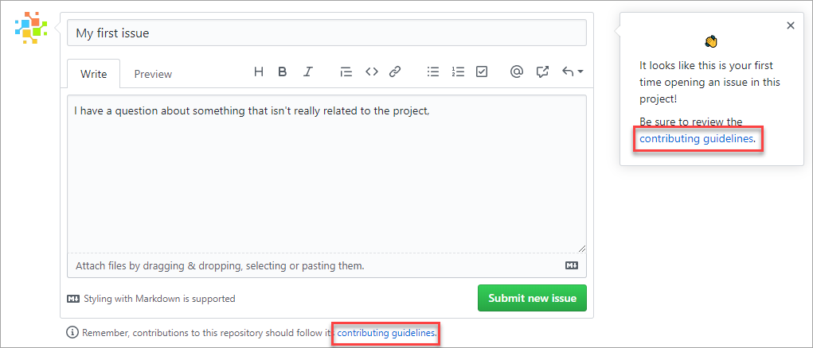
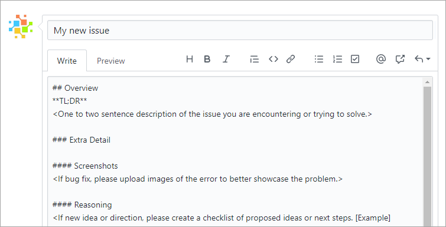

Here, we discuss how you can design an InnerSource program to enjoy the best of open-source patterns within any software development organization.

## What is InnerSource?

**InnerSource** is the practice of applying open-source patterns to projects with a limited audience. For example, a company may establish an InnerSource program that mirrors the structure of a typical open-source project, except that it's only accessible to the employees of that company. In effect, it's an open-source program behind your company's firewall.

### InnerSource benefits

An InnerSource program can offer numerous benefits beyond what traditional closed-source models provide.

First, they *encourage transparency*. Access to the source code of other company projects can help developers be more productive when working on their own projects. They can see how different teams solved problems similar to the ones they're facing, and often find code and other assets that they can reuse. Access to team issues, pull requests, and project plans also provide better data for them to understand the velocity and direction of the project.

Next, they *reduce friction*. If a consumer team is dependent on a bug fix or new feature for a project owned by a different team, they have a channel through which they can propose the changes they need. And if those changes can't be merged in for any reason, the consumer team has the option of forking the project to meet their needs.

Finally, they *standardize practices*. A common challenge development organizations face is that different teams often diverge in the ways they operate. Building an InnerSource program is a great opportunity to adopt standard conventions that can be used across every development team, even if they don't follow identical practices. For example, two teams may prefer different processes for accepting contributions. Having them standardize on the way they communicate their different processes makes it much easier for anyone to contribute to either. 

These examples are just a few of the benefits enjoyed by InnerSource programs. To learn more, see [An introduction to InnerSource](https://resources.github.com/whitepapers/introduction-to-innersource/?azure-portal=true).

## Set up an InnerSource program on GitHub

### Set repository visibility and permissions

You can configure GitHub repositories with three levels of visibility. Users who don't meet the visibility requirement see "not found" pages when they try to access your repository. The levels are:

- **Public** repositories are visible to everyone. Use this visibility for projects that are truly open source and offer access to people inside and outside of your organization.
- **Internal** repositories are only visible to members of the organization that owns them. Use this visibility for InnerSource projects.
- **Private** repositories are only visible to the owner and any teams or individuals they add. Use this visibility for projects that only specific users and groups should have access to.

Once you've established repository visibility, you can configure permissions on an individual or team basis. There are five permission levels:

- **Read** level is recommended for non-code contributors who want to view or discuss the project.
- **Triage** level is recommended for contributors who need to proactively manage issues and pull requests without write access.
- **Write** level is recommended for contributors who actively push to the project.
- **Maintain** level is recommended for project managers who need to manage the repository without access to sensitive or destructive actions.
- **Admin** level is recommended for people who need full access to the project, including sensitive and destructive actions like managing security or deleting a repository.

Learn more about [repository access permissions by level](https://help.github.com/github/setting-up-and-managing-organizations-and-teams/repository-permission-levels-for-an-organization?azure-portal=true).

### Create discoverable repositories

As an InnerSource program grows, the number of repositories likely scales up significantly. While it's great to have all these assets available to the organization, it can become a challenge to efficiently find content. To proactively address this issue, it's a best practice for teams to consider what they can do to make it easier for others to find and work with their repositories.

A few best practices include:

- Use a descriptive repository name, such as `warehouse-api` or `supply-chain-web`.
- Include a concise description. A sentence or two should be enough for potential users to know if the project might fit their needs.
- Include a `README.md` file in the root of the repository. GitHub uses this file as the landing page when people visit the repository.
	- Articulate the purpose and vision of the project so potential consumers understand whether it fits their needs.
	- Offer visual aids, such as screenshots or code samples, to illustrate the project in action.
	- Include a link to a production or demo version of the app for review.
	- Set expectations for prerequisites and deployment procedures. If the project has disqualifying prerequisites, then let potential users know early.
	- Include references to projects on which you depend. Visitors might only need to use one of the projects you depend on to meet their needs, which saves everyone time. It's also a good way to promote the work of others.
	- Make use of Markdown to guide readers through properly formatted content.

Check out some [Awesome README examples](https://github.com/matiassingers/awesome-readme?azure-portal=true).

Once the project has launched, use email and other networking channels to promote it. Reaching an appropriate audience could produce a significant boost in project participation.

### Manage projects on GitHub

As projects gain traction, the influx of users and contributions can require lots of work to manage. Depending on the project, a significant amount of work may be required just to manage the expectations of project participants.

To proactively address this issue, GitHub looks for a `CONTRIBUTING.md` file in the root (or `/docs` or `/.github`) of a repository. Use this file to explain the contribution policy for the project. The exact details might vary, but it's a good idea to let potential contributors know what conventions the project follows, where the team is looking for pull requests, what details are requested for bug reports, and so on.

If a `CONTRIBUTING.md` exists, GitHub presents a link to it when users create issues or pull requests to encourage them to follow it.

Check out some [Awesome CONTRIBUTING.md examples](https://github.com/mntnr/awesome-contributing?azure-portal=true)

### Create issue and pull request templates

GitHub supports starter templates for new issues and pull requests. Use these to provide the initial description text for a newly created issue or pull request.

For example, if your project has `.github/ISSUE_TEMPLATE.md`, anytime a user starts the process of creating an issue, they see this content. Rather than having to constantly reference the required details from a `CONTRIBUTING.md`, they are able to just fill out the issue like a form using the template text.

It's the same for pull requests, except that the path is `.github/PULL_REQUEST_TEMPLATE.md`.

Check out some [Awesome GitHub issue & pull request templates](https://github.com/devspace/awesome-github-templates?azure-portal=true).

### Define workflows

For projects that encourage external contributions, be sure to specify what workflow the project follows. The workflow should include details about where and how branches should be used for bugs and features, how pull requests should be opened, and any other details people outside the repository team should know before they push code. If you don't yet have a workflow in mind, you should consider [the GitHub flow](https://guides.github.com/introduction/flow/?azure-portal=true).

You should communicate a strategy for managing releases and deployments. These parts of the workflow affect day-to-day branching and merging, so it's important to communicate them to contributors. Learn more about how they relate to your [Git branching strategy](/azure/devops/repos/git/git-branching-guidance?azure-portal=true).

### Measuring program success

Any team venturing into InnerSource should think about the kinds of metrics they want to track to gauge the success of their program. While traditional metrics like "time to market" and "bugs reported" are still applicable, they aren't necessarily going to illustrate the benefits achieved through InnerSource.

Instead, consider adding metrics that show how external participation has improved project quality. Is the repository receiving pull requests from external sources that fix bugs and add features? Are there active participants in discussions around the project and its future? Is the program inspiring an InnerSource expansion that drives benefits elsewhere in the organization?

In short, metrics are hard, especially when it comes to measuring the value and effect of individual and team contributions. If misused, metrics can harm the culture, existing processes, and diminish the collective sentiment towards the organization or leadership team. When thinking about measuring InnerSource adoption, consider the following:

- Measure process, not output
  - Code review turnaround time
  - Pull request size
  - Work in progress
  - Time to open
- Measure against targets and not absolutes
- Measure teams and not individuals
  - Number of unique contributors to a project
  - Number of projects reusing code
  - Number of cross-team @mentions

Learn about the successes others have enjoyed in these [InnerSource case studies](https://gist.github.com/githubteacher/9fe53687a5f173d1d64c24c68625349e?azure-portal=true).
