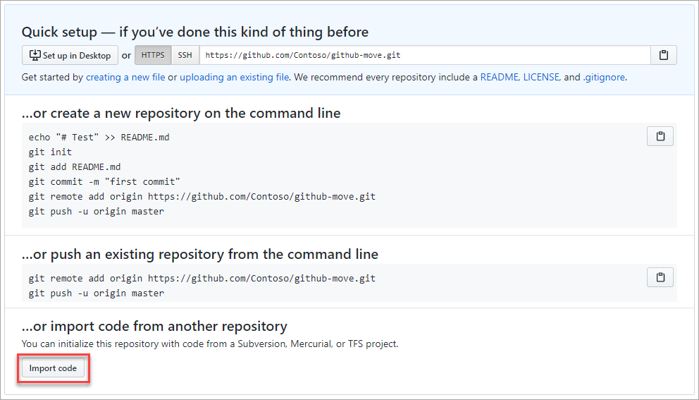
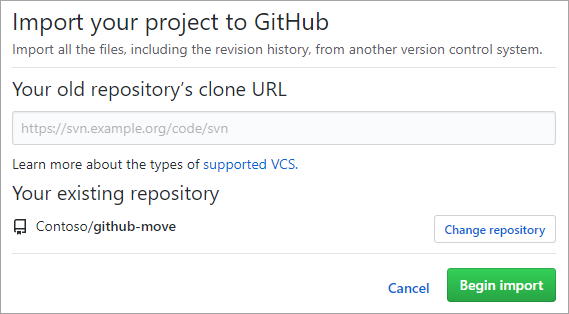

Here, we'll discuss the important considerations for migrating a project to GitHub from a legacy version-control system. 

## Why migrate to GitHub?

There are volumes of literature extolling the virtues of GitHub. It's beyond the scope of this module to convince you to move, but we can recap some of the key benefits within the context of topics you'll need to consider when planning your migration.

### Version control

GitHub exclusively uses **Git**, arguably the best version-control system around. However, Git is incredibly sophisticated and can present some complex scenarios for working with code with which your team might not be experienced. *Branches* and *pull requests* are a fundamental part of day-to-day life for developers using Git, so understanding when and how to use them effectively is necessary to being successful on GitHub. It's worthwhile for your team to first become familiar with [the GitHub flow](https://guides.github.com/introduction/flow/?azure-portal=true) so you can hit the ground running.

### Keep your code in the cloud

A large amount of project code is still stored in legacy version-control systems behind corporate firewalls. When you migrate to GitHub, you're moving your code to GitHub's cloud platform, where team members can easily access it from anywhere. This migration offers a good opportunity to review your team's policy for the kinds of files and data you keep in version control. As a best practice, you should assume that anything you commit to GitHub has been compromised, so be sure not to include sensitive data such as API keys, passwords, or other files containing comparable information.

> [!NOTE]
> GitHub offers both public and private repositories, as well as granular access controls for different parts of a repository. This lets you control to whom your projects are visible, as well as what actions a given user can perform.

### Collaboration

GitHub offers excellent support for team collaboration through features like issues, pull requests, and code reviews. However, the GitHub flow might differ from the practices to which your team is currently accustomed. It's a good idea to consider whether the team will adapt to GitHub, retain its given process, or meet somewhere in the middle before completing the migration.

If your project is an open-source project that allows outside contributors, there's no better option than GitHub for maximizing the benefits.

## Migrating to GitHub

### Planning considerations

The most important consideration before executing your migration to GitHub is whether you need to retain anything beyond the current state of your source. If you're satisfied with starting a new project with just your current source as-is, your best option is to treat it like a new project and upload the source to your repository.

However, if you want to retain version-control history, you'll need to import using the **GitHub Migrator tool**. For more information about the import support for different version-control platforms, check out [Importing data from third-party version control systems](https://docs.github.com/enterprise-server@3.7/admin/user-management/migrating-data-to-and-from-your-enterprise/importing-data-from-third-party-version-control-systems).

Beyond Git data, you might also want to retain issues, pull requests, or other data. Support for these items varies by platform, and is generally available from community projects. This module doesn't cover migrating non-Git data.

### Handling binary files currently stored in your project

As a best practice, GitHub repositories should be limited to the files necessary for building projects. Avoid committing large binary files such as build artifacts. Binary files like spreadsheets and presentations are better suited to be tracked on portals that understand how to serve and version them properly. If you need to version large binary files, consider using the [Git LFS](https://git-lfs.github.com/?azure-portal=true) (Large File Storage) Git extension.

### Creating important Git files like .gitignore

Git supports `.gitignore` files to help enforce version-control file policies. These files define the search patterns used to exclude files and folders from source-control tracking. The following simple example recursively excludes **any** folders called *Bin* or *bin*, as well as their contents, from source-control tracking:

```.gitignore
[Bb]in/
```

You can learn more about [Ignoring files](https://docs.github.com/get-started/getting-started-with-git/ignoring-files). You can also check out the collection of starter `.gitignore` files offered for various platforms in the [gitignore repository](https://github.com/github/gitignore?azure-portal=true).

There are several other files commonly used in GitHub projects to explain different policies to repository consumers and contributors. Even if your project is private and restricted to a limited audience, it can still be useful to explicitly articulate these policies. While none of these files are required, we've listed a few of the common ones here.

|File|Purpose|
|---|----|
|`README.md`|The landing page for the directory. This page is rendered when its directory is viewed on GitHub.|
|`LICENSE.md`|The license under which the code is provided.|
|`CONTRIBUTING.md`|Explains how users should contribute to the project, such as pull-request expectations.|
|`SECURITY.md`|Explains the security policy for the project, and provides guidance to users wanting to submit sensitive security-related code or feedback that should not be publicly disclosed before it's addressed.|

Learn more about [Setting up your project for healthy contributions](https://docs.github.com/communities/setting-up-your-project-for-healthy-contributions).

### Importing your project to GitHub

Once you've prepared your repository for migration, navigate to the **Code** tab of your GitHub repository. Use the **Import code** option to specify the source repository.



The **GitHub Migrator tool** will take care of the rest.


