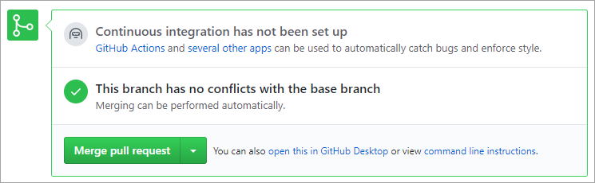
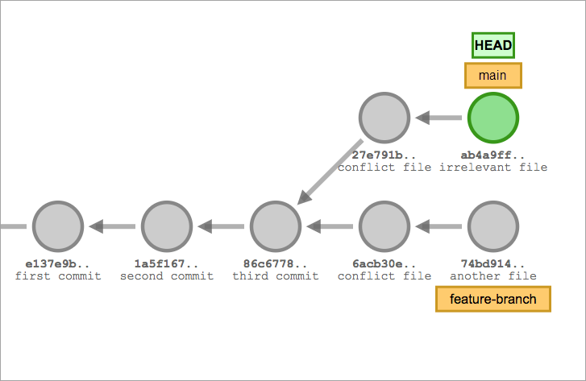
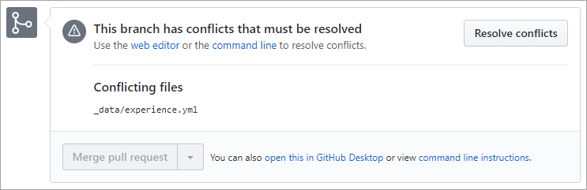

Here, we'll discuss how merge-conflict resolution helps developers produce the best result from two overlapping sources.

## The GitHub Flow

In addition to providing a platform for collaborative software development, GitHub also offers a prescribed workflow designed to optimize use of its various features. While this unit specifically covers merge conflicts, we recommend that you first review [Understanding the GitHub flow](https://guides.github.com/introduction/flow/?azure-portal=true).

## Merging branches

Consider a scenario where a developer creates a branch named `feature-branch` based off `main` and creates two commits. As this work is happening, someone else merges an unrelated pull request into `main`. What happens when our developer tries to merge `feature-branch` back in to `main`?

The answer: *it depends*.

Although `feature-branch` was created from `main`, it wasn't actually based on the branch itself. Rather, it was based on the *HEAD commit* of `main` at the time. It's not aware of all of the commits that have been applied to `main` since then. The commits it's currently tracking won't necessarily fold into the current state of the branch without overwriting recent changes.

If it turns out that the `feature-branch` commits don't overlap with parallel commits made to `main` since the branch was created, then there will be no problems. New files can be added. Untouched files can be deleted. Lines of code that were changed in `main` can be changed in `feature-branch` as long as the parallel work didn't change them since `feature-branch` was created.

But what if both sets of commits include changes to the same lines of code? This merge attempt would fail due to a **merge conflict**.

## What are merge conflicts?

Merge conflicts are raised when a developer attempts to merge changes that would inadvertently overwrite parallel changes. It doesn't matter how those other changes were merged into the base branch. Git won't automatically overwrite one set of changes in favor of another. Instead, it will point them out to the person trying to merge so that they can resolve them on their compare branch before trying to merge again.

### Resolving merge conflicts

To help you resolve merge conflicts, GitHub generates a temporary hybrid file that includes the differences from each branch. The convention is that the text from compare branch is shown above the base branch, separated by a line of equal signs (`=======`). 

You can use this view to directly edit the file if the changes are minor. If you decide to keep the final result, it will be committed to the compare branch. Alternatively, if the merge is more involved, you may prefer to work on it using other development tools. **Either way, don't forget to remove any branch markers from your code before committing**. If you forget to remove these markers when you commit your conflict resolution, they'll remain in the file and won't be commented out.

> [!NOTE]
> This unit discusses resolving merge conflicts within the context of a browser. There are also many development platforms, like [Visual Studio](https://visualstudio.microsoft.com/?azure-portal=true), that offer integrated merge conflict resolution experiences.

Once all of the merge conflicts have been resolved on your branch, you can retry the merge.

## Avoiding merge conflicts

Certain merge conflicts are unavoidable. Any merge could potentially produce merge conflicts for other pull requests waiting to be approved. However, one effective way to reduce the complexity of merge conflicts is to **pull** your branch often.

### Pull early and often

The `git pull` command pulls down any base branch commits that have not yet been applied to your current branch. It's conceptually similar to the **Get Latest** command that many version-control systems use to allow you to update your local code to the latest version. When you pull updates for your branch, you're merging down all of the changes that have happened since the branch was created (or last pulled).

Pulling updates to your branch may result in merge conflicts, but that's okay. You would have gotten them later on anyway, and by getting them earlier, they're usually easier to address.

In addition to mitigating the impact of merge conflicts, pulling updates also allows you to integrate committed changes into your branch as you work. Doing so allows you to head off potential problems earlier. For example, there may be class-definition changes in other files that will cause your code to no longer compile. This wouldn't have caused a merge conflict when you merged later on, but it would've broken the build if you didn't test first. It's a best practice to pull updates often to keep your branch as close to its base as possible.

### Tidying history with git rebase

The `git rebase` (or `git pull --rebase`) command rewrites your branch history to use the current HEAD commit of the base branch as its base. In other words, it updates your branch to behave as though it were only branched from the current state of the base branch. This means that all of your changes will be compared to the latest state of the base branch, and not the original commit you had originally branched from. This can make history much easier to track after your eventual merge, because your commits will follow the previous parallel commits in a linear fashion. It's a good practice to rebase your branch immediately prior to merging upstream.

Learn more [about Git rebase](https://docs.github.com/get-started/using-git/about-git-rebase) and [resolving merge conflicts after a Git rebase](https://docs.github.com/get-started/using-git/resolving-merge-conflicts-after-a-git-rebase).