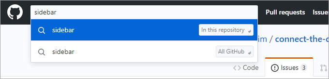
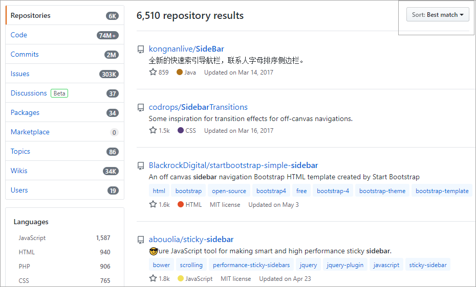
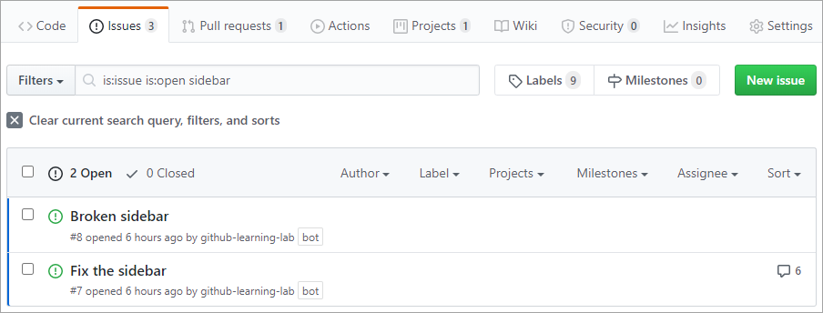
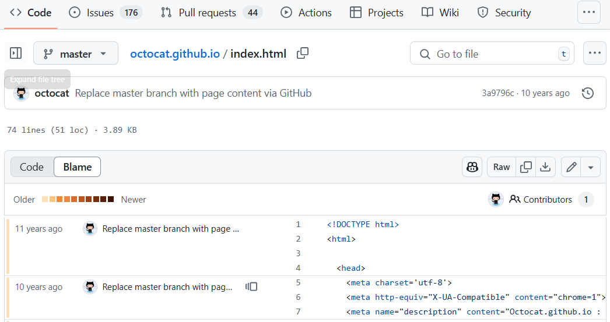
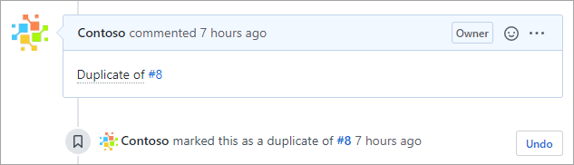
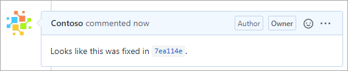

Here, we discuss how you can use filters, blame, and cross-linking to to search and organize repository history.

Put yourself in the position of a developer who has just joined a large project. Someone just posted a new issue reporting a bug related to the web app's sidebar, and you've been assigned to fix it. You've already read through the report a few times and understand the problem being described, so now you need to figure out how to get started with the fix.

As a new team member, you are not yet familiar with the codebase. You also haven't been part of the planning discussions, code reviews, or anything else that would provide you the context you need to start implementation. You'll first need to acquire that background knowledge to best determine the right fix. 

## Searching GitHub

Although you weren't around for the events that led to the sidebar's implementation, many of those events live on in the project's history. Searching the project's repository for "sidebar" will give you a starting point.

There are two search methods available on GitHub: the global search at the top of the page and the scoped search available on certain repository tabs. They support the same syntax and function in the same way, with some key differences.

### Global search

The global search enables you to use [the complete search syntax](https://help.github.com/github/searching-for-information-on-github/searching-on-github?azure-portal=true) to search across all of GitHub.

The search results are comprehensive, and include everything from code to issues to the Marketplace and even users. This is the best way to find mentions of key terms across multiple result types and repositories.  

> [!NOTE]
> The filter clause `is:pr` filters out issues returned from the issues/pull requests store. Some filter clauses, such as `is:pr`, are only supported by certain search providers and ignored by others. For example, the code search provider doesn't support that clause, so it will ignore it and return the same code results either way.

In our scenario, using the global search scoped to the current repository is a good way to find code and commits that mention the term "sidebar". You will also likely get hits for issues and pull requests, although they're not as easy to filter further in the global search results view.

To craft a complex global search, try the [advanced search](https://github.com/search/advanced?azure-portal=true).

### Context search

Context searches are available on certain tabs, such as **Issues** and **Pull requests**. These searches are scoped into the current repository and only return results of that type. The benefit to this scoping is that it allows the user interface to expose known type-specific filters, such as authors, labels, projects, and more.

Using the context search is the preferred option when you're looking for something in the current repository. In our scenario, this would be a good way to find search results mentioning "sidebar", which could then be easily refined using the filter dropdowns.

### Using search filters

There are an infinite number of ways to search using [the complete search syntax](https://help.github.com/github/searching-for-information-on-github/searching-on-github?azure-portal=true). However, most searches only make use of a few common filters. While these are often available from context search dropdowns, it's sometimes more convenient to type them in directly.

Here are some example filter queries:

Query|Explanation
-|-
`is:open is:issue assignee:@me`|Open issues assigned to the current user (`@me`)
`is:closed is:pr author:contoso`|Closed pull requests created by `@contoso`
`is:pr sidebar in:comments`|Pull requests where "sidebar" is mentioned in the comments
`is:open is:issue label:bug -linked:pr`|Open issues labeled as bugs that do not have a linked pull request

Learn more about [Understanding the search syntax](https://help.github.com/en/github/searching-for-information-on-github/understanding-the-search-syntax?azure-portal=true)

## What is git blame?

Despite its ominous name, `git blame` is a command that displays the commit history for a file. It makes it easy for you to see who made what changes and when. This makes it a lot easier to track down other people who have worked on a file in order to seek out their input or participation. 

> [!NOTE]
> Some Git systems alias `git praise` onto `git blame` to avoid the implication of judgment.

### Blame in GitHub

GitHub extends the basic `git blame` functionality with a more robust user interface.

In our scenario, there are a few ways you might get to this view. You might have found some sidebar code from the global search and selected the **Blame** option to see who had worked on it last. Or maybe you found a pull request and tracked that back to the last commit that seems related to the bug description. However you got here, the blame view is an effective way to locate a subject matter expert for the task at hand. 

## Cross-linking issues, commits, and more

Part of what makes GitHub great for collaborative software projects is its support for linking disparate pieces of information together. Some of this happens automatically, such as when you create a pull request from a series of commits on a branch. Other times, you can use the interface to manually link pull requests or projects to issues using the dropdown options.

### Autolinked references

To make it even easier to cross-link different items throughout your project, GitHub offers a shorthand syntax. For example, if you leave a comment like `Duplicate of #8`, GitHub will recognize that #8 is an issue and create the appropriate link for you.

GitHub also links commits for you if you paste in the first seven or more characters of its ID.

In our scenario, these links could prove very valuable for ramping up if someone thought ahead to leave the context. For example, the current state of the sidebar may have had some known issues related to a JavaScript dependency. If the issue with that dependency was discussed in another issue that didn't explicitly mention "sidebar", then it would be difficult to find. However, if someone had thought ahead to link the issue in the discussion, then it could save you a lot of time now. Keep that in mind the next time you're documenting issues and pull requests.

Learn more about [Autolinked references and URLs](https://help.github.com/en/github/writing-on-github/autolinked-references-and-urls?azure-portal=true).

### Looping in users with @mention

Besides linking issues and commits, it's often helpful to associate other people with discussions. The easiest way to do this is by using an `@mention`. This kind of mention notifies the mentioned user so that they can participate in the discussion. It's also a good way to identify people associated with issues long after they have been closed.

