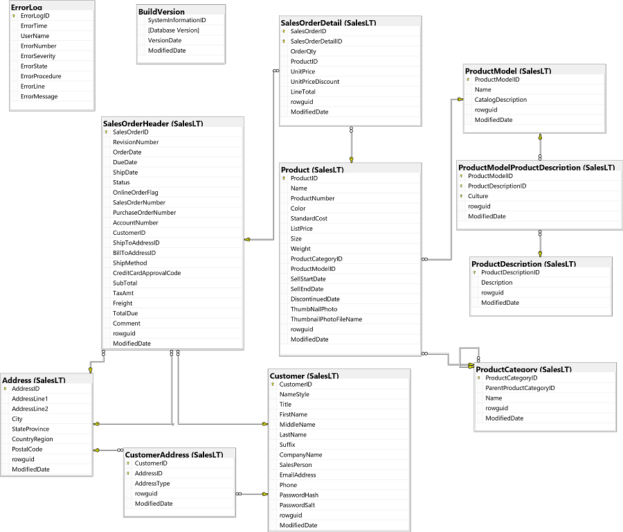

# Get Started with Transact-SQL
In this lab, you use some basic SELECT queries to retrieve data from the AdventureWorks database.

## Explore the AdventureWorks database
We use the AdventureWorks database in this lab, so let’s start by exploring it in Azure Data Studio.

1. Start Azure Data Studio, and in the Connections tab, select the AdventureWorks connection by clicking on the arrow just to the left of the name. This connects to the SQL Server instance and show the objects in the AdventureWorks database.
1. Expand the Tables folder to see the tables that are defined in the database. There are a few tables in the dbo schema, but most of the tables are defined in a schema named SalesLT.
1. Expand the SalesLT.Product table and then expand its Columns folder to see the columns in this table. Each column has a name, a data type, an indication of whether it can contain null values, and in some cases an indication that the columns are used as a primary key (PK) or foreign key (FK).
1. Right-click the SalesLT.Product table and use the SELECT TOP (1000) option to create and run a new query script that retrieves the first 1000 rows from the table.
1. Review the query results, which consist of 1000 rows - each row representing a product that is sold by the fictitious Adventure Works Cycles company.
1. Close the SQLQuery_1 pane that contains the query and its results.
1. Explore the other tables in the database, which contain information about product details, customers, and sales orders. The tables are related through primary and foreign keys, as shown here (you may need to resize the pane to see them clearly):



> [!NOTE]
> If you’re familiar with the standard AdventureWorks sample database, you may notice that in this lab we are using a simplified version that makes it easier to focus on learning Transact-SQL syntax.

## Use SELECT queries to retrieve data
Now that you’ve had a chance to explore the AdventureWorks database, it’s time to dig a little deeper into the product data it contains by querying the Product table.

1. In Azure Data Studio, create a new query (you can do this from the File menu or on the welcome page).
2. In the new SQLQuery_… pane, ensure that the AdventureWorks database is selected at the top of the query pane. If not, use the Connect button to connect the query to the AdventureWorks saved connection.
3. In the query editor, enter the following code:
```sql
 SELECT * FROM SalesLT.Product;
```
4. Use the ⏵Run button to run the query, and after a few seconds, review the results, which include all columns for all products.
5. In the query editor, modify the query as follows:
```sql
 SELECT Name, StandardCost, ListPrice
 FROM SalesLT.Product;
```
6. Use the ⏵Run button to rerun the query, and after a few seconds, review the results, which this time includes only the Name, StandardCost, and ListPrice columns for all products.
7. Modify the query as shown below to include an expression that results in a calculated column, and then rerun the query:
```sql
 SELECT Name, ListPrice - StandardCost
 FROM SalesLT.Product;
```
8. The results this time include the Name column and an unnamed column containing the result of subtracting the StandardCost from the ListPrice.
9. Modify the query as shown below to assign names to the columns in the results, and then rerun the query.
```sql
 SELECT Name AS ProductName, ListPrice - StandardCost AS Markup
 FROM SalesLT.Product;
```
10. The results now include columns named ProductName and Markup. The AS keyword has been used to assign an alias for each column in the results.
11. Replace the existing query with the following code, which also includes an expression that produces a calculated column in the results:
```sql
 SELECT ProductNumber, Color, Size, Color + ', ' + Size AS ProductDetails
 FROM SalesLT.Product;
```
12. Run the query, and note that the + operator in the calculated ProductDetails column is used to concatenate the Color and Size column values (with a literal comma between them). The behavior of this operator is determined by the data types of the columns - had they been numeric values, the + operator would have added them. Note also that some results are NULL - we explore NULL values later in this lab.

## Work with data types
As you just saw, columns in a table are defined as specific data types, which affect the operations you can perform on them.

1. Replace the existing query with the following code, and run it:
```sql
 SELECT ProductID + ': ' + Name AS ProductName
 FROM SalesLT.Product; 
```
2. This query returns an error. The + operator can be used to concatenate text-based values, or add numeric values; but in this case there’s one numeric value (ProductID) and one text-based value (Name), so it’s unclear how the operator should be applied.
3. Modify the query as follows, and rerun it:
```sql
 SELECT CAST(ProductID AS varchar(5)) + ': ' + Name AS ProductName
 FROM SalesLT.Product; 
```
4. Note that the effect of the CAST function is to change the numeric ProductID column into a varchar (variable-length character data) value that can be concatenated with other text-based values.
5. Modify the query to replace the CAST function with a CONVERT function as shown below, and then rerun it:
```sql
 SELECT CONVERT(varchar(5), ProductID) + ': ' + Name AS ProductName
 FROM SalesLT.Product; 
```
6. The results of using CONVERT are the same as for CAST. The CAST function is an ANSI standard part of the SQL language that is available in most database systems, while CONVERT is a SQL Server specific function.
7. The results of using CONVERT are the same as for CAST. The CAST function is an ANSI standard part of the SQL language that is available in most database systems, while CONVERT is a SQL Server specific function.
```sql
 SELECT SellStartDate,
    CONVERT(nvarchar(30), SellStartDate) AS ConvertedDate,
    CONVERT(nvarchar(30), SellStartDate, 126) AS ISO8601FormatDate
 FROM SalesLT.Product; 
```
8. Replace the existing query with the following code, and run it.
```sql
 SELECT Name, CAST(Size AS Integer) AS NumericSize
 FROM SalesLT.Product; 
```
9. An error is returned because some Size values aren't numeric (for example, some item sizes are indicated as S, M, or L).
10. Modify the query to use a TRY_CAST function, as shown here.
```sql
 SELECT Name, TRY_CAST(Size AS Integer) AS NumericSize
 FROM SalesLT.Product; 
```
11. Run the query and note that the numeric Size values are converted successfully to integers, but that non-numeric sizes are returned as NULL.
