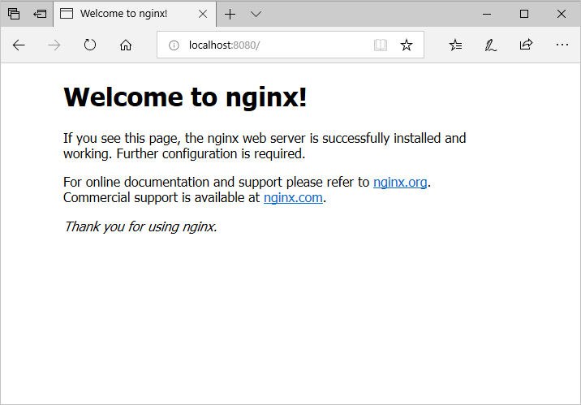

Now that you have a functioning container development environment, lets take a quick spin through some basic container operations. This is not a complete list Docker capabilities (not even close). This unit will prepare you to run, list, and delete containers. Throughout the remainder of this learning path, you will gain additional exposure to container operations.

## Run a basic container

Before digging into the details of running and managing containers, lets quickly see just how easy it is to run a hello world container. Create your first container with the following command.

```bash
docker run alpine echo "Hello World"
```
You should see output similar to the following.

```
Unable to find image 'alpine:latest' locally
latest: Pulling from library/alpine
8e3ba11ec2a2: Pull complete
Digest: sha256:7043076348bf5040220df6ad703798fd8593a0918d06d3ce30c6c93be117e430
Status: Downloaded newer image for alpine:latest
Hello World
```

The `docker run` command creates an instance of a container. In this case, the container was created from a container image named `alpine`, which was downloaded to your local system. Once the container started, the `echo "Hello World"` command was run inside of the container and the output echoed to your terminal. Once the `echo` process has completed, the container was stopped.

At this point, do not worry about the technical details of each of these actions, they will be detailed throughout this tutorial.

## Get container images

As was seen in the hello world example, containers are run from a container image. These images include the container base operating system and any additional processes, applications, and configurations. Container images are stored in a container image registry. In the case of the hello world example, the `alpine` image was auto-pulled from Docker Hub, which is a public container registry. Later on in this tutorial you will learn about Azure Container Registry (ACR) which is an Azure hosted, private container registry.

Lets see how to search for and download a pre-created container image.

Run the following command to see a list of images that have been downloaded to your system.

```bash
docker images
```

If you have been following along, you should see that alpine image. This image was auto-downloaed when the hello world example was run.

```bash
REPOSITORY          TAG                 IMAGE ID            CREATED             SIZE
alpine              latest              11cd0b38bc3c        2 weeks ago         4.41MB
```

To search for a container image, use the `docker search` command. For instance, use the following example to list all container images that include `nginx` in the name.

```bash
docker search nginx
```

The output should look similar to the following.

```
NAME                                                   DESCRIPTION                                     STARS               OFFICIAL            AUTOMATED
nginx                                                  Official build of Nginx.                        9071                [OK]
jwilder/nginx-proxy                                    Automated Nginx reverse proxy for docker con…   1365                                    [OK]
richarvey/nginx-php-fpm                                Container running Nginx + PHP-FPM capable of…   593                                     [OK]
jrcs/letsencrypt-nginx-proxy-companion                 LetsEncrypt container to use with nginx as p…   390                                     [OK]
kong                                                   Open-source Microservice & API Management la…   207                 [OK]
webdevops/php-nginx                                    Nginx with PHP-FPM                              106                                     [OK]
kitematic/hello-world-nginx                            A light-weight nginx container that demonstr…   102
zabbix/zabbix-web-nginx-mysql                          Zabbix frontend based on Nginx web-server wi…   60                                      [OK]
bitnami/nginx                                          Bitnami nginx Docker Image                      54                                      [OK]
1and1internet/ubuntu-16-nginx-php-phpmyadmin-mysql-5   ubuntu-16-nginx-php-phpmyadmin-mysql-5          38                                      [OK]
linuxserver/nginx                                      An Nginx container, brought to you by LinuxS…   37
tobi312/rpi-nginx                                      NGINX on Raspberry Pi / armhf                   20                                      [OK]
nginxdemos/nginx-ingress                               NGINX Ingress Controller for Kubernetes . Th…   11
blacklabelops/nginx                                    Dockerized Nginx Reverse Proxy Server.          10                                      [OK]
wodby/drupal-nginx                                     Nginx for Drupal container image                9                                       [OK]
webdevops/nginx                                        Nginx container                                 8                                       [OK]
nginxdemos/hello                                       NGINX webserver that serves a simple page co…   7                                       [OK]
centos/nginx-18-centos7                                Platform for running nginx 1.8 or building n…   6
1science/nginx                                         Nginx Docker images that include Consul Temp…   4                                       [OK]
centos/nginx-112-centos7                               Platform for running nginx 1.12 or building …   3
pebbletech/nginx-proxy                                 nginx-proxy sets up a container running ngin…   2                                       [OK]
travix/nginx                                           NGinx reverse proxy                             1                                       [OK]
toccoag/openshift-nginx                                Nginx reverse proxy for Nice running on same…   1                                       [OK]
ansibleplaybookbundle/nginx-apb                        An APB to deploy NGINX                          0                                       [OK]
mailu/nginx                                            Mailu nginx frontend                            0                                       [OK]
```

If you would like to pre-download an image prior to running it, use the `docker pull` command. The following example pulls the `nginx` image to your system.

```bash
docker pull nginx
```

The output should look similar to the following.

```
Using default tag: latest
latest: Pulling from library/nginx
be8881be8156: Pull complete
f2f27ed9664f: Extracting [===============>                                   ]  6.652MB/22.14MB
54ff137eb1b2: Download complete
```

Run `docker images` again to list all images on your system. You should see now see that the `nginx` image has been added to your system.

```bash
docker images
```

The output should look similar to the following.

```
REPOSITORY          TAG                 IMAGE ID            CREATED             SIZE
nginx               latest              c82521676580        26 hours ago        109MB
alpine              latest              11cd0b38bc3c        2 weeks ago         4.41MB
```

## Run containers

Now that you have identified and downloaded the `nginx` image, run a container from the image. When using the Docker CLI to run container image, use the `docker run` command.

In the following example, the `-d` argument specifies that the container will in a detached mode. In this configuration, the container runs a specified process. If that process stops or crashes, the container itself is stopped. The `-p 8080:80` argument species that network traffic arriving to port 8080 on the container host, your development system in this case, is forwarded to port 80 if the container. Finally, the `ngingx` argument is the name of the container image to be run.

For a complete list of docker run arguments, see the [docker run reference](https://docs.docker.com/engine/reference/run/).

```bash
docker run -d -p 8080:80 nginx
```

This operation returns the fill container ID.

```bash
bd2424bfe7a5423d7d65efdf0b1622770d59e212db7b82862c3129fb630b5721
```

List the running containers on your system using the `dokcer ps` command.

```bash
docker ps
```

You should see a single running container, which is the NGINX container that was run in the last step. Notice that the container has both an ID and a Name. Either one of these values can be used to manage the container. Take note of the container ID, this value will be used later in the unit.

```bash
CONTAINER ID        IMAGE               COMMAND                  CREATED             STATUS              PORTS                  NAMES
bd2424bfe7a5        nginx               "nginx -g 'daemon of…"   37 minutes ago      Up 37 minutes       0.0.0.0:8080->80/tcp   gallant_engelbart
```

To test the container, open up an internet browser and enter http://localhost:8080 for the address. Once completed, you should see the NGINX default website.



## Delete containers

When you are done working with a container, it can be delete by providing the container name or ID to the `docker rm` command. Try this out with the container ID of the container running NGINX.

```bash
docker rm bd2424bfe7a5
```

Notice that the container cannot be removed because it is in a running state. Replace the ID in this example with the ID from your environment.

```bash
Error response from daemon: You cannot remove a running container a31c5a5f2a8d6e420435bfcadbe158fa6a26ed29c005a892171505cc0c2861b2. Stop the container before attempting removal or force remove
```

Stop the container with the `docker stop` command.

```bash
docker stop <container name or id>
```

Notice at this point, if you run `docker ps` to list all containers, that the nginx container is not listed.

```bash
docker ps
```

The output should look similar to the following.

```bash
CONTAINER ID        IMAGE               COMMAND             CREATED             STATUS              PORTS               NAMES
```

To return a list of all containers including those is a stopped state, add the `-a` argument to `docker ps`.

```bash
$ docker ps -a
```

The output should look similar to the following.

```bash
CONTAINER ID        IMAGE               COMMAND                  CREATED             STATUS                     PORTS               NAMES
bd2424bfe7a5        nginx               "nginx -g 'daemon of…"   13 seconds ago      Exited (0) 3 seconds ago                       focused_spence
```

Now try the delete operation once again. Replace the ID in this example with the ID from your environment.

```bash
$ docker rm bd2424bfe7a5
```

This operation returns the container ID.

```bash
bd2424bfe7a5
```

## Delete container image

When you are done working with a container image, it can be remove with the `docker rmi` command. If any container (running or stopped) has been started from the container image, the image cannot be deleted. The containers need to first be removed. Adding the `-f` argument to the `docker rmi` command will force the removal of all associated containers, and then will remove the container image.

Remove the NGINX container image with the following command.

```bash
docker rmi nginx
```

The output should look similar to the following.

```bash
Untagged: nginx:latest
Untagged: nginx@sha256:4a5573037f358b6cdfa2f3e8a9c33a5cf11bcd1675ca72ca76fbe5bd77d0d682
Deleted: sha256:8b89e48b5f157d9455c963b57c85d21e2337c58b8c983bc06f88476610adc129
Deleted: sha256:119ded3eca5e85ef43ee966e74564c604ccda064d955a8c5ed762e1d5e87f428
Deleted: sha256:6ece91c2763d826487e707f7b8ec063742ad0ee56cc9e605465cce95550c9a7f
Deleted: sha256:cdb3f9544e4c61d45da1ea44f7d92386639a052c620d1550376f22f5b46981af
```
