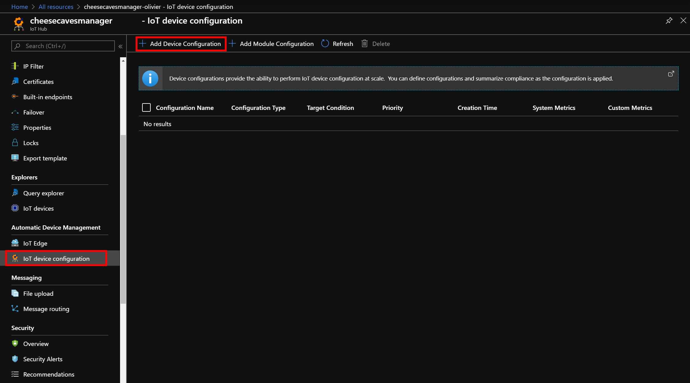
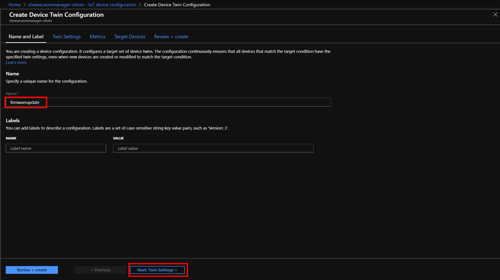
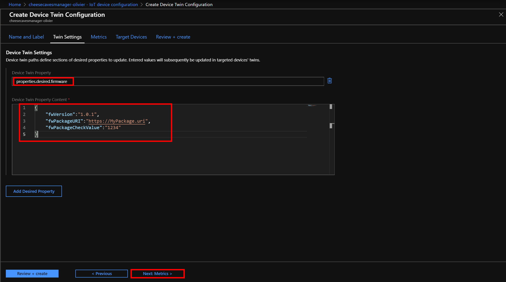
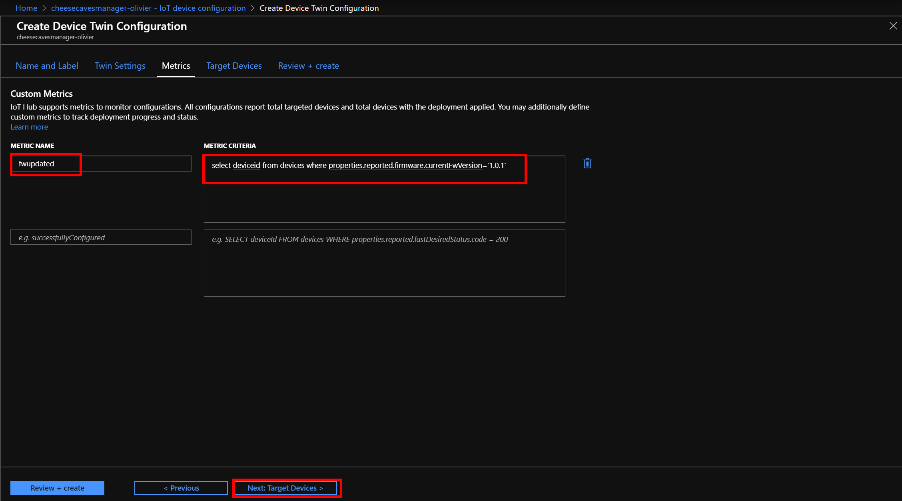
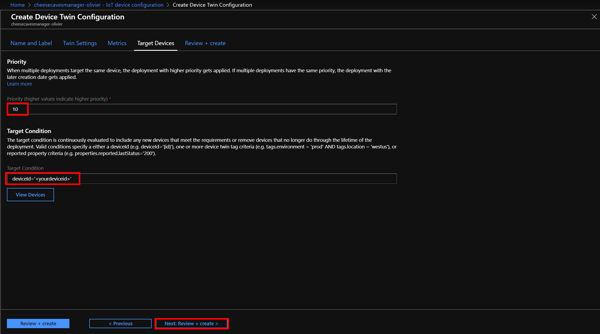
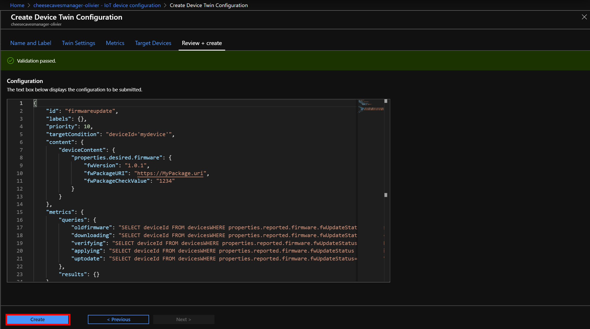
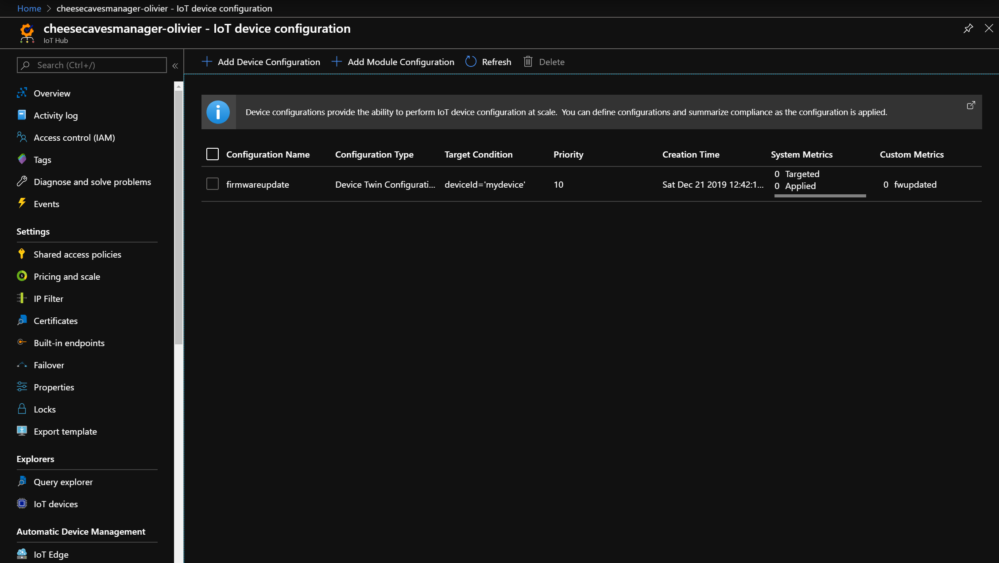
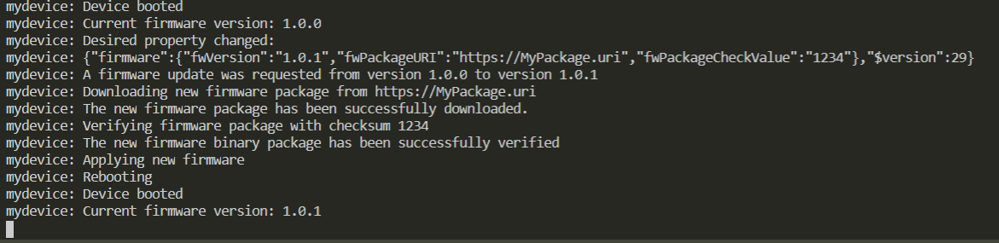
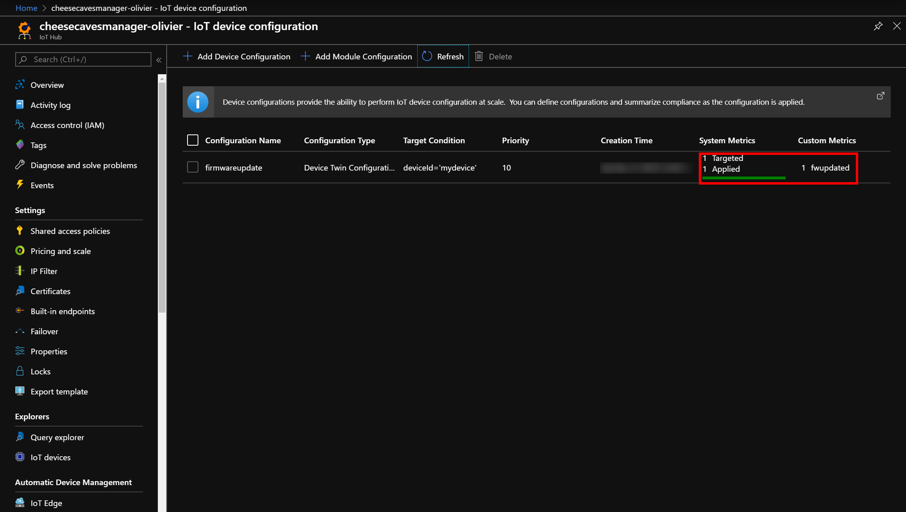

In this unit, we'll use the Azure portal to create a new device management configuration, and apply it to our single simulated device.

## Start the simulator

In Azure Cloud Shell, from the same folder you created the device simulator project, start the simulator by running the following command (replacing **\<device connection string\>** with the connection string you got at the end of unit 2):

> [!NOTE]
> In the following instructions, and in the next units of this module, you'll have to run long and customized commands. We recommend that you use a text editor to prepare your commands, replacing the placeholders with your own names and keys, and then copy paste from there to Cloud Shell.

```bash
dotnet run "<device connection string>"
```

You should see the following output in the terminal (where "mydevice" is the device ID you used when creating the device identity):

```bash
mydevice: Device booted
mydevice: Current firmware version: 1.0.0
```

## Create the device management configuration

1. Sign in to the [Azure portal](https://portal.azure.com/learn.docs.microsoft.com?azure-portal=true).

1. Go to the IoT Hub page. To find your IoT Hub, in the top search bar, enter the name you used when creating it in unit 2.

1. In the IoT Hub, find the *Automatic Device Management* page, and select **IoT Device Configuration**, then select **Add Device Configuration**.

    [  ](../media/device-management-1.png#lightbox)

1. Enter an ID for the configuration, such as *firmwareupdate*, then select on **Next: Twins settings**.

    [  ](../media/device-management-2.png#lightbox)

1. For the **Device Twin Property** field, enter the following code. To define a desired property, you need to prefix the value in the field with *properties.desired*. You can also add several desired properties, but in our case, we'll only add one.

    ```json
    properties.desired.firmware
    ```

1. In the **Device Twin Property Content** field, enter the following code, and then select **Next: Metrics**.

    ```json
    {
        "fwVersion":"1.0.1",
        "fwPackageURI":"https://MyPackage.uri",
        "fwPackageCheckValue":"1234"
    }
    ```

    [  ](../media/device-management-3.png#lightbox)

1. In the **Metrics** section, we'll define a custom metric to track that the firmware update was effective. Create a new custom metric, called *fwupdated*, enter the following criteria, and then select **Next: Target devices**.

    ```SQL
        SELECT deviceId FROM devices
           WHERE properties.reported.firmware.currentFwVersion='1.0.1'
    ```

    [  ](../media/device-management-4.png#lightbox)

1. In the **Priority** field, enter *10*, and in the **Target Condition** field, enter the following query, replacing "\<your device id\>" with the device ID you used to create the device in unit 2, and then select **Next: Review + Create**. (Valid conditions include specifying either a deviceId (for example, deviceId='{id}'), one or more device twin tag criteria (for example, tags.environment = 'prod' AND tags.location = 'westus'), or reported property criteria)

    ```SQL
        deviceId='<your device id>'
    ```

    [  ](../media/device-management-5.png#lightbox)

1. On the next page, you should see the validation succeed for your new configuration. Select **Create**.

    [  ](../media/device-management-6.png#lightbox)

1. After the configuration has been created, you'll see it in the automatic device management page:

    [  ](../media/device-management-7.png#lightbox)

## See the magic happen

IoT Hub will now look for devices matching the configuration's target devices criteria, and will apply the firmware update configuration automatically.

In Cloud Shell that you started the device on, you should see the following traces indicating the progress of the firmware update process on the device itself:

[  ](../media/simulated-device-1.png#lightbox)

On the **Device Management Configuration**, you should see:

[  ](../media/device-management-8.png#lightbox)

You have validated that the firmware update process on your simulated device works. You can stop the device simulator by entering *q*, and pressing <kbd>Enter</kbd> in the terminal.
