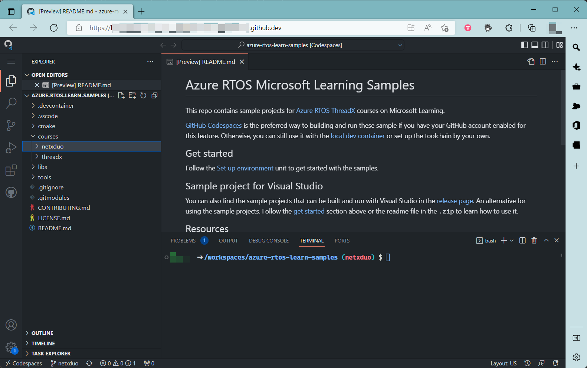

## Learning objectives

In this module, you will:

- Learn the overview of how TCP/IP works
- Learn the difference between IPv4 and IPv6
- Learn the purpose and structure of packet pools
- Learn about the general template of a NetX Duo project
- Learn how to create an IP instance
- Learn how to enable Address Resolution Protocol (ARP)
- Learn how to enable Internet Control Message Protocol (ICMP)
- Learn how to make ping requests

## Prerequisite

Completion of the Introduction to Azure RTOS NetX Duo module.

## Set up environment

This unit provides instructions for how to set up your development environment so that you can complete the exercises in this learning path. We provide GitHub Codespaces for setting up your environment. Use [GitHub Codespaces](https://github.com/features/codespaces) for projects in this learning path.

Codespaces is the preferred environment because you won't need to install the toolchain on your PC. Here is how you get started with Codespaces:

1. Fork the [azure-rtos-learn-samples](https://github.com/Azure-Samples/azure-rtos-learn-samples) GitHub repo to your own GitHub account. Codespaces requires read/write access which is why a fork is necessary.

1. From the forked repo page, create a new codespace. Wait until the codespace is set up.

1. The VSCode web opens and you can see the projects in the Explorer view under `courses/netx`. We will give you additional instructions in the module where you will build and run your first NetX project.

   > [!TIP]
   > If you are using macOS or Linux and do not have the access to Codespaces in GitHub, then you can use [local devcontainer](https://code.visualstudio.com/docs/remote/containers) with the same repo.

   

1. Follow the Build and debug unit in each module for detailed steps.
