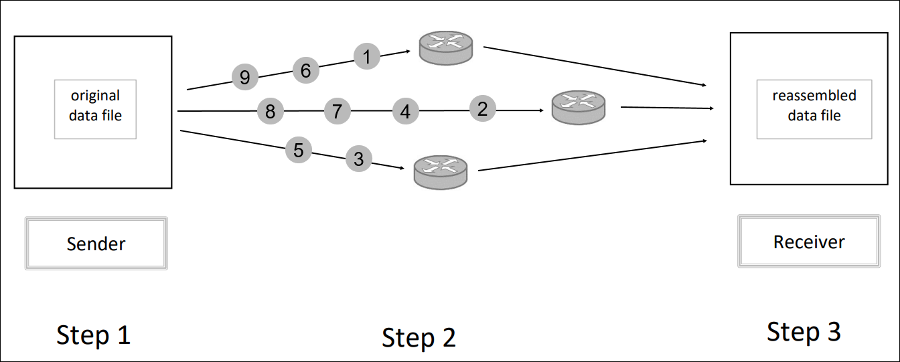
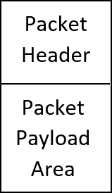

## Overview of how TCP/IP works

Sharing information over the Internet is a straightforward, but somewhat complex process. We use the layers of the TCP/IP model to perform the transmission of data over the Internet. In order to provide you with an overview of this process, consider the following simplified diagram of the TCP/IP model. In this diagram, we have three routers that analyze and forward the data packets until they reach their destination.

There are three main steps illustrated in this diagram. In Step 1, the amount of data to be sent may be quite large so it is divided into numbered fixed-size pieces called data packets. Each data packet contains its order number, the destination address, and other data. In Step 2, the data packets are sent using Internet protocol. The data packets may take different paths and may not be in any order as they are sent. In Step 3, the data packets are reassembled into one data file according to their numbering sequence. The receiver acknowledges the receipt of the data packets, and if any are missing, it requests that they be re-sent.

### IPv4 and IPv6

NetX Duo supports both IPv4 and IPv6. Internet Protocol version 4 (IPv4) is the fourth version of the Internet Protocol (IP). It was initially deployed in 1982, and it is currently the most commonly used protocol for packet-switched networks. IPv4 uses a 32-bit address space that provides 4,294,967,296 (232) unique addresses.

Internet Protocol version 6 (IPv6) is the sixth and most recent version of the Internet Protocol (IP). It was deployed in 1998 and provides several improvements over IPv4. IPv6 uses 128-bit addresses, therefore permitting up to 2128, or approximately 3.4×1038 total addresses.

### Packet pools

Allocating data packets in a fast and deterministic manner is essential in real-time networking applications. NetX Duo provides the ability to create and manage multiple pools of fixed-size network data packets. Packet pools are created either during initialization or during runtime by application threads. There is no limit on the number of packet pools in a NetX Duo application.

A packet pool is created with the `nx_packet_pool_create(…)` service. The following table illustrates the parameters for this service.

| Parameter                | Description                   |
| ------------------------ | ----------------------------- |
| `&my_packet_pool`        | Pointer to control block      |
| `"My Pool"`              | User name for packet pool     |
| `PAYLOAD_SIZE`           | Size of the payload           |
| `packet_pool_memory_ptr` | Pointer to packet pool memory |
| `PACKET_POOL_SIZE`       | Total size of the packet pool |

If **N = number** of packets desired, then
total size of packet pool memory = **N \* (PAYLOAD_SIZE + sizeof(NX_PACKET))**

For a complete list of packet management services in the NetX Duo User Guide, click on the following link: [https://learn.microsoft.com/azure/rtos/netx-duo/appendix-a#packet-management](/azure/rtos/netx-duo/appendix-a#packet-management)

The following image illustrates the structure of one packet header and packet payload. Note that the packet header is placed in front of the packet payload.

## General Template

We’ll study the Hello World project in the next module, but first we need to introduce you to several important concepts that will be used. Following is a general template that illustrates the basic components of a NetX Duo project.

Each NetX Duo project will have this basic structure, regardless of its size or complexity. We’ll discuss each of these features so that our discussion of the Hello World project will be meaningful.

The service `nx_system_initialize` must be called before any other NetX Duo service is called. After `nx_system_initialize` returns, the system is ready to create packet pools and IP instances. Because creating an IP instance requires a default packet pool, at least one NetX Duo packet pool must exist prior to creating an IP instance. Creating packet pools and IP instances are allowed from the ThreadX initialization function `tx_application_define` and from application threads.

### IP instance

Each Net Duo project will have at least one IP instance as noted in the general template. Creating an IP instance is accomplished in two parts: The first part is done within the context of the caller, either from `tx_application_define` or from an application thread’s context. This includes setting up the IP data structure and creating various IP resources, including the internal IP thread. The second part is performed during the initial execution from the internal IP thread. This is where the network driver, supplied during the first part of IP creation, is first called. Calling the network driver from the internal IP thread enables the driver to perform I/O and suspend during its initialization processing. When the network driver returns from its initialization processing, the IP creation is complete.

The IP instance is created with the `nx_ip_create()` service. Following is an illustration of the parameters for this service.

| Parameter           | Description                             |
| ------------------- | --------------------------------------- |
| `&ip_ptr`           | Pointer to IP control block             |
| `"my IP name"`      | User defined name                       |
| `ip_address`        | Uniquely identifies each device         |
| `network_mask`      | Determine subnet of IP address          |
| `&packet_pool`      | Pointer to control block of packet pool |
| `ip_network_driver` | User-supplied network driver            |
| `stack_ptr`         | Pointer to thread stack                 |
| `stack_size`        | Helper thread stack size                |
| `priority`          | Helper thread priority                  |

For a complete list of Internet Protocol services in the NetX Duo User Guide, click on the following link: [https://learn.microsoft.com/azure/rtos/netx-duo/appendix-a#internet-protocol-ip](/azure/rtos/netx-duo/appendix-a#internet-protocol-ip)

Each IP instance needs a helper thread that must also be created. You’ll notice that several parameters of this service define several aspects of the helper thread, such as the thread stack and priority.

### Address Resolution Protocol (ARP)

The Address Resolution Protocol (ARP) is responsible for dynamically mapping 32-bit IPv4 addresses to those of the underlying physical media. Ethernet is the most typical physical media, and it supports 48-bit addresses. The need for ARP is determined by the network driver supplied to the `nx_ip_create` service. For ARP to function properly, it must first be enabled by the application with the `nx_arp_enable` service. This service sets up various data structures for ARP processing, including the creation of an ARP cache area. The ARP cache can be viewed as an array of internal ARP mapping data structures. Each internal structure is capable of maintaining the relationship between an IP address and a physical hardware address.

In summary, ARP is responsible for finding the hardware address of a host from a known IP address. Most computer programs/applications use a logical address (IP address) to send or receive messages, but the actual communication occurs with the physical address, namely, the Media Access Control (MAC) address. Thus, the purpose of ARP is to translate an IP address to a physical address.

Following is a table showing the parameters of the `nx_arp_enable` service.

| Parameter          | Description                                                                                                        |
| ------------------ | ------------------------------------------------------------------------------------------------------------------ |
| `ip_ptr`           | Pointer to previously created IP instance                                                                          |
| `arp_cache_memory` | Pointer to memory area to place ARP cache                                                                          |
| `arp_cache_size`   | Each ARP entry is approximately 52 bytes, so the total number of ARP entries is, therefore, the size divided by 52 |

For a complete list of ARP services in the NetX Duo User Guide, click on the following link: [https://learn.microsoft.com/azure/rtos/netx-duo/appendix-a#address-resolution-protocol-arp](/azure/rtos/netx-duo/appendix-a#address-resolution-protocol-arp)

### Internet Control Message Protocol (ICMP)

We will use the Internet Control Message Protocol for IPv4 (ICMPv4) in this module. ICMPv4 is limited to passing error and control information. Internet Control Message Protocol for IPv6 (ICMPv6) also handles error and control information and is required for address resolution protocols such as Duplicate Address Detection (DAD) and stateless address auto-configuration. Like most other application layer messages such as TCP/IP, ICMPv4 and ICMPv6 messages are encapsulated by an IP header with the ICMPv4 (or ICMPv6) protocol designation.

Before ICMPv4 messages can be processed by NetX Duo, the application must call the `nx_icmp_enable` service to enable ICMPv4 processing. After this is done, the application can send ping requests and receive incoming ping packets.

For a complete list of ICMP services in the NetX Duo User Guide, click on the following link: [https://learn.microsoft.com/azure/rtos/netx-duo/appendix-a#internet-control-message-protocol-icmp](/azure/rtos/netx-duo/appendix-a#internet-control-message-protocol-icmp)

### Ping Request

Ping is a software utility that is used to check the reachability of a host. The reachability includes the availability and the response time. Ping sends a signal to another device across a network and then receives the response from the device that was pinged. The ping command is standard in most command-line interfaces. Typically, you type the command **ping** followed by the IP address or domain name of the target. We will use this feature in the Hello World project.
