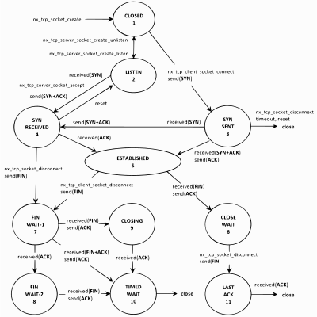
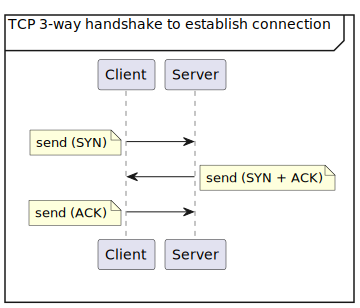

## Learning objectives

20 minutes

In this module, you’ll learn about building and running a TCP echo client. You’ll learn about the transmission control protocol (TCP), ports, sockets, and packet transmission. You’ll also use codespace to build and run your project.

## Prerequisites

- Completion of the Azure RTOS NetX UDP echo server project module.
- If you haven't done so already, set up [GitHub Codespaces](https://github.com/Azure-Samples/azure-rtos-learn-samples/codespaces) so that you can build and run your projects in this learning path.

## Introduction

This module is similar to the UDP echo server project module that you completed. It uses many of the concepts in the previous modules and adds several more features. This module is the third in a series of four related modules as follows:

1. Building and running a UDP echo client
1. Building and running a UDP echo server
1. Building and running a TCP echo client
1. Building and running a TCP echo server

Before starting with this module, we’ll need to study the following concepts:

- Transmission control protocol (TCP)
- TCP ports and sockets
- TCP state machine
- TCP data packets

## Transmission control protocol (TCP)

TCP provides reliable data transfer between two network devices. All data sent from one network device are verified and acknowledged by the receiving device. In addition, the two devices must have established a connection prior to any data transfer. All this results in reliable data transfer; however, it does require substantially more overhead than UDP data transfer. Except where noted, there are no changes in TCP protocol API services between NetX and NetX Duo because IPv6 is primarily concerned with the underlying IP layer. All NetX Duo (from now on, NetX) TCP services can be used for either IPv4 or IPv6 connections.

## TCP state machine

The connection between two TCP sockets (one client and one server) is complex and is managed in a state machine manner. Each TCP socket starts in a CLOSED state. Through connection events each socket’s state machine migrates into the ESTABLISHED state, which is where the bulk of the data transfer in TCP takes place. When one side of the connection no longer wishes to send data, it disconnects. After the other side disconnects, eventually the TCP socket returns to the CLOSED state. This process repeats each time a TCP client and server establish and close a connection. The following diagram shows the various states of the TCP state machine.

The connection between two TCP sockets (one client and one server) is complex and is managed in a state machine manner. Each TCP socket starts in a CLOSED state. Through connection events each socket’s state machine migrates into the ESTABLISHED state, which is where the bulk of the data transfer in TCP takes place. When one side of the connection no longer wishes to send data, it disconnects. After the other side disconnects, eventually the TCP socket returns to the CLOSED state. This process repeats each time a TCP client and server establish and close a connection.

## Description of TCP socket states

Following is the meaning of the states in the TCP socket state machine.

| **State**    | **Description**                                                       |
| ------------ | --------------------------------------------------------------------- |
| CLOSED       | No connection state at all                                            |
| LISTEN       | Wait for connection request                                           |
| SYN-SENT     | Waiting for a matching connection request                             |
| SYN-RECEIVED | Wait for a confirming connection request acknowledgment               |
| ESTABLISHED  | The normal state for the data transfer phase of the connection.       |
| CLOSE-WAIT   | Wait for connection termination request from the local user           |
| FIN-WAIT-1   | Wait for termination request or acknowledgment of termination request |
| FIN-WAIT-2   | Wait for connection termination request                               |
| CLOSING      | Wait for termination request or acknowledgment from the remote TCP    |
| TIMED-WAIT   | Wai for time to pass so all remaining packets have expired            |
| LAST-ACK     | Wait for acknowledgment of the connection termination request         |

## TCP client connection

The client side of the TCP connection initiates a connection request to a TCP server. Before a connection request can be made, TCP must be enabled on the client IP instance. In addition, the client TCP socket must next be created with the nx_tcp_socket_create service and bound to a port via the nx_tcp_client_socket_bind service.

After the client socket is bound, the `nxd_tcp_client_socket_connect` service is used to establish a connection with a TCP server. The socket must be in a CLOSED state to initiate a connection attempt. Establishing the connection starts with NetX issuing a SYN packet and then waiting for a SYN ACK packet back from the server, which signifies acceptance of the connection request. After the SYN ACK is received, NetX responds with an ACK packet and promotes the client socket to the ESTABLISHED state.

The following diagram is an illustration of how this connection is established. Note that we begin in the CLOSED state and end in the ESTABLISHED state. This is an example of a 3-way handshake process to establish a TCP connection.

## TCP services used

We’ll use a variety of TCP services in this project. Here is a summary of these services and brief definitions.

> [!NOTE]
> The services with the nx prefix are designed for IPv4 operations. The services with the `nxd` prefix are designed for IPv4 and IPv6 dual stack operation.
| **TCP Service**               | **Description**                                 |
| ----------------------------- | ----------------------------------------------- |
| nx_tcp_client_socket_bind     | Bind client TCP socket to TCP port              |
| nxd_tcp_client_socket_connect | Connect client TCP socket                       |
| nx_tcp_client_socket_unbind   | Unbind TCP client socket from TCP port          |
| nx_tcp_enable                 | Enable TCP component of NetX                    |
| nx_tcp_socket_create          | Create TCP client or server socket              |
| nx_tcp_socket_delete          | Delete TCP socket                               |
| nx_tcp_socket_disconnect      | Disconnect client and server socket connections |
| nx_tcp_socket_receive         | Receive data from TCP socket                    |
| nx_tcp_socket_send            | Send data through a TCP socket                  |

## Typical order of TCP services

Following is the usual order in which the TCP services appear for both client and server.

| **Client**                       | **Server**                       |
| -------------------------------- | -------------------------------- |
| 1. nx_tcp_enable                 | 1. nx_tcp_enable                 |
| 2. nx_tcp_socket_create          | 2. nx_tcp_socket_create          |
| 3. nx_tcp_client_socket_bind     | 3. nx_tcp_server_socket_listen   |
| 4. nxd_tcp_client_socket_connect | 4. nx_tcp_server_socket_accept   |
| 5. nx_tcp_socket_send            | 5. nx_tcp_socket_receive         |
| 6. nx_tcp_socket_disconnect      | 6. nx_tcp_socket_disconnect      |
| 7. nx_tcp_client_socket_unbind   | 7. nx_tcp_server_socket_unaccept |
| Loop back to 4.                  | 8. nx_tcp_server_socket_relisten |
|                                  | Loop back to 4.                  |

## TCP header

On transmission, the TCP header is placed in front of the data from the user. On reception, the TCP header is removed from the incoming packet, leaving only the user data available to the application. TCP utilizes the IP protocol to send and receive packets, which means there is an IP header in front of the TCP header when the packet is on the network.

## TCP enable

Before TCP connections and packet transmissions are possible, the application must first enable TCP by calling the `nx_tcp_enable` service. After being enabled, the application is free to access all TCP services.

## TCP socket create

TCP sockets are created either during initialization or during runtime by application threads. The initial type of service, time to live, and window size are defined by the `nx_tcp_socket_create` service. There are no limits on the number of TCP sockets in an application.

## TCP port

A TCP port is a logical connection point in the TCP protocol. There are 65,535 valid ports in the TCP component of NetX, ranging from 1 through 0xFFFF. Unlike UDP in which data from one port can be sent to any other destination port, a TCP port is connected to another specific TCP port, and only when this connection is established can any data transfer take place—and only between the two ports making up the connection.

> [!NOTE]
> TCP ports are separate from UDP ports; for example, UDP port number 1 has no relation to TCP port number 1.
## TCP client disconnection

Closing the connection is accomplished by calling `nx_tcp_socket_disconnect`. If no suspension is specified, the client socket sends a RST packet to the server socket and places the socket in the CLOSED state. Otherwise, if a suspension is requested, the full TCP disconnect protocol is performed, as follows:

- If the server previously initiated a disconnect request (the client socket has already received a FIN packet, responded with an ACK, and is in the CLOSE WAIT state), NetX promotes the client TCP socket state to the LAST ACK state and sends a FIN packet. It then waits for an ACK from the server before completing the disconnect and entering the CLOSED state.
- If the client is the first to initiate a disconnect request (the server has not disconnected and the socket is still in the ESTABLISHED state), NetX sends a FIN packet to initiate the disconnect and waits to receive a FIN and an ACK from the server before completing the disconnect and placing the socket in a CLOSED state.
- If there are still packets on the socket transmit queue, NetX suspends for the specified timeout to allow the packets to be acknowledged. If the timeout expires, NetX empties the transmit queue of the client socket.

To unbind the port from the client socket, the application calls `nx_tcp_client_socket_unbind`. The socket must be in a CLOSED state or in the process of disconnecting (namely, TIMED WAIT state) before the port is released; otherwise, an error is returned.

If the application no longer needs the client socket, it calls `nx_tcp_socket_delete` to delete the socket.
