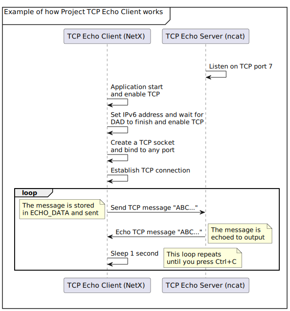

## Overview

The basics of the TCP echo client are similar to the UDP echo client. Following is a list of differences.

- TCP vs UDP
  - The TCP client will need to connect (`nxd_tcp_client_socket_connect`) to the server before sending messages.
  - The TCP sockets must be disconnected (`nxd_tcp_socket_disconnect`) after they are no longer used.
  - While allocating (`nx_packet_allocate`) a packet, the packet type must be `NX_TCP_PACKET`.
  - The command to start the TCP echo server for `ncat` is:
    **sudo ncat -e /bin/cat -k -l 7**
- IPv6 is used in this project rather than IPv4.

The following sequence diagram illustrates the main features of ProjectTCPEchoClient.



Now we’ll study the code to determine how the above actions occur. When you are reviewing the code, look for this define directive:

`#define ECHO_DATA "ABCDEFGHIJKLMNOPQRSTUVWXYZ "`

ECHO_DATA contains the data that we’ll send. Looking farther down in the code, look for this statement:

`status = nx_packet_data_append(packet_ptr, ECHO_DATA, ...`
This statement appends the data to the packet. Several statements later, you’ll see this statement:
`status =  nx_tcp_socket_send(&tcp_client,`
`packet_ptr, NX_WAIT_FOREVER);`
This statement is in a loop and is used to send the packet to the echo server.

To get started, let’s look at the code in the TCP echo client project, and understand the purpose of each section. We’ll investigate the code based on the general NetX template discussed previously.

## Section 1—include directives and definitions

As you may recall from the NetX general template, the first section comprises the include directives and definitions. The required C header files for ThreadX and NetX that contain system equates, data structures, and service prototypes are specified here.

The two included header files are mandatory for using ThreadX and NetX. The define directives are needed for use in the various services and to make the code more readable. All the APIs, macros and structures are defined in these two header files.

```c
#include   "tx_api.h"
#include   "nx_api.h"
/* Make sure IPv6 is enabled.  */
#if !defined(FEATURE_NX_IPV6) || !defined(NX_ENABLE_IPV6_ADDRESS_CHANGE_NOTIFY)
#error "IPv6 and address change notify must be enabled to run this project"
#endif /* NX_FEATURE_IPv6 */
/* Define sample IP address.  */
#define SAMPLE_IPV4_ADDRESS             IP_ADDRESS(192, 168, 1, 2)
#define SAMPLE_IPV4_MASK                0xFFFFFF00UL
#define SAMPLE_PRIMARY_INTERFACE        0
#define SAMPLE_IPV6_ADDRESS_0           0x20010000
#define SAMPLE_IPV6_ADDRESS_1           0x00000000
#define SAMPLE_IPV6_ADDRESS_2           0x00000000
#define SAMPLE_IPV6_ADDRESS_3           0x00005678
#define SAMPLE_IPV6_ADDRESS_PREFIX      64
/* Define ECHO server address and port.  */
#define ECHO_SERVER_ADDRESS_0           0x20010000
#define ECHO_SERVER_ADDRESS_1           0x00000000
#define ECHO_SERVER_ADDRESS_2           0x00000000
#define ECHO_SERVER_ADDRESS_3           0x00001234
#define ECHO_SERVER_PORT                7
#define ECHO_DATA                       "ABCDEFGHIJKLMNOPQRSTUVWXYZ "
#define ECHO_RECEIVE_TIMEOUT            NX_IP_PERIODIC_RATE
/* Define packet pool.  */
#define PACKET_SIZE                     1536
#define PACKET_COUNT                    30
#define PACKET_POOL_SIZE                ((PACKET_SIZE
                                         + sizeof(NX_PACKET)) * PACKET_COUNT)
/* Define IP stack size.   */
#define IP_STACK_SIZE                   2048
/* Define IP thread priority.  */
#define IP_THREAD_PRIORITY              1
/* Define stack size of sample thread.  */
#define SAMPLE_THREAD_STACK_SIZE        2048
/* Define priority of sample thread.  */
#define SAMPLE_THREAD_PRIORITY          4
/* Define ARP pool.  */
#define ARP_POOL_SIZE                   1024
/* Define TCP socket TTL and window size.  */
#define SAMPLE_SOCKET_TTL               0x80
#define SAMPLE_SOCKET_WINDOW_SIZE       65535
/* Define time wait for IPv6 DAD process.  */
#define SAMPLE_DAD_WAIT            (3 * NX_IP_PERIODIC_RATE)
```

> [!NOTE]
> The following items define the various object control blocks, the memory buffers, the counter, and the thread prototype.
```c
/* Define the ThreadX and NetX object control blocks...  */
NX_PACKET_POOL          default_pool;
NX_IP                   default_ip;
NX_TCP_SOCKET           tcp_client;
TX_THREAD               client_thread;
/* Define memory buffers.  */
ULONG                   pool_area[PACKET_POOL_SIZE >> 2];
ULONG                   ip_stack[IP_STACK_SIZE >> 2];
ULONG                   arp_area[ARP_POOL_SIZE >> 2];
ULONG                   client_thread_stack[SAMPLE_THREAD_STACK_SIZE >> 2];
/* Define the counters used in the demo application...  */
ULONG                   error_counter;
```

## Section 2—main

> [!NOTE]
> The second part of the general template is the **main**, which is often the same in most projects.
```c
/* Define main entry point.  */
int main()
{
    /* Enter the ThreadX kernel.  */
    tx_kernel_enter();
}
```

## Section 3—tx_application_define

> [!NOTE]
> The **tx_application_define** section is devoted to NetX initialization, creating packet pools, creating IP instances, enabling ARP, ICMP, and TCP, and displaying output information.
```c
/* Define what the initial system looks like.  */
void    tx_application_define(void *first_unused_memory)
{
UINT    status;
    NX_PARAMETER_NOT_USED(first_unused_memory);
    /* Initialize the NetX system.  */
    nx_system_initialize();
    /* Create the sample thread.  */
    tx_thread_create(&client_thread, "Client Thread", client_thread_entry, 0,
                     client_thread_stack, sizeof(client_thread_stack),
                     SAMPLE_THREAD_PRIORITY, SAMPLE_THREAD_PRIORITY,
                     TX_NO_TIME_SLICE, TX_AUTO_START);
    /* Create a packet pool.  */
    status = nx_packet_pool_create(&default_pool, "NetX Main Packet Pool",
                               PACKET_SIZE, pool_area, sizeof(pool_area));
    /* Check for packet pool create errors.  */
    if (status)
        error_counter++;
    /* Create an IP instance.  */
    status = nx_ip_create(&default_ip, "NetX IP Instance 0",
                          SAMPLE_IPV4_ADDRESS, SAMPLE_IPV4_MASK,
                          &default_pool, _nx_linux_network_driver,
                          (void *)ip_stack, sizeof(ip_stack),
                          IP_THREAD_PRIORITY);
    /* Check for IP create errors.  */
    if (status)
        error_counter++;
    /* Enable ARP and supply ARP cache memory for IP Instance 0.  */
    status =  nx_arp_enable(&default_ip, (void *)arp_area, sizeof(arp_area));
    /* Check for ARP enable errors.  */
    if (status)
        error_counter++;
    /* Enable IPv6. */
    status = nxd_ipv6_enable(&default_ip);
    /* Check for IPv6 enable errors.  */
    if(status)
        error_counter++;
    /* Enable ICMP for both ICMPv4 and ICMPv6. */
    status = nxd_icmp_enable(&default_ip);
    /* Check for ICMP enable errors.  */
    if(status)
        error_counter++;
    /* Enable TCP */
    status = nx_tcp_enable(&default_ip);
    /* Check for TCP enable errors.  */
    if(status)
        error_counter++;
    /* Output IP address and network mask.  */
    printf("NetXDuo is running\r\n");
    printf("IPv4 address: %lu.%lu.%lu.%lu\r\n",
           (SAMPLE_IPV4_ADDRESS >> 24),
           (SAMPLE_IPV4_ADDRESS >> 16 & 0xFF),
           (SAMPLE_IPV4_ADDRESS >> 8 & 0xFF),
           (SAMPLE_IPV4_ADDRESS & 0xFF));
    printf("Mask: %lu.%lu.%lu.%lu\r\n",
           (SAMPLE_IPV4_MASK >> 24),
           (SAMPLE_IPV4_MASK >> 16 & 0xFF),
           (SAMPLE_IPV4_MASK >> 8 & 0xFF),
           (SAMPLE_IPV4_MASK & 0xFF));
}
```

## Section 4—Thread entry function

> [!NOTE]
> This is the function for the thread called **client_thread_entry** that performs the operations of the TCP echo client. Here we define the variable `status` that we’ll use to check the results of various service calls. We also define the server address and the packet pointer for transmitting and receiving. We also set other addressing configurations.
```c
/* Client thread entry.  */
void client_thread_entry(ULONG thread_input)
{
UINT       status;
NX_PACKET *packet_ptr;
NXD_ADDRESS sample_ipv6_address;
NXD_ADDRESS echo_server_address;
    /* Set link local address by stateless address auto configuration.  */
    sample_ipv6_address.nxd_ip_version = NX_IP_VERSION_V6;
    sample_ipv6_address.nxd_ip_address.v6[0] = SAMPLE_IPV6_ADDRESS_0;
    sample_ipv6_address.nxd_ip_address.v6[1] = SAMPLE_IPV6_ADDRESS_1;
    sample_ipv6_address.nxd_ip_address.v6[2] = SAMPLE_IPV6_ADDRESS_2;
    sample_ipv6_address.nxd_ip_address.v6[3] = SAMPLE_IPV6_ADDRESS_3;
    status = nxd_ipv6_address_set(&default_ip, SAMPLE_PRIMARY_INTERFACE,
                                  &sample_ipv6_address, SAMPLE_IPV6_ADDRESS_PREFIX, NX_NULL);
    /* Check status.  */
    if (status)
    {
        error_counter++;
        return;
    }
    /* Set the IPv6 address change callback function.  */
    nxd_ipv6_address_change_notify(&default_ip, ipv6_address_DAD_notify);
    /* Suspend current thread for the IPv6 stack to finish DAD process. */
    tx_thread_suspend(tx_thread_identify());
```
> [!NOTE]
> Next, we define the echo server address, create a TCP socket, and bind the socket to a port.
```c
    /* Set echo server address.  */
    echo_server_address.nxd_ip_version = NX_IP_VERSION_V6;
    echo_server_address.nxd_ip_address.v6[0] = ECHO_SERVER_ADDRESS_0;
    echo_server_address.nxd_ip_address.v6[1] = ECHO_SERVER_ADDRESS_1;
    echo_server_address.nxd_ip_address.v6[2] = ECHO_SERVER_ADDRESS_2;
    echo_server_address.nxd_ip_address.v6[3] = ECHO_SERVER_ADDRESS_3;
    /* Create a TCP socket.  */
    status = nx_tcp_socket_create(&default_ip, &tcp_client,
                                  "TCP Echo Client", NX_IP_NORMAL,
                                  NX_DONT_FRAGMENT, SAMPLE_SOCKET_TTL,
                                  SAMPLE_SOCKET_WINDOW_SIZE, NX_NULL,
                                  NX_NULL);
    /* Check status.  */
    if (status)
    {
        error_counter++;
        return;
    }
    /* Bind the TCP socket to any port.  */
    status =  nx_tcp_client_socket_bind(&tcp_client, NX_ANY_PORT,
                                        NX_WAIT_FOREVER);
    /* Check status.  */
    if (status)
    {
        error_counter++;
        return;
    }
    /* Connect to server.  */
    printf("Connecting to server: ");
    print_ipv6_address(echo_server_address.nxd_ip_address.v6);
    status = nxd_tcp_client_socket_connect(&tcp_client, &echo_server_address,
                                           ECHO_SERVER_PORT,
                                           NX_WAIT_FOREVER);
    /* Check status.  */
    if (status)
    {
        printf("Not connected\r\n");
        error_counter++;
        return;
    }
    printf("Connected\r\n");
```
> [!NOTE]
> Now we loop forever to send data to the echo server, allocate a packet, write ABCs into the packet payload, send data to the server, receive data from the server, process the data, release the packet, and sleep one second.
```c
    /* Loop to send data to echo server.  */
    for (;;)
    {
        /* Allocate a packet.  */
        status =  nx_packet_allocate(&default_pool, &packet_ptr,
                                     NX_TCP_PACKET, NX_WAIT_FOREVER);
        /* Check status.  */
        if (status != NX_SUCCESS)
        {
            error_counter++;
            break;
        }
        /* Write ABCs into the packet payload.  */
        status = nx_packet_data_append(packet_ptr, ECHO_DATA,
                                       sizeof(ECHO_DATA), &default_pool,
                                       NX_WAIT_FOREVER);
        /* Check status.  */
        if (status != NX_SUCCESS)
        {
            error_counter++;
            break;
        }
        /* Send data to echo server.  */
        status =  nx_tcp_socket_send(&tcp_client, packet_ptr,
                                     NX_WAIT_FOREVER);
        /* Check status.  */
        if (status != NX_SUCCESS)
        {
            nx_packet_release(packet_ptr);
            error_counter++;
            break;
        }
        /* Receive data from echo server.  */
        status =  nx_tcp_socket_receive(&tcp_client, &packet_ptr,
                                        NX_WAIT_FOREVER);
        if (status)
        {
            /* No response received.  */
            printf("No response from server\n");
            break;
        }
        else
        {
            /* Response received from server.  */
            printf("Receive response: %.*s\n",
                   (INT)(packet_ptr -> nx_packet_length),
                   packet_ptr -> nx_packet_prepend_ptr);
            nx_packet_release(packet_ptr);
            /* Sleep 1 second.  */
            tx_thread_sleep(NX_IP_PERIODIC_RATE);
        }
    }
```
> [!NOTE]
> Finally we cleanup the TCP socket.
```c
    /* Cleanup the TCP socket.  */
    nx_tcp_socket_disconnect(&tcp_client, NX_WAIT_FOREVER);
    nx_tcp_client_socket_unbind(&tcp_client);
    nx_tcp_socket_delete(&tcp_client);
}
static VOID print_ipv6_address(ULONG *ipv6_address)
{
    printf("%X:%X:%X:%X:%X:%X:%X:%X\r\n",
           (UINT)(ipv6_address[0] >> 16),
           (UINT)(ipv6_address[0] & 0xFFFF),
           (UINT)(ipv6_address[1] >> 16),
           (UINT)(ipv6_address[1] & 0xFFFF),
           (UINT)(ipv6_address[2] >> 16),
           (UINT)(ipv6_address[2] & 0xFFFF),
           (UINT)(ipv6_address[3] >> 16),
           (UINT)(ipv6_address[3] & 0xFFFF));
}
static VOID ipv6_address_DAD_notify(NX_IP *ip_ptr, UINT status,
                                    UINT interface_index,
                                    UINT ipv6_addr_index,
                                    ULONG *ipv6_address)
{
    NX_PARAMETER_NOT_USED(ip_ptr);
    NX_PARAMETER_NOT_USED(interface_index);
    NX_PARAMETER_NOT_USED(ipv6_addr_index);
    /* Check the status.  */
    switch(status)
    {
        case NX_IPV6_ADDRESS_DAD_SUCCESSFUL:
        {
            printf("DAD successful\r\nIPv6 address: ");
            print_ipv6_address(ipv6_address);
            tx_thread_resume(&client_thread);
            break;
        }
        case NX_IPV6_ADDRESS_DAD_FAILURE:
        {
            printf("DAD failure\r\nIPv6 address: ");
            print_ipv6_address(ipv6_address);
            break;
        }
        default:
        {
            break;
        }
    }
}
```
