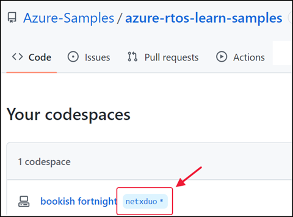
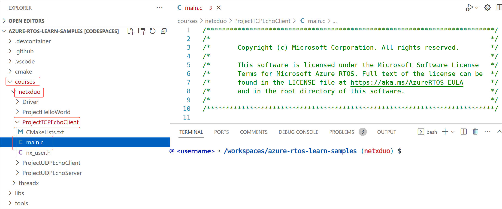
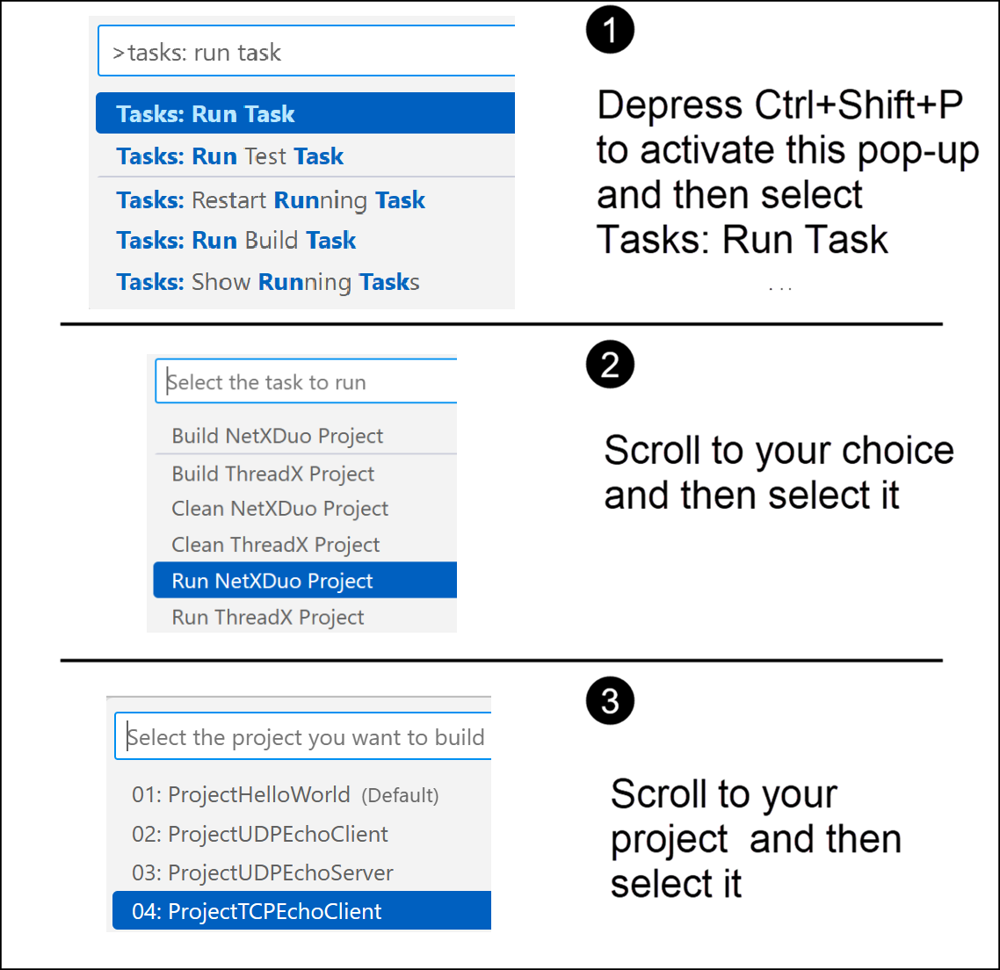
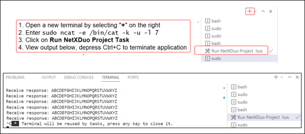

We'll use codespace to build and run the TCP echo client project, and future projects in this learning path. There are four steps required to build and run this project, and these steps are described as follows.

## Step 1: Go to codespace

1. Launch your browser and go to the forked samples repository that you created in a [previous module](/training/modules/azure-rtos-netx-duo-fundamentals/1-introduction). The link should look like this: ``` https://github.com/[your_GitHub_id]/azure-rtos-learn-samples ```
1. Select Code and open the Codespace you've created.
1. Once the Codespace is launched, in the Explorer pane file tree, expand and open the `courses/netxduo` folder, as illustrated by the following screenshot.



## Step 2: Go to main.c

The path to the TCP echo client project in codespace is:
**courses –> netxduo –> ProjectTCPEchoClient -> main.c**

Navigate to **main.c** under ProjectTCPEchoClient as indicated in the following screenshot.



## Step 3: Build ProjectTCPEchoClient

Build your project by completing the steps in the following illustration as a guide.


You'll then observe the building process. When it finishes, go to the next step where you'll run the project.

## Step 4: Run ProjectTCPEchoClient

Run your project by following the steps in the illustration as a guide.



We'll use several networking utilities in this project to display output. The `ncat` utility keeps listening on `TCP port 7` and does the receiving. For each incoming packet, `/bin/cat` will execute it. The `cat` command outputs the received content. We'll use the `sudo` command to execute `ncat` and `/bin/cat`.

Open a new terminal by selecting the “**+**” on the right side of the terminal. Then enter the following command:

**sudo ncat -e /bin/cat -k -u -l 7**

Select **Run NetXDuo Project Task**, and view the output as illustrated in the following image. You'll see that the ABCs are displayed repeatedly. Depress `Ctrl+C` to terminate the application.


