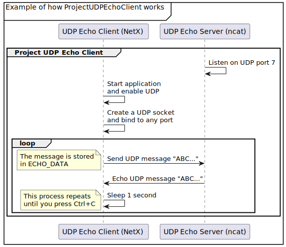

## Overview

The logic of the UDP echo client is similar to the Hello World project except for the transport layer. After we build and run **ProjectUPDEchoClient**, the following actions occur.

1. Create an IP instance and enable UDP from NetX.
1. Create a UDP socket and bind it to any port.
1. Allocate a packet and fill in data.
1. Send the packet by the UDP socket.
1. When the UDP echo server receives data, it will echo the same data back.
1. In NetX, you'll receive the original data from the UDP socket.
1. This project will loop endlessly from step 3.

The following sequence diagram illustrates the main features of **ProjectUDPEchoClient**.



Now we'll study the code to determine how the above actions occur. When you're reviewing the code, look for the following define:

```c
#define ECHO_DATA "ABCDEFGHIJKLMNOPQRSTUVWXYZ "
```

**ECHO_DATA** contains the data that we'll send. Looking farther down in the code, look for this statement:

```c
status = nx_packet_data_append(packet_ptr, ECHO_DATA, ...
```

This statement appends the data to the packet. Several statements later, you'll see this statement:

```c
status = nxd_udp_socket_send(&udp_client, packet_ptr,
                             echo_server_address,
                             ECHO_SERVER_PORT);
```

This statement is in a loop and is used to send the packet to the echo server.

To get started, let’s look at the code in the UDP echo client project, and understand the purpose of each section. We'll investigate the code based on the general template discussed previously.

## Section 1: Include directives and definitions

As you may recall from the NetX general template, the first section comprises include directives and definitions. The required C header files for ThreadX and NetX that contain system equates, data structures, and service prototypes are specified here.

> [!NOTE]
> The two included header files are mandatory for using ThreadX and NetX. The defines are needed for use in the various services and to make the code more readable. All the APIs, macros and structures are defined in the two header files.

```c
#include   "tx_api.h"
#include   "nx_api.h"

/* Define sample IP address.  */
#define SAMPLE_IPV4_ADDRESS             IP_ADDRESS(192, 168, 1, 2)
#define SAMPLE_IPV4_MASK                0xFFFFFF00UL

/* Define ECHO server address and port.  */
#define ECHO_SERVER_ADDRESS             IP_ADDRESS(192, 168, 1, 1)
#define ECHO_SERVER_PORT                7
#define ECHO_DATA                       "ABCDEFGHIJKLMNOPQRSTUVWXYZ "
#define ECHO_RECEIVE_TIMEOUT            NX_IP_PERIODIC_RATE

/* Define packet pool.  */
#define PACKET_SIZE                     1536
#define PACKET_COUNT                    30
#define PACKET_POOL_SIZE                ((PACKET_SIZE
                                        + sizeof(NX_PACKET)) * PACKET_COUNT)

/* Define IP stack size.   */
#define IP_STACK_SIZE                   2048

/* Define IP thread priority.  */
#define IP_THREAD_PRIORITY              1

/* Define stack size of sample thread.  */
#define SAMPLE_THREAD_STACK_SIZE        2048

/* Define priority of sample thread.  */
#define SAMPLE_THREAD_PRIORITY          4

/* Define ARP pool.  */
#define ARP_POOL_SIZE                   1024

/* Define UDP socket TTL and receive queue size.  */
#define SAMPLE_SOCKET_TTL               0x80
#define SAMPLE_SOCKET_RX_QUEUE_MAXIMUM  5
```

The following items define the various object control blocks, the memory buffers, the counter, and the thread prototype.

```c
/* Define the ThreadX and NetX object control blocks...  */
NX_PACKET_POOL          default_pool;
NX_IP                   default_ip;
NX_UDP_SOCKET           udp_client;
TX_THREAD               client_thread;

/* Define memory buffers.  */
ULONG                   pool_area[PACKET_POOL_SIZE >> 2];
ULONG                   ip_stack[IP_STACK_SIZE >> 2];
ULONG                   arp_area[ARP_POOL_SIZE >> 2];
ULONG                   client_thread_stack[SAMPLE_THREAD_STACK_SIZE >> 2];

/* Define the counter used in the demo application...  */
ULONG                   error_counter;

/***** Substitute your ethernet driver entry function here *********/
extern  VOID _nx_linux_network_driver(NX_IP_DRIVER*);

/* Define thread prototypes.  */
void client_thread_entry(ULONG thread_input);
```

## Section 2: main

The second part of the general template is the **main**, which is often the same in most projects.

```c
/* Define main entry point.  */
int main()
{
    /* Enter the ThreadX kernel.  */
    tx_kernel_enter();
}
```

Any code following `tx_kernel_enter()` is unreachable.

## Section 3: `tx_application_define`

The tx_application_define is devoted to NetX initialization, creating packet pools, creating IP instances, enabling ARP and ICMP, and displaying output information.

```c
/* Define what the initial system looks like.  */
void    tx_application_define(void *first_unused_memory)
{

UINT    status;

    NX_PARAMETER_NOT_USED(first_unused_memory);

    /* Initialize the NetX system.  */
    nx_system_initialize();

    /* Create the sample thread.  */
    tx_thread_create(&client_thread, "Client Thread", client_thread_entry, 0,
                     client_thread_stack, sizeof(client_thread_stack),
                     SAMPLE_THREAD_PRIORITY, SAMPLE_THREAD_PRIORITY,
                     TX_NO_TIME_SLICE, TX_AUTO_START);

    /* Create a packet pool.  */
    status = nx_packet_pool_create(&default_pool, "NetX Main Packet Pool",
                                   PACKET_SIZE, pool_area,
                                   sizeof(pool_area));

    /* Check for packet pool create errors.  */
    if (status)
        error_counter++;

    /* Create an IP instance.  */
    status = nx_ip_create(&default_ip, "NetX IP Instance 0",
                          SAMPLE_IPV4_ADDRESS, SAMPLE_IPV4_MASK,
                          &default_pool, _nx_linux_network_driver,
                          (void *)ip_stack, sizeof(ip_stack),
                          IP_THREAD_PRIORITY);

    /* Check for IP create errors.  */
    if (status)
        error_counter++;

    /* Enable ARP and supply ARP cache memory for IP Instance 0.  */
    status =  nx_arp_enable(&default_ip, (void *)arp_area, sizeof(arp_area));

    /* Check for ARP enable errors.  */
    if (status)
        error_counter++;

    /* Enable ICMP */
    status = nx_icmp_enable(&default_ip);

    /* Check for ICMP enable errors.  */
    if(status)
        error_counter++;

    /* Enable UDP */
    status = nx_udp_enable(&default_ip);

    /* Check for UDP enable errors.  */
    if(status)
        error_counter++;

    /* Output IP address and network mask.  */
    printf("NetXDuo is running\r\n");
    printf("IP address: %lu.%lu.%lu.%lu\r\n",
           (SAMPLE_IPV4_ADDRESS >> 24),
           (SAMPLE_IPV4_ADDRESS >> 16 & 0xFF),
           (SAMPLE_IPV4_ADDRESS >> 8 & 0xFF),
           (SAMPLE_IPV4_ADDRESS & 0xFF));
    printf("Mask: %lu.%lu.%lu.%lu\r\n",
           (SAMPLE_IPV4_MASK >> 24),
           (SAMPLE_IPV4_MASK >> 16 & 0xFF),
           (SAMPLE_IPV4_MASK >> 8 & 0xFF),
           (SAMPLE_IPV4_MASK & 0xFF));
}
```

## Section 4: Thread entry function

This is the function for the thread called client_thread_entry that performs the operations of the echo client.

Here we define the variable status that we’ll use to check the results of various service calls. We also define the server address and the packet pointer for transmitting and receiving.

```c
/* Client thread entry.  */
void client_thread_entry(ULONG thread_input)
{
UINT       status;
NX_PACKET *packet_ptr;
NXD_ADDRESS echo_server_address;
```

Next, we define the echo server address, create a UDP socket, and bind the socket to a port.

```c
    /* Set echo server address.  */
    echo_server_address.nxd_ip_version = NX_IP_VERSION_V4;
    echo_server_address.nxd_ip_address.v4 = ECHO_SERVER_ADDRESS;

    /* Create a UDP socket.  */
    status = nx_udp_socket_create(&default_ip, &udp_client,
                    "UDP Echo Client", NX_IP_NORMAL, NX_FRAGMENT_OKAY,
                    SAMPLE_SOCKET_TTL, SAMPLE_SOCKET_RX_QUEUE_MAXIMUM);

    /* Check status.  */
    if (status)
    {
        error_counter++;
        return;
    }

    /* Bind the UDP socket to any port.  */
    status =  nx_udp_socket_bind(&udp_client, NX_ANY_PORT, NX_WAIT_FOREVER);

    /* Check status.  */
    if (status)
    {
        error_counter++;
        return;
    }
```

Now we loop forever to send data to the echo server, allocate a packet, write ABCs into the packet payload, send data to the server, receive data from the server, process the data, release the packet, and sleep one second.

```c
    /* Loop to send data to echo server.  */
    for (;;)
    {

        /* Allocate a packet.  */
        status =  nx_packet_allocate(&default_pool, &packet_ptr,
                                     NX_UDP_PACKET, NX_WAIT_FOREVER);

        /* Check status.  */
        if (status != NX_SUCCESS)
        {
            error_counter++;
            break;
        }

        /* Write ABCs into the packet payload.  */
        status = nx_packet_data_append(packet_ptr, ECHO_DATA,
                                       sizeof(ECHO_DATA), &default_pool,
                                       NX_WAIT_FOREVER);

        /* Check status.  */
        if (status != NX_SUCCESS)
        {
            error_counter++;
            break;
        }

        /* Send data to echo server.  */
        status =  nxd_udp_socket_send(&udp_client, packet_ptr,
                                      &echo_server_address,
                                      ECHO_SERVER_PORT);

        /* Check status.  */
        if (status != NX_SUCCESS)
        {
            nx_packet_release(packet_ptr);
            error_counter++;
            break;
        }

        /* Receive data from echo server.  */
        status =  nx_udp_socket_receive(&udp_client, &packet_ptr,
                                        ECHO_RECEIVE_TIMEOUT);
        if (status)
        {

            /* No response received.  */
            printf("No response from server\n");
        }
        else
        {

            /* Response received from server.  */
            printf("Receive response: %.*s\n",
                   (INT)(packet_ptr -> nx_packet_length),
                   packet_ptr -> nx_packet_prepend_ptr);
            nx_packet_release(packet_ptr);

            /* Sleep 1 second.  */
            tx_thread_sleep(NX_IP_PERIODIC_RATE);
        }
    }
```

Finally, we clean up the UDP socket.

```c
    /* Cleanup the UDP socket.  */
    nx_udp_socket_unbind(&udp_client);
    nx_udp_socket_delete(&udp_client);
}
```
