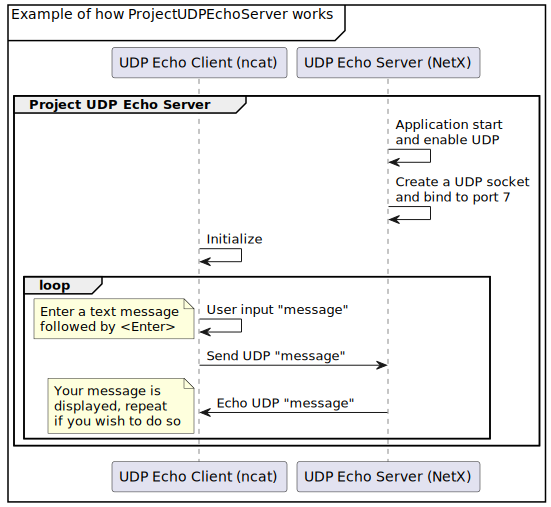

## Overview

This project will build on the UDP echo client module and will introduce you to more concepts of UDP. The logic of the UDP echo server for this project is straightforward and the following procedure is an overview.

1.  Create a UDP socket.
1.  Bind to a port. In this project, we choose UDP port 7 because it's a well-known port.
1.  Loop to receive a UDP packet.
1.  Retrieve the IP address and port from the packet.
1.  Send the UDP packet.

The following diagram illustrates the main features of ProjectUDPEchoServer.



To get started, let’s look at the code in the UDP echo server project, and understand the purpose of each section. We'll investigate the code based on the general NetX template discussed previously.

## Section 1: include directives and definitions

As you may recall from the NetX general template, the first section comprises include directives and definitions. The required C header files for ThreadX and NetX that contain system equates, data structures, and service prototypes are specified here.

> [!NOTE]
> The two included header files are mandatory for using ThreadX and NetX. The define directives are needed for use in the various services and to make the code more readable. All the APIs, macros and structures are defined in these two header files.

```c
#include   "tx_api.h"
#include   "nx_api.h"

/* Define sample IP address.  */
#define SAMPLE_IPV4_ADDRESS             IP_ADDRESS(192, 168, 1, 2)
#define SAMPLE_IPV4_MASK                0xFFFFFF00UL

/* Define ECHO server address and port.  */
#define ECHO_SERVER_ADDRESS             IP_ADDRESS(192, 168, 1, 1)
#define ECHO_SERVER_PORT                7
#define ECHO_DATA                       "ABCDEFGHIJKLMNOPQRSTUVWXYZ "
#define ECHO_RECEIVE_TIMEOUT            NX_IP_PERIODIC_RATE

/* Define packet pool.  */
#define PACKET_SIZE                     1536
#define PACKET_COUNT                    30
#define PACKET_POOL_SIZE                ((PACKET_SIZE + sizeof(NX_PACKET)) * PACKET_COUNT)

/* Define IP stack size.   */
#define IP_STACK_SIZE                   2048

/* Define IP thread priority.  */
#define IP_THREAD_PRIORITY              1

/* Define stack size of sample thread.  */
#define SAMPLE_THREAD_STACK_SIZE        2048

/* Define priority of sample thread.  */
#define SAMPLE_THREAD_PRIORITY          4

/* Define ARP pool.  */
#define ARP_POOL_SIZE                   1024

/* Define UDP socket TTL and receive queue size.  */
#define SAMPLE_SOCKET_TTL               0x80
#define SAMPLE_SOCKET_RX_QUEUE_MAXIMUM  5

/* Define the ThreadX and NetX object control blocks...  */
NX_PACKET_POOL          default_pool;
NX_IP                   default_ip;
NX_UDP_SOCKET           udp_server;
TX_THREAD               server_thread;

/* Define memory buffers.  */
ULONG                   pool_area[PACKET_POOL_SIZE >> 2];
ULONG                   ip_stack[IP_STACK_SIZE >> 2];
ULONG                   arp_area[ARP_POOL_SIZE >> 2];
ULONG                   server_thread_stack[SAMPLE_THREAD_STACK_SIZE >> 2];

/* Define the counters used in the demo application...  */
ULONG                   error_counter;

/***** Substitute your ethernet driver entry function here *********/
extern  VOID _nx_linux_network_driver(NX_IP_DRIVER*);

/* Define thread prototypes.  */
void server_thread_entry(ULONG thread_input);
```

## Section 2: main

The second part of the general template is the main, which is often the same in most projects.

```c
/* Define main entry point.  */
int main()
{
    /* Enter the ThreadX kernel.  */
    tx_kernel_enter();
}
```

## Section 3: `tx_application_define`

The **tx_application_define** is dedicated to NetX initialization, creating packet pools, creating IP instances, enabling ARP and ICMP, and displaying output information.

```c
/* Define what the initial system looks like.  */
void    tx_application_define(void *first_unused_memory)
{

UINT    status;

    NX_PARAMETER_NOT_USED(first_unused_memory);

    /* Initialize the NetX system.  */
    nx_system_initialize();

    /* Create the sample thread.  */
    tx_thread_create(&server_thread, "Server Thread", server_thread_entry, 0,
                     server_thread_stack, sizeof(server_thread_stack),
                     SAMPLE_THREAD_PRIORITY, SAMPLE_THREAD_PRIORITY, TX_NO_TIME_SLICE, TX_AUTO_START);

    /* Create a packet pool.  */
    status = nx_packet_pool_create(&default_pool, "NetX Main Packet Pool",
                                   PACKET_SIZE, pool_area, sizeof(pool_area));

    /* Check for packet pool create errors.  */
    if (status)
        error_counter++;

    /* Create an IP instance.  */
    status = nx_ip_create(&default_ip, "NetX IP Instance 0",
                          SAMPLE_IPV4_ADDRESS, SAMPLE_IPV4_MASK,
                          &default_pool, _nx_linux_network_driver,
                          (void *)ip_stack, sizeof(ip_stack),
                          IP_THREAD_PRIORITY);

    /* Check for IP create errors.  */
    if (status)
        error_counter++;

    /* Enable ARP and supply ARP cache memory for IP Instance 0.  */
    status =  nx_arp_enable(&default_ip, (void *)arp_area, sizeof(arp_area));

    /* Check for ARP enable errors.  */
    if (status)
        error_counter++;

    /* Enable ICMP */
    status = nx_icmp_enable(&default_ip);

    /* Check for ICMP enable errors.  */
    if(status)
        error_counter++;

    /* Enable UDP */
    status = nx_udp_enable(&default_ip);

    /* Check for UDP enable errors.  */
    if(status)
        error_counter++;

    /* Output IP address and network mask.  */
    printf("NetXDuo is running\r\n");
    printf("IP address: %lu.%lu.%lu.%lu\r\n",
           (SAMPLE_IPV4_ADDRESS >> 24),
           (SAMPLE_IPV4_ADDRESS >> 16 & 0xFF),
           (SAMPLE_IPV4_ADDRESS >> 8 & 0xFF),
           (SAMPLE_IPV4_ADDRESS & 0xFF));
    printf("Mask: %lu.%lu.%lu.%lu\r\n",
           (SAMPLE_IPV4_MASK >> 24),
           (SAMPLE_IPV4_MASK >> 16 & 0xFF),
           (SAMPLE_IPV4_MASK >> 8 & 0xFF),
           (SAMPLE_IPV4_MASK & 0xFF));
}
```

## Section 4: Thread entry function

The following function for the thread called **server_thread_entry** performs the operations of the echo server.

> [!NOTE]
> Here we define the variable **status** that we’ll use to check the results of various service calls. We also define the server address and the packet pointer for transmitting and receiving.

```c
/* Server thread entry.  */
void server_thread_entry(ULONG thread_input)
{
UINT         status;
NX_PACKET    *packet_ptr;
NXD_ADDRESS  echo_client_address;
UINT         echo_client_port;

    /* Create a UDP socket.  */
    status = nx_udp_socket_create(&default_ip, &udp_server,
                   "UDP Echo Server", NX_IP_NORMAL, NX_FRAGMENT_OKAY,
                   SAMPLE_SOCKET_TTL, SAMPLE_SOCKET_RX_QUEUE_MAXIMUM);

    /* Check status.  */
    if (status)
    {
        error_counter++;
        return;
    }

    /* Bind the UDP socket to echo port.  */
    status =  nx_udp_socket_bind(&udp_server, ECHO_SERVER_PORT,
              NX_WAIT_FOREVER);

    /* Check status.  */
    if (status)
    {
        error_counter++;
        return;
    }

    /* Loop to echo data from client.  */
    for (;;)
    {

        /* Receive a packet.  */
        status =  nx_udp_socket_receive(&udp_server, &packet_ptr, NX_WAIT_FOREVER);

        /* Check status.  */
        if (status != NX_SUCCESS)
        {
            error_counter++;
            break;
        }

        /* Get address of peer.  */
        status = nxd_udp_source_extract(packet_ptr, &echo_client_address, &echo_client_port);

        /* Echo data to client.  */
        status =  nxd_udp_socket_send(&udp_server, packet_ptr, &echo_client_address, echo_client_port);

        /* Check status.  */
        if (status != NX_SUCCESS)
        {
            nx_packet_release(packet_ptr);
            error_counter++;
            break;
        }
    }

    /* Cleanup the UDP socket.  */
    nx_udp_socket_unbind(&udp_server);
    nx_udp_socket_delete(&udp_server);
}
```
