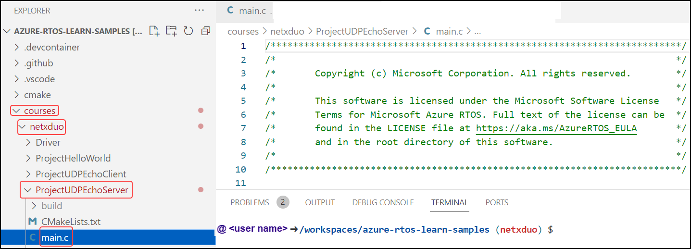
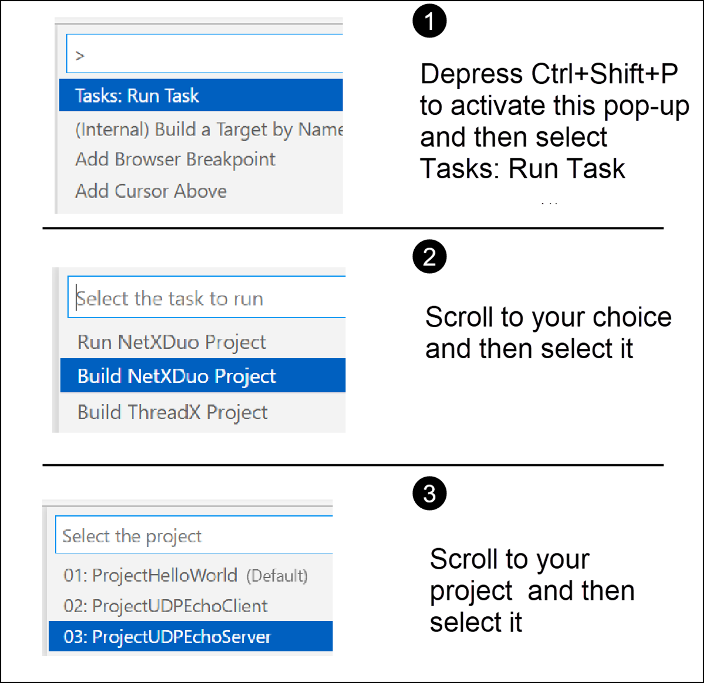
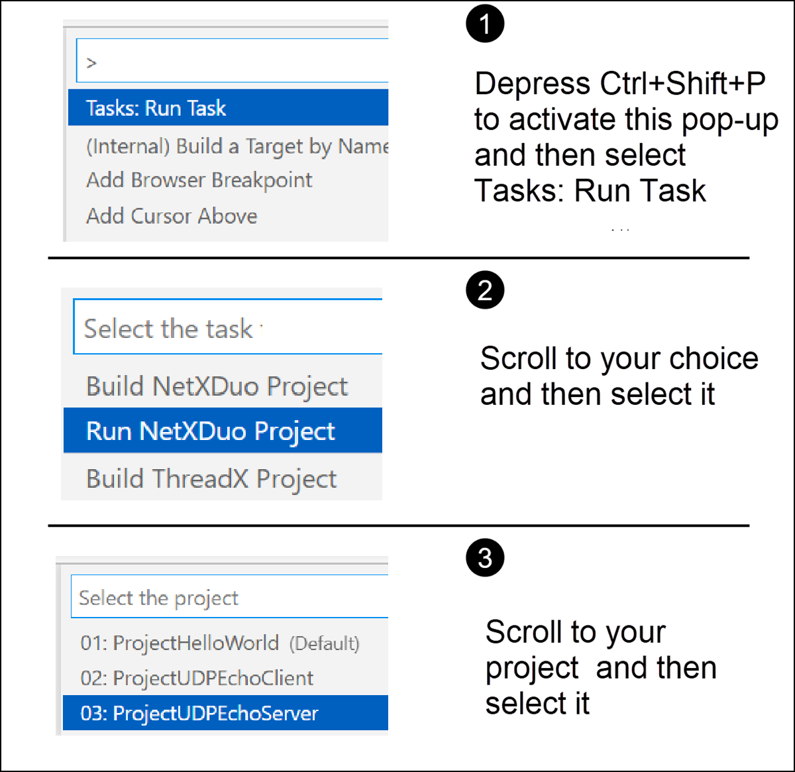
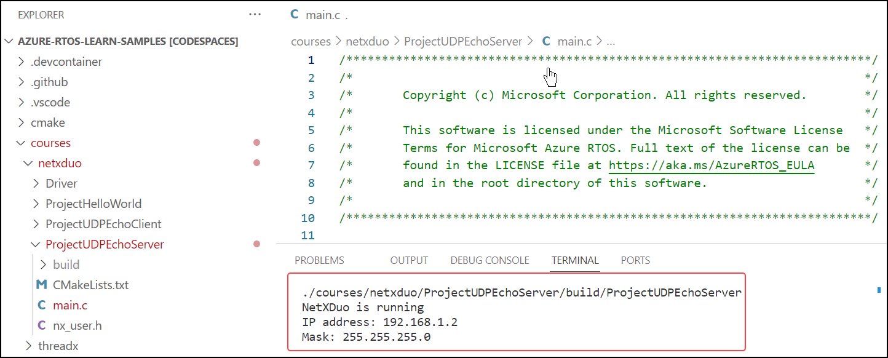
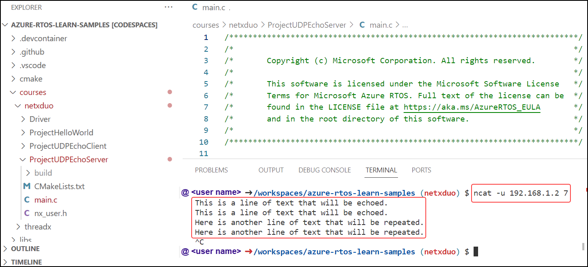

We'll use codespace to build and run the UDP echo server project, and future projects in this learning path. There are four steps required to build and run this project, and the following procedure describes
these steps.

## Step 1: Go to codespace

1. Launch your browser and go to the forked samples repository, which you've done in a previous module. The link should look like this: https://github.com/lyour_githubJdl/azure-rtos-learn-samples
1. Select Code and open the codespace you've created.
1. Once the codespace is launched, in the Explorer pane file tree, expand and open the `courses/netxduo`folder, as illustrated by the following screenshot.

## Step 2: Go to main

The path to the UDP echo server project in codespace is:
**courses –> netxduo –> ProjectUDPEchoServer -> main.c**

Navigate to main.c under **ProjectEchoServer** as illustrated in the following diagram.

## Step 3: Build project UDP echo server

Build your project by performing the steps in the following illustration.

## Step 4: Run project UDP echo server

Run your project by following the steps in the following illustration.

After running your project, you'll get a confirmation that NetX is running, as illustrated in the following image.

Open a new terminal by pressing the “**+**” sign and entering following **ncat** command.

**ncat -u 192.168.1.2 7**

You may then enter a text message, followed by **Enter**, and your message will be echoed back to you. You may enter several messages if you wish. When finished, depress Ctrl+C to terminate the application. The following image illustrates two messages being entered and echoed.

