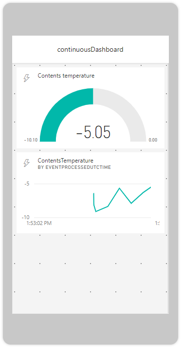

In this module, we look at the ability of an Azure IoT Central app to continuously export data.

The data in this scenario is telemetry from one or more Internet of Things (IoT) devices. The continuous data stream can be along a warm path for data analysis, or visualization, or along a cold path into storage. Or both.

This module builds on the app that you developed in the [Create your first Azure IoT Central app](https://docs.microsoft.com/learn/modules/create-your-first-iot-central-app/) module by adding data export and a data viewing app. It's not a _requirement_ to have completed the earlier module, but it might help your understanding of Azure IoT Central if you do complete it.

The earlier module explains how to monitor and command the movements of a refrigerated truck. This module adds to the realism of the scenario by archiving all the incoming data. Also, an external app is added to the mix. This app enables a remote viewer to easily use a mobile phone to check the temperature of the contents of the refrigerated truck.

You build the Azure IoT Central app from a pre-prepared JSON file that defines all the device capabilities. You load and run the device app code. A more detailed explanation of the sections of code is available in the earlier module.

You might notice that the next two units are identical to those in the [Set up rules and take action on telemetry data in Azure IoT Central](https://docs.microsoft.com/learn/modules/set-up-rules-take-actions-telemetry-data-azure-iot-central/) module, which also builds on the refrigerated trucks scenario, where you added rules and actions. If you haven't deleted the app you built for the rules and actions module, you can reuse it and go straight to unit 4. If you don't still have the app, start here at the beginning of this module.

## Learning objectives

In this module you will:

- Create an Azure IoT Central custom app by using the Azure IoT Central portal.
- Import a capability model for a custom device by using the Azure IoT Central portal.
- Create a programming project to simulate a refrigerated truck by using Visual Studio Code or Visual Studio.
- Create a storage account, and export all the incoming data into that account by using the Azure IoT Central portal.
- Create an Azure event hub to route data through an Azure Stream Analytics job by using the IoT portal.
- Create an external app to view the data by using Power BI.

## Prerequisites

- Introductory knowledge of the purpose of Azure IoT
- Ability to navigate the Azure IoT Central portal 
- Ability to use Node.js or C# at the beginner level 
- Experience using Visual Studio or Visual Studio Code at the beginner level 
- Must have an Azure Maps account or be able to open one

## The scenario

You've already built an Azure IoT Central app to monitor and control a simulated refrigerated truck. In this module, you make the process more realistic by archiving the telemetry data and enabling remote viewing of the data.

In this module, you use supplied components to construct the app that displays the data in the preceding image. You then add data export, so that the temperature of the truck contents is archived and viewable on your mobile device, as shown here:

## Create a custom Azure IoT Central app

1. Right-click [Azure IoT Central](https://apps.azureiotcentral.com/?azure-portal=true), and then select **Open link in new window**. It's a good idea to bookmark this URL, because it's the home page for all your Azure IoT Central apps.

1. Select **My apps**, and then select **New application**. 
1. Select **Custom apps**. 

1. Select **Custom application**, and then configure the app as shown in the following image:

    
 
    a. In the **Application name** box, enter a friendly name for the app.  
    b. In the **URL** box, enter a few words to include in the URL that describe the app.

    > [!IMPORTANT]
    > Your application name can be any friendly name, such as *Refrigerated Trucks*, but the URL _must_ be unique. This is why you append a unique ID to it. For example, if your URL includes *refrigerated-trucks-\<your id>*, replace *\<your id>* with a unique ID.

    c. Under **Pricing plan**, select **Free**.  
    d. Fill in the rest of the required fields, which is your contact information.

1. Select **Create**, and wait a few seconds while the app resource is built.

   You should now see a dashboard with a few default links.

The next time you visit your Azure IoT Central home page, select **My apps** on the left pane, and an icon for your Refrigerated Trucks app should appear.
