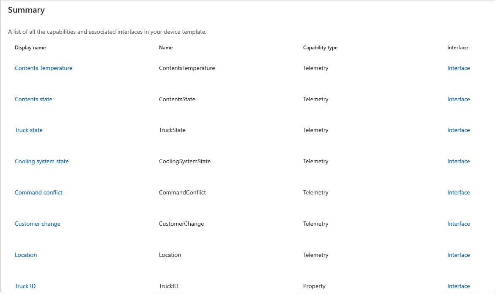
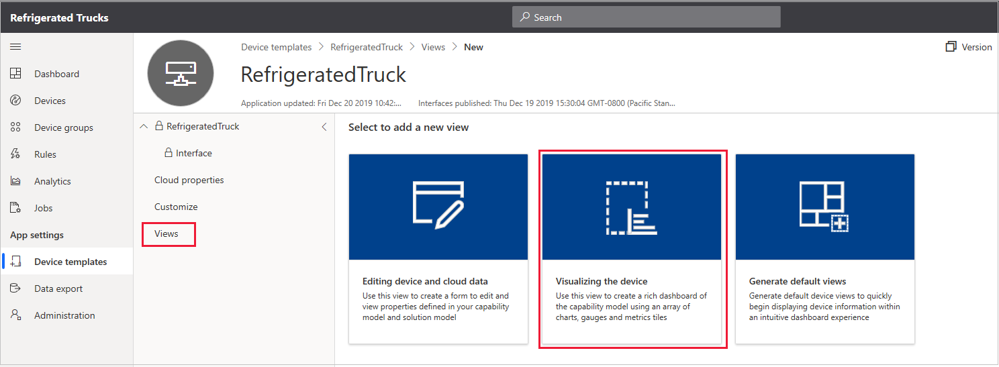
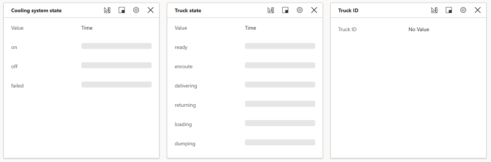

In this unit, you first download the required files and then import the capability model. Next, you create a dashboard that displays all the capabilities of the device template. You then create a real device and record the connection settings needed for the remote device app. Finally, you create an Azure Maps account, if you need to.

## Download the source code and import the capability model

In the preceding unit, you created the IoT Central app. The next step is to download the required files for the device app. You can choose to build your project by using C# or Node.js.

1. Go to the GitHub site that contains the project files for [Build your first IoT Central app](https://github.com/MicrosoftDocs/mslearn-your-first-iot-central-app).

1. Download two files to your local machine.

   * Download either of the following:
     * For C# developers: Select the *Program.cs* file.
     * For Node.js developers: Select the *app.js* file.
   
   * For all developers: Download the *Refrigerated Truck Capability Model.JSON* file.

## Import the capability model to the IoT Central app

A _capability model_ contains a definition of a device template. A device template can be created from scratch but, for this module, we'll import a pre-built capability model. The model defines the capabilities of a refrigerated truck.

1. In the IoT Central portal, on the left pane, select **Device templates**.

1. Select **New** to create a new device template.

1. Select **IoT device**.

    [](../media/rules-actions-new-template.png#lightbox)

1. Select **Next: Customize**.

1. Skip the **Gateway device** check box, select **Next: Review**, and then select **Create**.

1. Give the template a name, such as *RefrigeratedTruck*, and then select Enter.

1. Select **Import capability model**.

    [](../media/rules-actions-import-model.png#lightbox)

1. Open the downloaded JSON file, which contains the capability model. A **Summary** page displays all the elements of the capability model.

    [](../media/rules-actions-model-summary.png#lightbox)

1. At the upper right, select **Publish** and then, in the pane that opens, select **Publish** again to publish the capability model. Only a published model is available for your app to use.

## Create a rich dashboard

To visualize the movements and state of the refrigerated truck, you need to create a dashboard.

1. Select the **Views** menu option, and then select the **Visualizing the device** tile.

    [](../media/refrigerated-trucks-add-view.png#lightbox)

    The pane displays a list that includes **Telemetry**, **Property**, and other tiles of the capability model, each with a check box next to it.

1. Select the **Location** check box, and then select **Add tile**. 

   Dashboards are made up of tiles. The reason for choosing the **Location** tile first is that you want to expand it from its default size. Drag the lower right corner of the tile, so that it is at least twice the default size. This tile is the most fun, because it shows the location of the truck on a map of the world.

1. Before you add more tiles, change the **View name** to something more specific, such as *Truck view*.

1. Select each of the rest of the telemetry and properties capabilities in turn, starting at the top, and then select **Add tile**. 

   The idea is to go for function over form here. You can make the dashboard more elegant later. For now, you want only a dashboard that confirms all the telemetry that's being sent from your remote device. There's no need to add the commands to the dashboard, though that option does exist.

1. When you've added all the tiles, check out the tile labels. You can drag tiles around, and the portal will try to rearrange them neatly.

    [](../media/refrigerated-trucks-sample-tiles.png#lightbox)

1. When you're satisfied with your dashboard, select **Save**, and then select **Publish**. 

    In the pane that opens, you'll now notice that the **Views** entry is **Yes**. 
    
1. Select **Publish**.

You can create as many views as you'd like and give each a friendly name. For this module, though, one dashboard works well.

The next step is to create a device.

## Create a real device

By *real* device, we mean that IoT Central understands that there's a remote app running. The app can be in a real device, either taking input from real sensors or running a simulation. Both options are treated as a connection to a real device.

1. On the left pane, select **Devices**.

1. On the **Devices** menu, select **RefrigeratedTruck**. This selection ensures that the device you create is using this device template.

1. Select **New**. 

1. On the **Create a new device** pane, in the **Device template** box, verify that the template is **RefrigeratedTruck**.

    [](../media/refrigerated-trucks-create-new-device.png#lightbox)

1. Change the **Device name** to a friendlier name (for example, *RefrigeratedTruck - 1*).

1. Change the **Device ID** to a friendlier name (for example, *RefrigeratedTruck1*).

1. Leave the **Simulate this device?** setting at **No**. 

   You're going to build a real truck here. Well, a _simulated_ real truck. Setting this value to **Yes** instructs IoT Central to pump out random values for your telemetry. These random values can be useful in validating a device template.

1. Select **Create**. 

   After a few seconds, your device list should be populated with a single entry.

    > [!NOTE]
    > The **Device status** is *Registered*. Not until the device status is *Provisioned* will the IoT Central app accept a connection to the device. The coding unit that follows shows how to provision a device.

1. In the device list, select **RefrigeratedTruck - 1**.

   The live dashboard is displayed, with lots of "Waiting for data" messages.

1. On the menu, select the **Commands** entry that includes **Truck view**. 

    The commands that were in the capability model are ready to be run.

The next step is to create the keys that allow a remote device to communicate with this app.

### Record the connection keys

1. For the device, select **Connect** on the menu at the upper right. Do _not_ select **Connect to gateway**.

1. On the **Device connection** pane, copy the **ID scope**, **Device ID**, and **Primary key** values to a text file. Save the file with a meaningful name (for example, *Truck keys.txt*).

1. Leave the **Connect method** value as **Shared access signature (SAS)**.

1. Select **Close**.

Leave the IoT Central portal open in your browser, because it's "waiting for data."

::: zone pivot="vs-node,vscode-node"

## Generate a connection string

The essential component for communication between a Node.js device app and IoT Central is the connection string. There are some tools that make generating these strings easy. In this unit, you access these tools in such a way that you can reuse them later. To start with, you need some information about your real device.

All of the work to generate connection strings is handled through Azure Cloud Shell.

1. Open [Azure Cloud Shell](https://shell.azure.com/?azure-portal=true).

1. Create a *refrigerated-truck* folder by running the following commands:

    ```bash
    mkdir ~/refrigerated-truck
    cd ~/refrigerated-truck
    ```

1. In the *refrigerated-truck* folder, install the Device Provisioning System (DPS) key generator (_dps-keygen_) by running the following command:

    ```bash
    npm install dps-keygen
    ```

1. Download and install a DPS connection string utility (_dps-cstr_) from GitHub:

    ```bash
    wget https://github.com/Azure/dps-keygen/blob/ota/bin/linux/dps_cstr?raw=true -O dps_cstr
    ```

    > [!NOTE]
    > You might have noticed in the preceding URL that you're downloading the Linux version of dps-cstr. This version is needed for the command to run in Azure Cloud Shell.

1. To give dps-cstr the correct permissions, run the following command:

    ```bash
    chmod +x dps_cstr
    ```

1. Remember that in the preceding section you stored the scope ID, device ID, and primary key for your device. It's a good idea to keep a text document open and create in it the following string, replacing *{scope-id}*, *{device-id}*, and *{primary-key}* with your own values. With this text document, you can create and validate the string before you commit to running it. Copy this command from your text document to the *refrigerated-truck* folder of Azure Cloud Shell, and run it.

    ```bash
    ./dps_cstr {scope_id} {device_id} {primary_key} > connection1.txt
    ```

1. In Cloud Shell, go to the *connection1.txt* file by selecting the braces ({&nbsp;}) button. 

   To locate the file, you might have to expand the *refrigerated-truck* node. 
   
1. Double-click the *connection1.txt* file to open it, and then copy the file contents to your text tool.

    [](../media/refrigerated-trucks-connection1.png#lightbox)

    > [!IMPORTANT]
    > The last element of the connection string is the primary key. Verify that the connection string in your text file ends with an exact copy of the primary key. If it doesn't, correct the copy you've made of the correction string in your text document.

1. The connection string you'll use in the Node.js app in the next unit starts with *HostName=*. Separate this part of the string from the rest in your text document, so that one line contains a string that looks _similar_ to `HostName=iotc-<guid>.azure-devices.net;DeviceId=<your Device ID>;SharedAccessKey=<your primary key>`.

1. Save the file.

You now have the all-important connection string. The scope ID identifies the app, the device ID identifies the real device, and the primary key gives you permissions for the connection.

::: zone-end
::: zone pivot="vscode-csharp"

## Install the C# extensions

1. To use C# in Visual Studio Code, ensure that both [.NET Core](https://dotnet.microsoft.com/download), and the [C# extension](https://marketplace.visualstudio.com/items?itemName=ms-vscode.csharp) are installed.

::: zone-end


## Create a free Azure Maps account

All developers also need an Azure Maps account. If you don't already have an Azure Maps account, you can create one by doing the following: 

1. Go to [Azure Maps](https://azure.microsoft.com/services/azure-maps/?azure-portal=true).

1. Follow the prompts to create a free account. 

1. When your account is set up, you'll need the primary key for the account. To find this key, select **Authentication** on the left pane for your Azure Maps resource. 

1. Copy this key to the *Truck keys.txt* file, and add a note that it applies to Azure Maps.

You don't need an Azure Maps account to _render_ a map, because the rendering is done by an IoT Central dashboard. You need the Azure Maps account to use its API calls to calculate the best route to any specified destination.

## Next steps

In the next unit, you create the device app.
