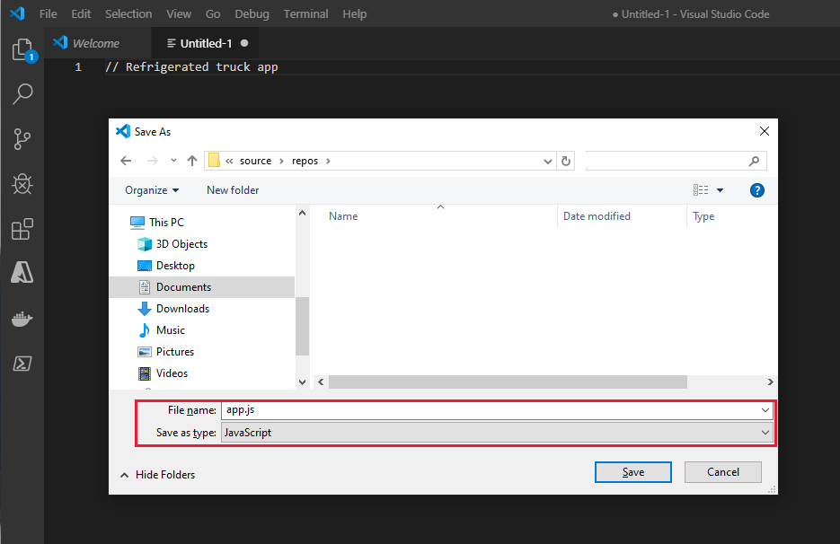
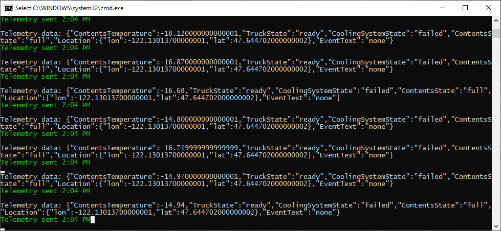
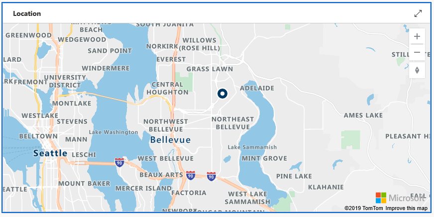

In this unit, you create a programming project to simulate a sensor device in a refrigerated truck. This simulation enables you to test the code long before you require a real truck. 

## Create the device app

In your preferred development environment, build the device sensor app. Visual Studio Code and Visual Studio examples are available in this unit.

::: zone pivot="vscode-node"

Node.js is a platform for building server apps, based on JavaScript. All the JavaScript code you'll need is provided here, so you don't have to be a JavaScript developer to get this app up and running.

1. In Visual Studio Code, on the **Terminal** menu, select **New Terminal**.

1. In the **Terminal** window, create an empty folder, *RefrigeratedTruck*, where you'll develop your code, by running the following command:

   `mkdir RefrigeratedTruck`
   
1. Go to the folder by running the following command:

   `cd RefrigeratedTruck`

1. On the Visual Studio Code **File** menu, select **New File**, and then do the following: 

   a. Insert a single line as a comment, such as *// Refrigerated Truck app*.   
   b. Save the file to the *RefrigeratedTruck* folder with the name *app.js*. 
   
   When you use the .js file extension, Visual Studio Code interprets this file as JavaScript and evaluates the contents by using the JavaScript language service.

    [](../media/refrigerated-trucks-vscode.png#lightbox)

1. Back in the **Terminal** window, load the libraries you need by running the following commands:

    ```CLI
    npm install azure-iot-device
    npm install azure-iot-device-mqtt
    npm install azure-maps-rest
    npm install chalk
    ```

::: zone-end
::: zone pivot="vscode-csharp"

1. In Visual Studio Code, on the **Terminal** menu, select **New Terminal**.

1. In the **Terminal** window, create an empty folder, *RefrigeratedTruck*, where you'll develop your code, by running the following command:

   `mkdir RefrigeratedTruck`
   
1. Go to the *RefrigeratedTruck* folder by running the following command:

   `cd RefrigeratedTruck`

1. In the **Terminal** window, run:  

   `dotnet new console`
   
   This command creates a *Program.cs* file in your folder, along with a project file.

1. In the **Terminal** window, run:

   `dotnet restore`
   
   This command gives your app access to the required .NET packages.

1. In the **Terminal** window, install the required libraries by running the following commands:

    ```CLI
    dotnet add package AzureMapsRestToolkit
    dotnet add package Microsoft.Azure.Devices.Client
    dotnet add package Microsoft.Azure.Devices.Provisioning.Client
    dotnet add package Microsoft.Azure.Devices.Provisioning.Transport.Mqtt
    dotnet add package System.Text.Json
    ```

1. On the Visual Studio Code **File** menu, open the *Program.cs* file, and then delete the default contents.

::: zone-end
::: zone pivot="vs-node"

1. In Visual Studio, go to the **JavaScript** project types, and then select **Blank Node.js Console Application**, called "RefrigeratedTruck."

    [](../media/refrigerated-trucks-vs-project.png#lightbox)

1. Right-click the **npm** entry in Solution Explorer, and select **Install New npm Packages**.

1. On the **Install New npm Packages** page, search for and install the following libraries:

    * **azure-iot-device**
    * **azure-iot-device-mqtt**
    * **azure-maps-rest**
    * **chalk**

    [](../media/refrigerated-trucks-vs-npm.png#lightbox)

1. Delete the default contents of the *app.js* file.

::: zone-end
::: zone pivot="vs-csharp"

1. Open Visual Studio, and create a new **Visual C#/Windows Desktop** project. 

1. Select **Console App (.NET Framework)**.

1. Give the project a friendly name, such as "RefrigeratedTruck."

1. Under **Tools/NuGet Package Manager**, select **Manage NuGet Packages for Solution**. 

1. Install the following libraries:
    * **AzureMapsRestToolkit**
    * **Microsoft.Azure.Devices.Client**
    * **Microsoft.Azure.Devices.Provisioning.Client**
    * **Microsoft.Azure.Devices.Provisioning.Transport.Mqtt**
    * **System.Text.Json**

1. Delete the default contents of the *Program.cs* file.

::: zone-end

## Load and run the device app

::: zone pivot="vs-node"

1. Copy the previously downloaded app.js code to the *app.js* file of the project.
1. Copy the connection string and the Azure Maps key to the locations marked in the code.
1. In Visual Studio, select **Debug/Start without Debugging**.

::: zone-end

::: zone pivot="vs-csharp"

1. Copy the previously downloaded Program.cs code to the*Program.cs* file of the project.
1. Replace the strings in the code (`ScopeID`, `DeviceID`, `PrimaryKey`, and `AzureMapsKey`) with the ID and key strings that you stored in your *Truck keys.txt* file.
1. In Visual Studio, select **Debug/Start without Debugging**.

::: zone-end
::: zone pivot="vscode-node"

1. Copy the previously downloaded app.js code to the *app.js* file of the project.
1. Copy the connection string and the Azure Maps key to the locations marked in the code.
1. In the Visual Studio Code **Terminal**, enter **node app.js**.

::: zone-end
::: zone pivot="vscode-csharp"

1. Copy the previously downloaded Program.cs code to the *Program.cs* file of the project.
1. Replace the strings in the code (`ScopeID`, `DeviceID`, `PrimaryKey`, and `AzureMapsKey`) with the ID and key strings you stored in your *Truck keys.txt* file.
1. In the Visual Studio Code **Terminal**, enter **dotnet run**.

::: zone-end

A console window opens, displaying the text "Starting Truck number 1" on the first line.

You're now ready to test the device app.

### Confirm that the device app has connected to Azure IoT Central

If one of the next few lines on the console is "Device successfully connected to Azure IoT Central," you've made the connection. 

If this text isn't displayed, it usually means that either the IoT Central app isn't running or the connection key strings are incorrect.

The "Device successfully connected to Azure IoT Central" line should be followed by some text verifying that the settings and properties were sent successfully.

[](../media/refrigerated-trucks-connected.png#lightbox)

If your device has connected successfully, proceed to the second test.

### Confirm that the telemetry functions are sending data at the specified interval

A console message should appear every five seconds, displaying the temperature of the truck contents.

Watch the telemetry for a short while.

### Confirm that the data is being picked up correctly by IoT Central

1. To verify that the data is being received at IoT Central, make sure that your IoT Central app is open and the device is selected. 

1. If the device is not selected, select **Devices** on the left pane and then, in the list of devices, double-click the real device, **RefrigeratedTruck - 1**.

1. On the **Contents temperature** tile, verify approximately that the temperatures being sent by the device app match the data that's displayed in the telemetry view of the IoT Central app.

    > [!NOTE]
    > It might take a few minutes for the dashboard to display the incoming data.

    | IoT Central | Device app |
    | --- | --- |
    | [](../media/refrigerated-trucks-central.png#lightbox) | [](../media/refrigerated-trucks-console.png#lightbox) |

    > [!NOTE]
    > The screenshots in this module are taken from the C# version of the app. The Node.js app display is similar, but not identical.

1. In the IoT Central app, check the **Truck state**, **Cooling system state**, and **Contents state** tiles to verify that the truck and its contents are in the expected state.

1. Check the **Location** map view for the device. 

   In the following image, a blue circle near Seattle shows that your truck is ready to go. You might have to zoom out to view the entire map.

    [](../media/refrigerated-trucks-seattle.png#lightbox)

1. Try giving the truck a command to go to a customer. To do so, select **Commands**, enter a customer ID, and then select **Run**. Valid customer numbers are 0 through 9.

If you've confirmed all information successfully, this is great progress. The truck is responsive and awaiting more commands.

The next step is to understand the data export options.
