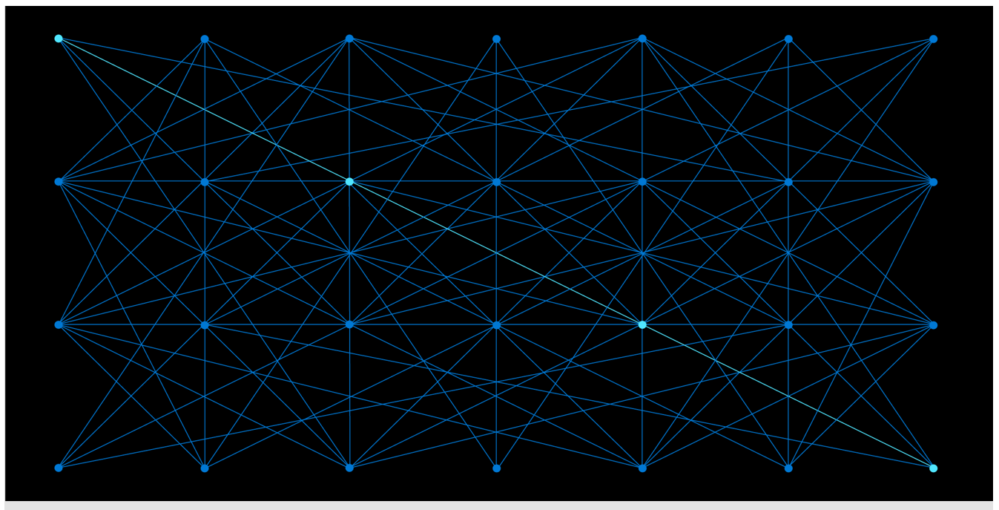

Let's go over some of the concepts behind continuous data export.

Data that's exported from IoT Central can be sent to any of three services. Let's take a quick look at each of these services.

## Azure Blob storage

Azure Blob storage is the go-to storage for Azure services. It isn't as sophisticated, or costly, as the Azure Cosmos DB service. Blob storage is ideal for logging, archiving, and general purpose storage.

There's a key difference between sending data to Blob storage and sending continuous data to the other two services discussed here. Data for Blob storage is batched, and sent once every minute. Data that's sent to Azure Service Bus or Azure Event Hubs is continuous, and it's sent in near real time. If response within a minute is important to you, this latency makes Blob storage a less suitable route for warm path data analysis.

## Azure Service Bus

Azure Service Bus is a message brokering service that decouples apps from services. Data is transferred between various apps and services by using _messages_.

A message is in binary format, and it can contain JSON or XML code, or text.

Service Bus messages are secure and transmitted asynchronously. When apps are decoupled from services, the client and the service don't have to be online at the same time. Also, decoupling can improve the reliability and scalability of an app.

Common applications of Service Bus include standard business communications, such as purchase orders, sales, and inventory. There can be a one-to-many relationship between publisher and subscriber. Messages can be ordered and deferred. Messages can be queued, so that the receiving app receives and processes them in order. Also, multiple queues and topics can be held in a single namespace. A namespace can often serve as a container.

We won't be implementing Service Bus in this module. The key takeaway is that Service Bus is an enterprise-level message routing service.

## Azure Event Hubs

Azure Event Hubs is a big-data streaming platform. The range of applications that it's designed for is similar to that of Azure IoT Hub, except that, for IoT devices, the recommended solution is an IoT hub. An Azure event hub, however, might well be part of a larger solution, and you might want your IoT data exported to it.

Event Hubs can handle millions of events per second. Back-end processes might well handle real-time analytics, storage, anomaly detection, analytics pipelines, live dashboards, transaction processing, and many other processes.

An event hub is a gateway to an event pipeline, often called an _event ingestor_ in solution architectures.

You'll implement an event hub in this module. The event hub is used as input to an Azure Stream Analytics job, which itself is used as input to Power BI.

## Practical tips for implementing data export

When you create the data export service from IoT Central, you can define one of the three services described here. You'll be given the option of selecting any of them from within your subscription. However, you can send data to any of these services outside of your subscription by using a connection string.

An important tip: if your IoT devices are sending telemetry data, and your data export is _not_ running, the telemetry data is lost. Only when the data export service is started will data be exported. To ensure that you're capturing the data, we recommend that you set it to run early.

Let's now put some of this theory to practice, and set data export in motion.
