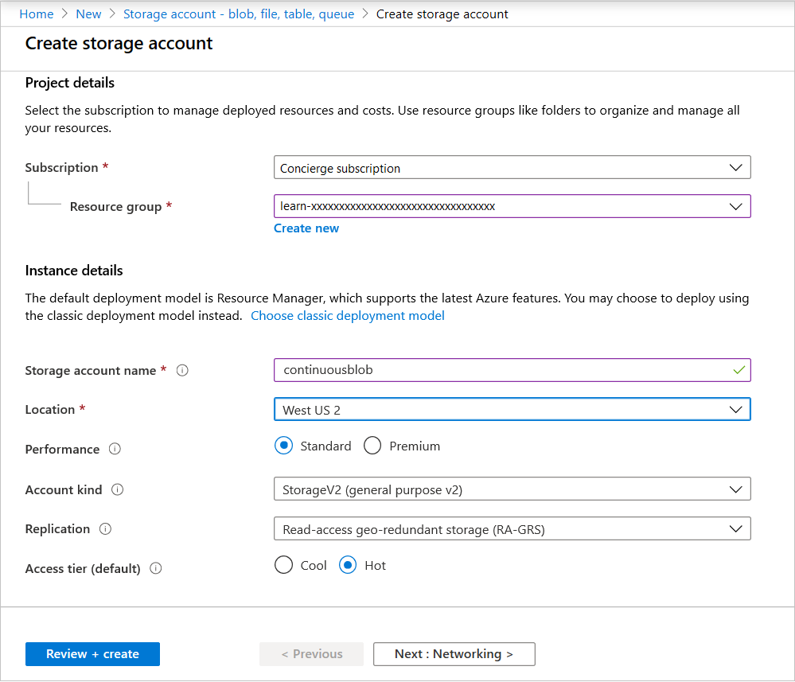
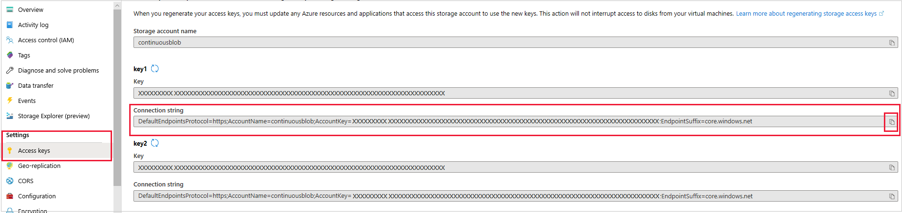
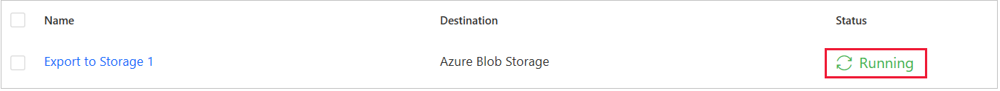
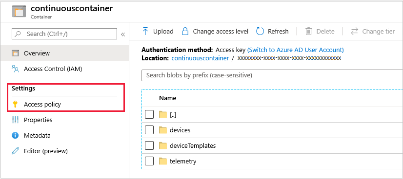

In this unit, you first create an Azure Blob storage resource, including one container, and then you create a new data export from your IoT Central app. Finally, you test that the telemetry data is reaching the storage container.

It's essential to create the resources in the correct order: storage first, and then data export.

## Create a Blob storage resource

In this section, you create a Blob storage resource outside of your IoT Central app, and then connect to it by using a connection string.

1. Sign in to the [Azure portal](https://portal.azure.com/learn.docs.microsoft.com?azure-portal=true), select **Create a resource** and then, in the search box, enter **Blob storage**.

1. From among the many storage options, select **Storage account - blob, file, table, queue**.

    

1. Select **Create**.

   The **Create storage account** pane is displayed.

    

1. In the **Subscription** box, enter **Concierge subscription** (your sandbox subscription).

1. In the **Resource group** box for the sandbox, enter a name that begins with **learn-**.

1. In the **Storage account name** box, enter a suitable name, such as *continuousblob*.

1. In the **Location** box, select the region nearest to you.

1. Leave the rest of the entries at their default values, and then select **Review + create**.  

1. Select **Create** again, when that option appears.

1. When the option is available, select **Go to resource**.

## Create a storage container

It's important to have a container within your Blob storage account.

1. On the left pane of your Blob storage account, select **Containers**, and then select **Container**.

1. Create a new container, and then give it a descriptive name, such as *continuouscontainer*.

1. When the container is deployed, go back to the overview page for the Blob storage account.

## Extract the connection string for the Blob storage account

Now you're going to connect the data export feature to the storage account by using a connection string.

1. On the left pane, select **Settings**, and then select **Access keys**.

1. You'll notice that there are two keys under **key1**. You need the full connection string, so select the **Copy** button next to the **Connection string** box to copy the **key1** connection string to the clipboard.

    

1. Paste the copied connection string in the text file that you created earlier.

Great, you've now set up everything you need. Leave the Blob storage overview page open, so that you can come back to it when the checking data is being received.

## Create the data export

1. Go to the browser window with your IoT Central app in view.

1. On the left pane, select **Data export** and then, in the **New** drop-down list, select **Azure Blob Storage**.

    

1. On the **Create data export** pane, enter the connection string that you saved in the preceding section.

1. In the **Container** box, enter **continuouscontainer**.

1. Verify that the **Enabled**, **Telemetry**, **Devices**, and **Device templates** options are all set to **On**, and then select **Save**.

   The **Data export** page is displayed, and your data export **Status** is *Running*.

    

Good work. The final step of this unit is to verify that the telemetry is reaching your container.

## Verify that your container is receiving continuous data

1. Open your refrigerated truck app, if it isn't already open.

1. Find the browser window with the Blob storage resource in view.

1. On the left pane, select **Containers**, and then select **continuouscontainer**.

   There will be some latency before the data appears. When the data starts arriving, you can clearly see the node headings **devices**, **deviceTemplates**, and **telemetry**.

    

Great progress: your continuous data is now flowing into your Blob storage container. Feel free to explore the container nodes, though the content is fairly dry JSON code.

Leave everything running. In the real world, data will certainly flow continuously.

With this JSON data arriving in volumes, the question is what to do with it. What you want is an app that enables the friendly display of the data. Let's next look at some Microsoft technology that's suitable for data visualization.
