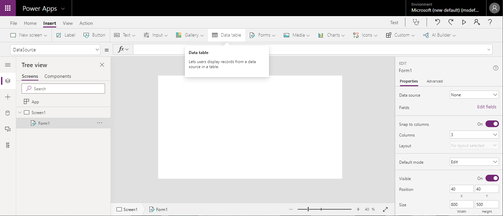
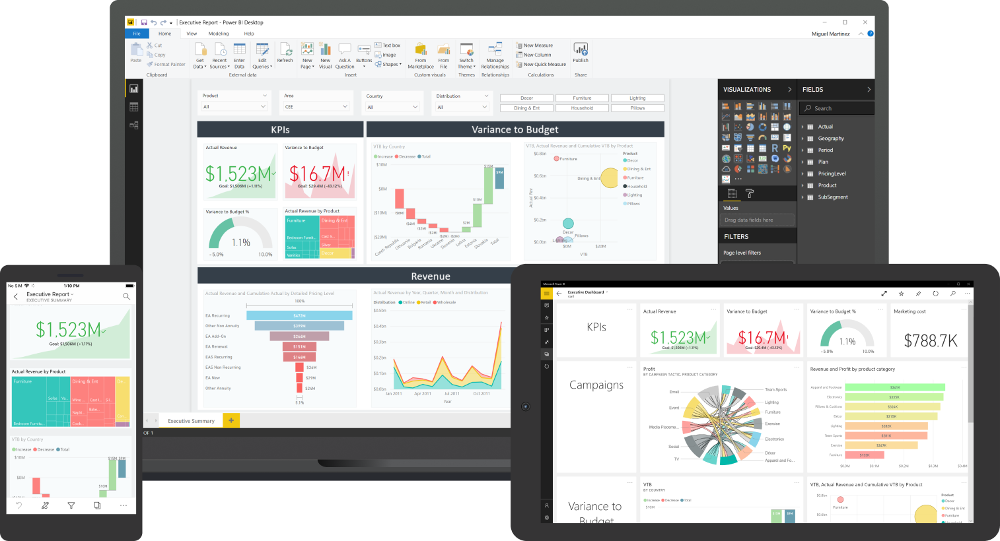
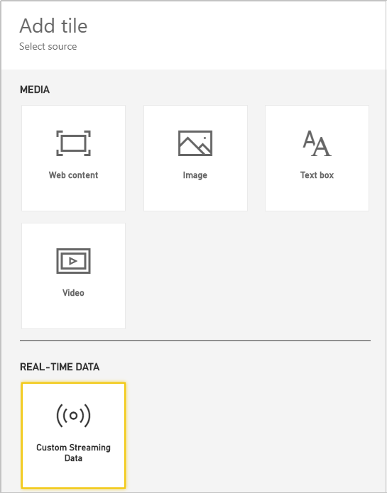

In this unit, we look at two Microsoft technologies that you can use to visualize Azure IoT Central continuous data. The technologies are Power Apps and Power BI.

Let's first go over some of the concepts behind Power Apps.

## Introduction to Power Apps

By using Power Apps, you can build your application without any coding. You use a web portal to select components, inputs, outputs, and so on. Your app is built almost as a drag-and-drop process. You might select a _template_, if one of the available templates matches your ideas. If there's no suitable template, you can build your app from scratch.

Power Apps can be built to ingest data either from an underlying data platform, known as Common Data Service or, as in our scenario, from an external data source. This data source can be SharePoint, Excel, Microsoft 365, or many others. In our scenario, we'll use Azure Blob storage for our data source. Fortunately, this option is available.

With Power Apps, the key concept is _rapid development_. You can build a functional, useful app in just a few minutes.

Let's drill down a little further into the three types of Power Apps: _canvas apps_, _portals_, and _model-driven apps_.

### Canvas apps

The name should give away the idea. You drag and drop components onto a _canvas_. An easy way to start might be to select **All templates** after you sign in to [Power Apps](https://make.preview.powerapps.com/environments/). But it might be more fun to select **Canvas app from blank**, and educate yourself by dragging in a mix of components.

Power Apps gives you the option of specifying **Tablet** or **Phone** for your canvas app. You then get a powerful, but slightly intimidating, user interface. You have lots of options, as shown here:

The key to canvas apps is they are user-interface driven. Canvas apps start with your user experience, letting you select a target of phone, tablet, or web. You can then select and connect to data from over 200 different sources.

### Portals

Power Apps portals are external-facing. You can build a web portal that allows users outside of your organization to sign in, view, and create data by using Common Data Service.

### Model-driven apps

Model-driven apps are fascinating. You start by selecting your data model and source. Model-driven apps automatically create a user interface that matches the format of your data. Forms, views, dashboards, charts, and other components are built without you having to specify anything.

Now, let's look at the other technology, Power BI. BI stands for _business intelligence_.

## Visualize data by using Power BI

Power BI is an easy-to-use dashboard-building technology. You create dashboards from tiles. Tiles can contain images, text boxes, videos, or more complex web content. This fourth, web content tile can contain HTML, which is typically pasted into a tile-creation box. Tiles are rectangular shapes that you can resize to fit your preferred output device.

Power BI has a built-in conversion feature that lets any dashboard display content in a format that's suitable for a mobile phone.

A fifth type of tile, to accommodate custom streaming data, is the one we're most interested in for our scenario. This tile is the most powerful, because it accepts data from any available _dataset_. Power BI datasets take input from many sources, which can range from, for example, a simple Excel spreadsheet to more a complex Azure Stream Analytics job.

It takes only minutes to build a functioning Power BI dashboard, as you'll see in the next unit.

To accept Azure IoT Central data as a source, you need to create an Azure event hub and a Stream Analytics job.

## Next steps

Power Apps is the more powerful of the two technologies. You can build more sophisticated apps with Power Apps than with Power BI. Currently, however, the Power Apps service requires a paid subscription to enable Azure data as a source.

In this module, you build a Power BI dashboard to display continuous IoT Central data on a mobile phone. When you've completed this module, we encourage you to investigate Power Apps for a developer-level solution.
