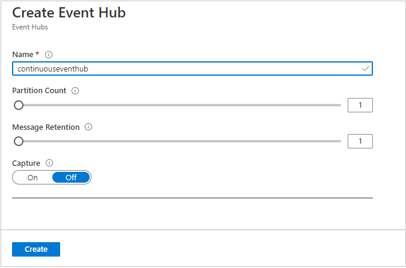
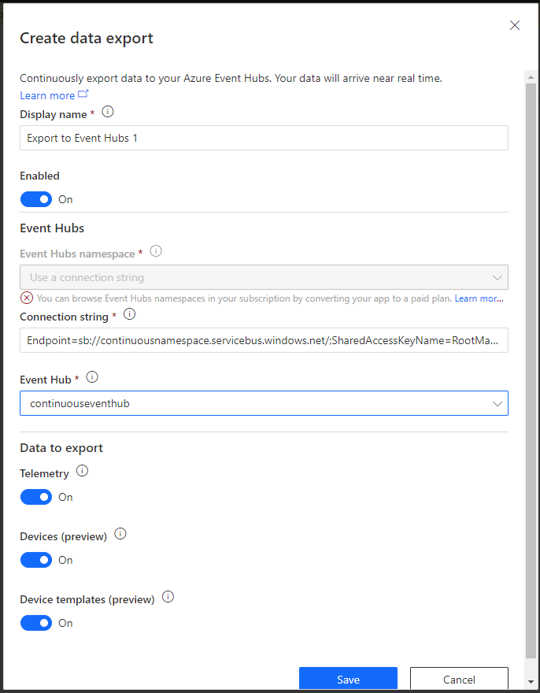
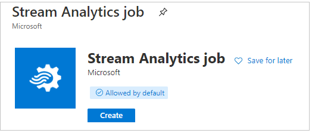
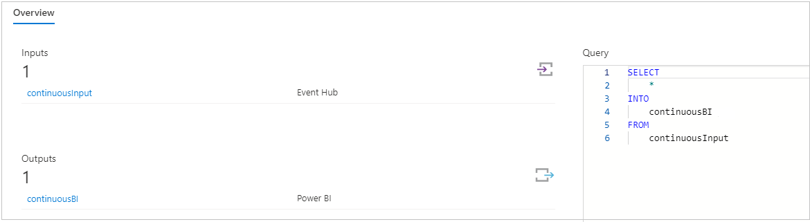
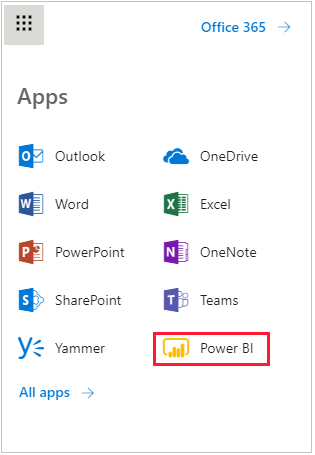
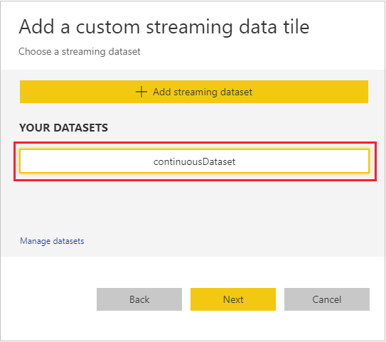
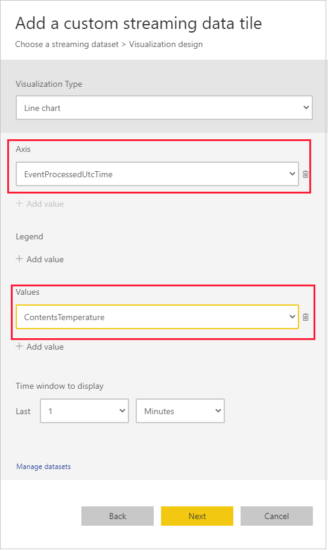
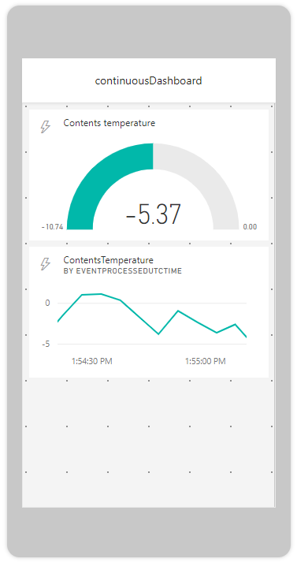

In this exercise, you create a Stream Analytics job and then use Power BI to visualize the output from the query. To begin, you create an instance of an event hub namespace.

## Create an event hub namespace

In this unit, you use the Azure portal, which contains your Blob storage account and container, to create a new resource. 

1. In the Azure portal, search for **Event Hubs** and then, in the results list, select it.

1. Verify that the subscription is **Concierge Subscription**, select the sandbox **learn-** resource group, and do the following:

   a. In the **Name** box, enter **continuousnamespace**.   
   b. For **Pricing tier**, use the recommended selection, because sandbox resources are free.  
   c. Set the **Throughput Units** value at **1**.

1. Select **Create**, and wait for the resource to be deployed. This process can take a few minutes.

1. Save the connection string for the namespace. On the left pane, select **Shared access policies**, open **RootManagedSharedAccessKey**, and then copy the **Connection string-primary key** value to your text file. This key is the connection string for the event hub namespace.

### Create an event hub instance

1. Go to the **Overview** page for your event hub namespace resource. If you don't already have it open, find it by going to your Azure portal home page, and then searching recent resources or selecting **All resources**.

1. Select the namespace, and then select **Event Hub**. You need to create an instance of this namespace.

1. On the **Create Event Hub** pane, in the **Name** box, enter **continuouseventhub**. Keep the default settings for the other fields, and then select **Create**.

    [](../media/continuous-data-create-event-hub-instance.png#lightbox)

   Wait for the resource to be deployed.

### Set continuous data export to your event hub

1. Locate the home page for your IoT Central Refrigerated Truck app.

1. On the left pane, select **Data export**.

1. Select **New**, and then select **Azure Event Hubs**.

1. On the **Create data export** pane, keep the value in the **Display name** box as **Export to Event Hubs 1**.

1. In the **Event Hubs namespace** box, enter the connection string that you saved in the preceding section.

     [](../media/continuous-data-create-data-export-event-hub.png#lightbox)

1. In the **Event Hub** box, enter **continuouseventhub**.

1. Keep the default values of the other fields, and select **Save**.

1. Wait for the status of the data export to change to *Running*.

## Create an Azure Stream Analytics job

1. Go to the home page for your Azure Blob storage and event hub resources.

1. Select **Create a resource**. 

1. Search for and select **Stream Analytics job**, and then select **Create**.

    [](../media/continuous-data-new-job-create.png#lightbox)

1. In the **Name** box, enter **continuousjob**. Select the sandbox **Concierge Subscription** link, and then select the **learn-** resource group.

1. In the **Location** drop-down list, select the location nearest to you.

1. Reduce the number of **Streaming units** from **3** to **1**. There's no need for more capability than is required.

1. Select **Create**. 

1. Wait for the "Deployment succeeded" message, and then open the new resource.

    > [!TIP]
    > If you miss the message to go to the new resource, or you need to find a resource at any time, select to **Home/All resources**. Enter enough of the resource name for it to appear in the list of resources.

An empty Stream Analytics job is displayed as a skeleton query, with no inputs or outputs. The next step is to populate these entries. Do the following: 
   
1. Select **Inputs**.

1. Select **Add stream input** and then, in the drop-down list, select **Event Hub**.

1. In the **Input alias** box, enter **continuousInput**.

1. Ensure that the **Select Event Hub from your subscriptions** option is selected, and do the following: 

   a. For **Event Hub namespace**, select **continuousnamespace**.  
   b. For **Event Hub name**, ensure that **Use existing** is selected.  
   c. Select **continuouseventhub**.  
   d. Ensure that **Use existing** is selected for the two other check boxes.  
   e. Keep the default values for the other fields.

1. Select **Save**.

1. Select your Stream Analytics job again. You can easily do so from the breadcrumbs at the upper left. 

   You should now see that your job has an input. 
   
1. Select **Outputs**.

1. To add an output, select **Add** and then, in the drop-down list, select **Power BI**.

1. At the prompt, authorize the connection.

1. For **Output alias**, enter **continuousBI**.

1. In the **Group workspace** drop-down list, select **My workspace**. If this option isn't available, select one of the listed workspaces, and record that workspace name in your text file.

1. For **Dataset name**, enter **continuousDataset**.

1. For **Table name**, enter **continuousTable**.

1. Change the **Authentication mode** value to **User token**.

1. Keep the default values for the other fields, and select **Save**.

1. Use the breadcrumbs to select your job.

1. Select **Edit query**, and change the query to:

    ```sql
    SELECT
        *
    INTO
        continuousBI
    FROM
        continuousInput
    ```

1. Select **Save query**, and return to your job.

    [](../media/continuous-data-job-overview.png#lightbox)

1. Select **Start**, and run your job.

## Create a dashboard to visualize the query by using Power BI

1. In your browser, go to your [Microsoft Outlook mail inbox](https://outlook.office365.com). You might have to enter your Microsoft account sign-in information.

1. On the **Bookmarks bar**, at the far left, select the **Show apps** icon.

1. In the drop-down list, select **All apps**, and then select **Power BI**.

    [](../media/continuous-outlook-power-bi.png#lightbox)

1. Open the workspace where you created the dataset. The workspace might be **My workspace** or one that you selected earlier and stored in your text file.

1. Under **Datasets**, verify that **continuousDataset** is displayed. If it isn't displayed, you might have to wait a short time for this datasets list to populate.

1. At the upper right, in the **Create** drop-down list, select **Dashboard**.

1. Give the dashboard a friendly name (for example, *Continuous dash*).

1. On the next pane, select **Add tile**. 

1. Select **Custom Streaming Data** > **Next** and then, in the list of datasets, select **continuousDataset**.

    [](../media/continuous-power-bi-dataset.png#lightbox)

1. For the first card, do the following:

   a. For **Visualization Type**, select **Gauge**.  
   b. For **Value**, select **ContentsTemperature**.   
   c. Select **Next**.  
   d. In the **Tile details** box, for the title, enter **Contents temperature**.

1. Select **Apply**.

1. On the tile, use the icon at the lower right to reduce it to the smallest allowable size.

1. Repeat the process, with the same dataset and tile source, for a second tile. This time, use the following values:

    a. For **Visualization Type**, select **Line chart**.  
    b. For **Axis**, select **EventProcessedUtcTime**.  
    c. For **Values**, select **ContentsTemperature** again.  
    d. You don't need to add a title.  
    e. Select **Next**, and then select **Apply**.

    [](../media/continuous-power-bi-utc-tile.png#lightbox)

1. At the upper right, change **Web view** to **Phone view**.

   There might be a latency because of the many routes and connections, so you might have to wait a minute. Are you now seeing the continuous data coming through? Is the temperature changing? Is the line chart scrolling left?

1. Let the job run for a while, with the console output of the device app in view. 

    Are you able to correlate the contents temperatures from the app, shown in the console window, with the gauge in Power BI?

    [](../media/continuous-data-phone-view-2.png#lightbox)

If you're seeing an active Power BI dashboard, similar to the one in the image, you've nearly completed this module. Great work.

Finish the module with a knowledge check.
