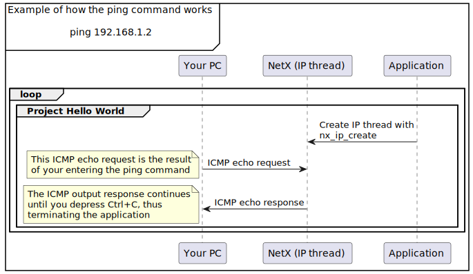

## Learning objectives

In this module, you will:

- Learn how to use the address resolution protocol (ARP)
- Learn how to use the internet control message protocol (ICMP)
- Learn how to build and run the Hello World project
- Learn how to submit a ping request

## Introduction

In this module, you get to experiment with NetX Duo. We will use the address resolution protocol (ARP), and the internet control message protocol (ICMP) described in the previous module. We will use these protocols in this first project (the Hello World project) whenever you submit a ping request, which will be discussed later in this module.

For this Hello World sample project, we enable ARP and ICMPv4. ARP is essential for IPv4 over Ethernet/Wi-Fi, and it is very helpful to enable ICMPv4 to detect the network status. Whenever you develop a new application, you should always do a ping test (ICMP echo request/response) first. This test can help you to achieve the following objectives:

- Determine whether the Ethernet cable is connected, or Wi-Fi is connected without any issue. A common mistake is that the Ethernet cable is not connected to the device but you take time checking issues somewhere else.
- Determine whether the device is alive or not. When the application crashes or the resource is depleted, using a ping test is the simplest way to detect the status of device.
- Determine the stability of the device through the packet loss and ping time statistical report. The statistical report is generated automatically after you finish a ping test. For a normal Ethernet environment, there should be zero packet loss, and the average ping time should be within 1 ms. This helps you to detect network issues at an early stage.

## Prerequisites

- Completion of the Fundamentals module.
- If you haven't done so already, set up [GitHub Codespaces](https://github.com/features/codespaces) so that you can build and run your projects in this learning path.

## Overview of the project

Our purpose here is to start with a simple project to illustrate the basic features of NetX. Traditionally, the objective in an introductory computer programming course is to display the words “Hello World.” We call our first project the Hello World project because of its simplicity and clarity.

The objective of this project is to create a networking example where you can test the network by using the ping command. The word ping derives from Packet InterNet Groper, but the actual command name is ping. The purpose of the ping command is to determine the reachability of a device. In our case, we will send a ping request to `192.168.1.2`, which is a private IP address. The following image illustrates the operation of the Hello World project.

After we build and run the project, we enter a ping command on the terminal, and we will receive output that contains information about the status of the device that was pinged. Our approach here is to first study the project code and understand what must be done in order to set up this project. The next steps are to use Codespace, and then build and run your project. Finally, you enter the ping command to test the device. You will receive multiple outputs that contain statistical information about the device. Depress `Ctrl+C` to terminate the application.

The logic of the Hello World project is very straightforward and the following is an overview.

1. Create an IP instance and enable ICMP.
1. Run the ping command from your PC.
1. An ICMP echo request packet will be sent from your PC to the NetX application.
1. The NetX IP thread will respond with the ICMP echo response to your PC.
1. Output will appear on your PC showing the round-trip time for each ping.
