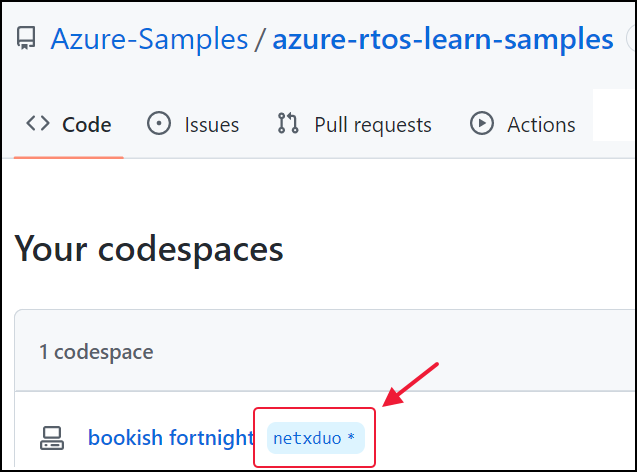
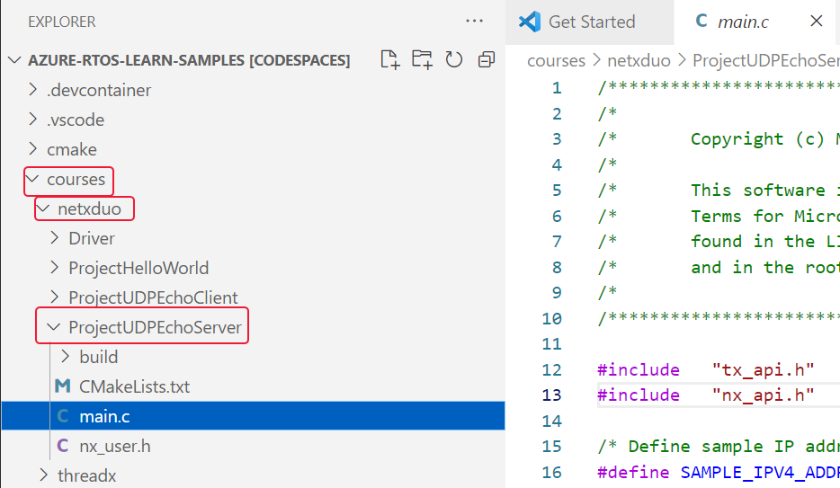
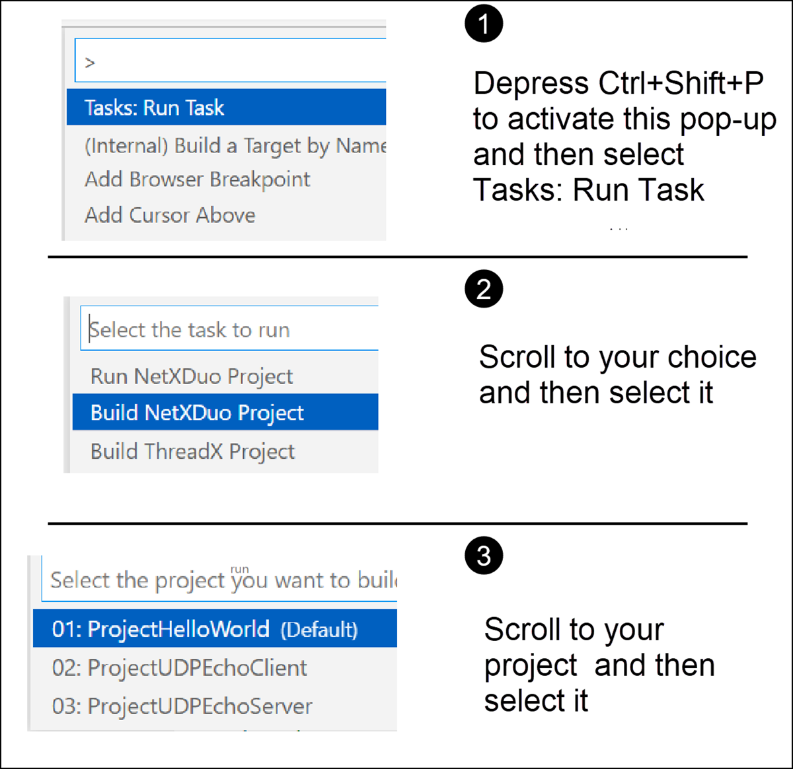
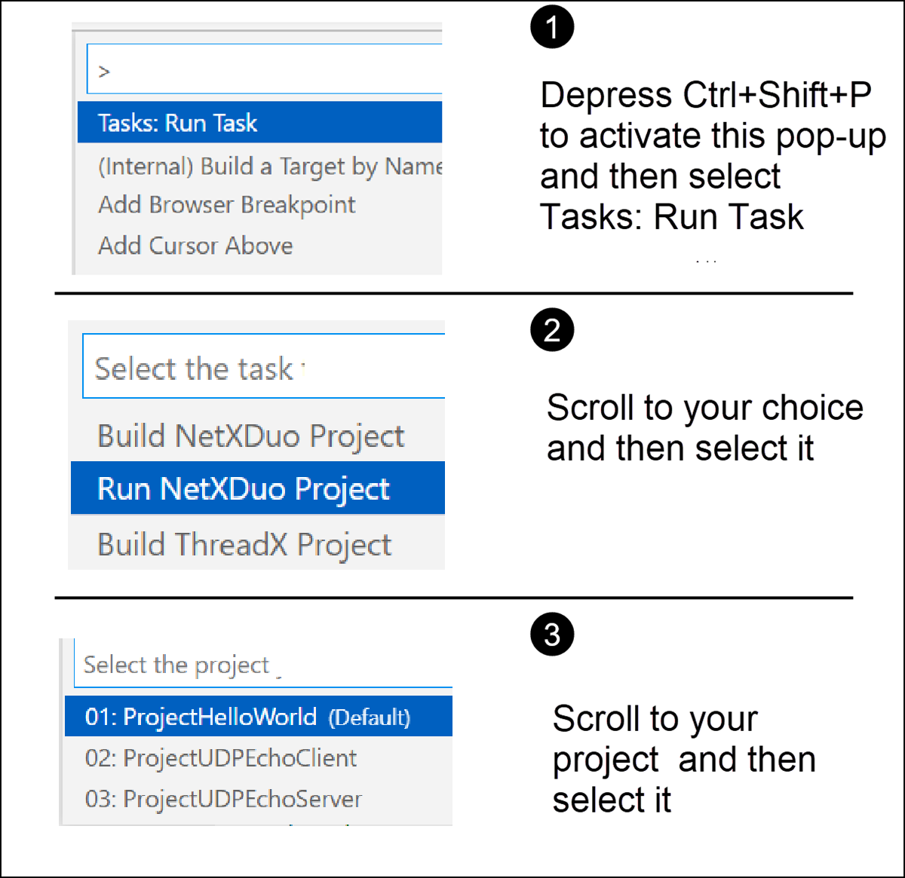
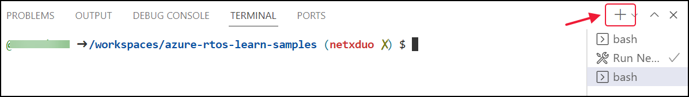
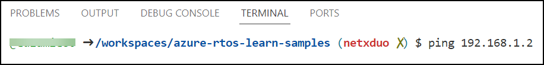

We will use Codespace to build and run the Hello World project, and future projects in this learning path. There are five steps required to build and run this project, and these steps are described below.

## Step 1—Go to Codespace

1. Launch browser and go to the forked samples repository which you have done in the [previous step](/training/modules/azure-rtos-netx-duo-fundamentals/1-introduction). The link should look like `https://github.com/[your_github_id]/azure-rtos-learn-samples`

   > [!TIP]
   > Replace [your_github_id] with your own GitHub ID that will use your forked repository of the samples to create the Codespace.

1. Select **Code** and open the Codespace you have created.

   

1. Once the Codespace is launched, in the Explorer pane file tree, expand and open `courses/netxduo` folder.

## Step 2—Go to `main.c`

The path to the Hello World project in Codespace is:

**courses –> netxduo –> ProjectHelloWorld -> main.c**



When you get to the main, you're ready to build and run your project.

## Step 3—Build Project Hello World

Follow the instructions in the image below to build your project.



Your project will start building. When it's finished, you're ready to run the project. Follow the instructions in the image in the next step to run your project.

## Step 4—Run Project Hello World



Following is the output produced when the project is running.

```txt
NetXDuo is running now…
IP address: 192.168.1.2
Mask: 255.255.255.0
```

At this point, NetX Duo is waiting to receive commands, such as a ping request.

## Step 5—Open a new terminal

Open a new terminal by selecting the **"+"** in the terminal window.



## Send a ping request

We will now send a ping request to **192.168.1.2**, which is a private IP address.



Following is sample output produced by this ping request. The application will terminate and output will stop when you press `Ctrl+C`.

```txt
PING 192.168.1.2 (192.168.1.2) 56(84) bytes of data.
64 bytes from 192.168.1.2: icmp_seq=1 ttl=128 time=0.385 ms
64 bytes from 192.168.1.2: icmp_seq=2 ttl=128 time=0.307 ms
64 bytes from 192.168.1.2: icmp_seq=3 ttl=128 time=1.04 ms
64 bytes from 192.168.1.2: icmp_seq=4 ttl=128 time=0.270 ms
64 bytes from 192.168.1.2: icmp_seq=5 ttl=128 time=0.463 ms
64 bytes from 192.168.1.2: icmp_seq=6 ttl=128 time=0.254 ms
^C
--- 192.168.1.2 ping statistics ---
6 packets transmitted, 6 received, 0% packet loss, time 5079ms
rtt min/avg/max/mdev = 0.254/0.452/1.038/0.271 ms
```

In this case, six data packets were transmitted and received with 0% packet loss. Following are descriptions of several values that appear in the statistical report.

- `rtt` (round trip time) is the time between a data request and the completion of that request. `rtt` is measured in milliseconds.
- `rtt` min is the minimum `rtt`.
- `rtt` avg is the average or mean `rtt`.
- `rtt` max is the maximum `rtt`.
- `rtt` mdev is the mean deviation of the `rtt`, which is similar to the population standard deviation of the `rtt`.

There are many other ping requests that you could send. Enter `ping -h` to get information about other options.
