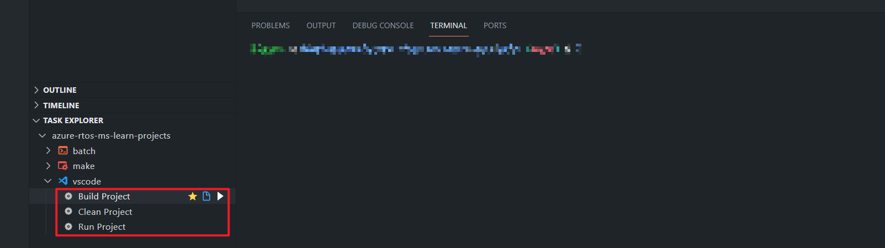

## Introduction

Finally, you get to work on your first Hello World project! In this exercise, you use GitHub Codespaces or Visual Studio to modify a C project called *ProjectHelloWorld*.

If you haven't done so already, set up your development environment in accordance with the [instructions](/training/modules/introduction-azure-rtos/2-set-up-environment?azure-portal=true) in the module titled **Azure RTOS ThreadX fundamentals**.

## Use GitHub Codespaces

1. Open the codespace you created from the GitHub repo. Once done, you can view the sample projects repo within VS Code web.

1. Expand the **TASK EXPLORER** pane and expand the **vscode** node. From the **Build / Clean / Run Project** tasks, choose **Build Project** and select the run button.

   

1. Choose **ProjectHelloWorld** to build the project.

1. Now choose **Run Project** in the same **TASK EXPLORER**.

## Use Visual Studio

1. Open the solution `azure_rtos_threadx_training.sln` in Visual Studio.

1. In the **Solution Explorer**, right-click on **ProjectHelloWorld** and select **Set as Startup Project**.

1. Select the **Build** tab and choose **Build ProjectHelloWorld** to build your project. Then select the **Debug** tab, followed by **Start debugging** to debug your project.

## Complete the sample

If all has gone well, you should see initial output appearing on the screen similar to this example:

:::image type="content" source="../media/figure-17-output-from-project.png" alt-text="Image of initial output." border="false":::

Each time the Urgent thread completes a cycle, it displays the current time and a brief message. Similarly, each time the Routine thread completes a cycle, it displays the current time and a brief message.

You're now ready to complete this project by modifying the Routine thread entry function as shown in [building block 4, part 2](/training/modules/create-first-threadx-project/6-exercise-build-debug-project#building-block-4-part-2).

Activity 4 is incomplete and there's a suggestion that you should use Activity 2 in [building block 4, part 1](/training/modules/create-first-threadx-project/6-exercise-build-debug-project#building-block-4-part-1) as a guide. Here's the code in Activity 2:

```c
/* Activity 2:  4 timer ticks  *** critical section *** */
/* Get the mutex with suspension */
   tx_mutex_get(&Processor, TX_WAIT_FOREVER);
   tx_thread_sleep(4);
   /* Release the mutex */
   tx_mutex_put(&Processor);
```

Using Activity 2 and the [Hello World scenario](/training/modules/create-first-threadx-project/3-hello-world#hello-world-scenario) as guides, complete your modifications, then build and debug your project. Your completed output should look like the following example:

:::image type="content" source="../media/figure-18-output-from-completed-project.png" alt-text="Image of completed output." border="false":::

Congratulations! You've completed your first ThreadX project. You should now investigate the module titled `Analyze thread behavior with timing facilities` because it logically follows this project.
