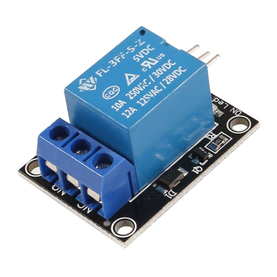

In this unit, we'll construct the circuits used to monitor environmental conditions and control the fan in the cheese cave.

## Measuring environmental conditions

To measure temperature and humidity, we'll use a commonly available low-cost environmental sensor, the BME280. Your BME280 is already installed on a breakout board. All we need to do is connect the breakout board to the Inter-Integrated Circuit (I2C) bus on the Raspberry Pi. The I2C bus is accessible on the General Purpose Input/Output (GPIO) header.

> [!NOTE]
> There are many manufacturers of BME280 breakouts. Most designs are similar, and the manufacturer shouldn't make any difference to the functionality. This module was built with the Adafruit example in the prerequisites. Ensure your BME280 breakout includes an Inter-Integrated Circuit (I2C) interface.

> [!TIP]
> Most BME280 breakouts are sold unassembled and require soldering to assemble. If you don't know how to solder, don't be discouraged! Soldering isn't as hard as you might think! There are a plethora of tutorials and videos to get you started. [Here's a good example](https://www.youtube.com/watch?v=ZwU9SqO0udU).

## Controlling fans

In a real-world scenario, you would use a relay module like this to control power to the fan.

A relay is an electromagnetic switch that allows you to use small currents to control larger currents. When a small current is passed through the low-voltage input on the relay, it activates the switch. Activating the switch completes a different circuit.

A real-world device might use this relay to control the power to the fan. A fan large enough to maintain humidity in a cave would generally require a large AC current. For safety purposes, and to keep focus on the code, your device is going to use an LED to represent a relay. An illuminated LED will indicate that the relay is "on."

To activate the LED, your code will activate a GPIO pin for output, which will send current to the LED. This is the same process you'd use to activate many relays.

## Exercise: Construct the IoT device

We're going to use a breadboard to build the device. A breadboard is a rapid prototyping tool for circuits. The completed breadboard should look like the following diagram.

Refer to the diagram above as you construct your device.

1. Position the GPIO breakout, BME280 breakout, LED, and resistor as shown.
1. Use jumper wires to connect the BME280 to the GPIO breakout.

    - 3.3V to VIN (sometimes labeled 3V3) (shown in red)  
    - Ground to GND (black)
    - SDA (GPIO 2) to SDI (sometimes labeled SDA)  (blue)
    - SCL (GPIO 3) to SCK (sometimes labeled SCL) (orange)

1. Use jumper wires to connect the LED to the GPIO breakout.

    - GPIO 18 to LED anode (longer, positive lead)
    - LED cathode (shorter, negative lead) to 330 Ω resistor (either end)
    - 330 Ω resistor (other end) to ground

    > [!NOTE]
    > The resistor is required to ensure the LED isn't burnt out due to excessive current. You don't need a resistor in a real-world relay scenario.

## Connect the Raspberry Pi

While the Raspberry Pi is powered off, use a ribbon cable to connect the GPIO breakout to the Raspberry Pi's GPIO header. Power on the Raspberry Pi.

In the next unit, you'll learn about the .NET IoT Libraries.
