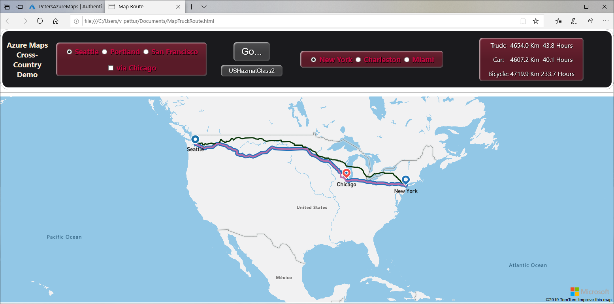
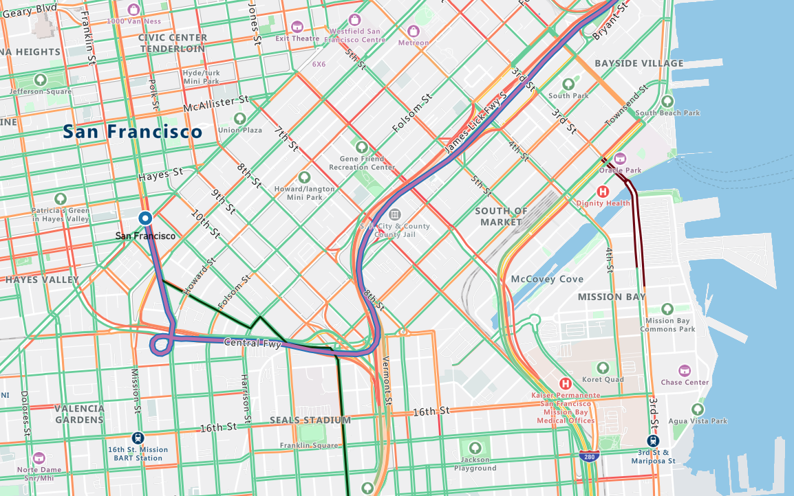

Finding your way on a map is fun, right up to the point where you realize you're lost!

Getting lost isn't usually a desirable position to be in. In this module, we'll build an app that will find a route many thousands of miles long, yet is accurate to such a level of detail that a driver will know which turn to take to bypass road construction in the middle of a bustling city.

Route finding is just one of many features of Azure Maps. Other features haven't anything to do with roads and routes. For example, it can be used to display population changes, or any census data, weather systems, industrial or agricultural output, construction cranes per square mile, or just about any spatial data you can think of.

However, route finding is fun to watch. It's one of the applications of mapping services that helps us understand just how detailed the maps are. It's a dynamic application that we can play with. Who isn't curious to know whether road and traffic data is good enough to help with our daily travels?

  

## Learning objectives

In this module, you'll:

- Create a free Azure Maps account
- Create an HTML and JavaScript app, for cross-country route finding, using Visual Studio Code
- Learn about route finding, map layers, hazardous materials, and integrating maps into your apps

## Prerequisites

- An introductory knowledge of the purpose of Azure Maps
- Ability to navigate the Azure portal
- Ability to use HTML, and JavaScript, at the beginner level
- Experience using Visual Studio Code, at the beginner level

## The scenario

We're going to use Azure Maps route finding, to select a best route from a west coast city, to an east coast city. We have arbitrarily chosen Seattle, Portland, and San Francisco as the west coast cities, and New York, Charleston, and Miami as the east coast cities. You'll be able to change these locations to any favorites you may have.

Also, we want to find the route for a variety of vehicles. We'll find the routes for a truck, a car, and a bicycle. OK, so cycling from Seattle to Miami may sound like madness to many. However, there's method to our madness. By including bicycles in our selection of vehicles, we can see the cross country routes, the passenger only ferries, or the bike trails, that are included in the underlying Azure Maps data.

On a more professional note, we can also vary the contents of our truck. There are nine classifications of hazardous materials, and our test app will allow us to specify any one of them. We add this feature so, again, we can see if the Azure Maps route finding algorithms can navigate through areas with road-use restrictions - "No flammable materials in the I-90 tunnel", for example.

Finally, we need to know a route may well consist of more than a start and ending location. There can be many intermediary points on any desired route. For our test app, we'll add the option of saying "hi" to Chicago on the way across country.

The following image shows the app we're going to build.

  

Notice, far right, that the travel distance, and estimated time, are provided. The map view shows the route. At the scale shown in the above image, you might wonder how much detail there really is. Look at the following image, it shows the route out of San Francisco, on an overland jaunt to Miami. The car and truck head north, the bicycle however, heads south. Every turn on every block is clear.

  

## First steps

To begin our journey into the wonderful world of route finding, we need to start at square one, and create an Azure Maps account. The next unit creates the basics.
