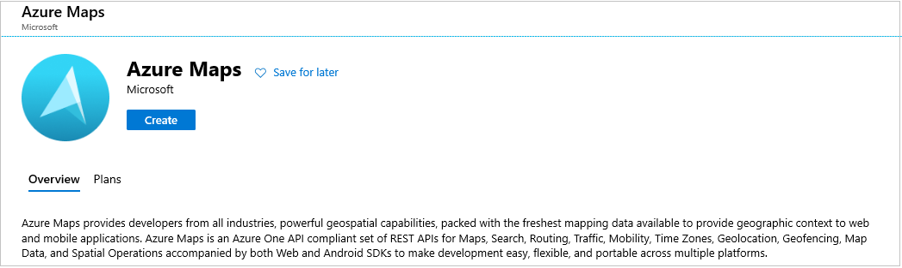
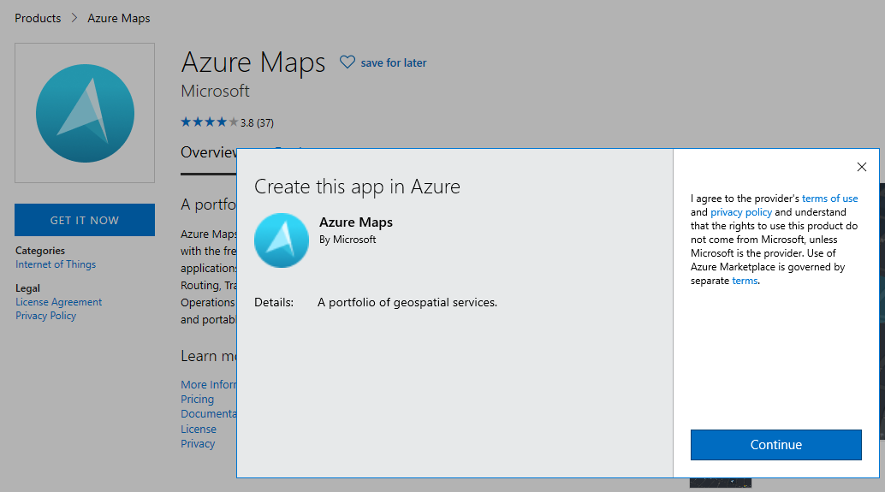
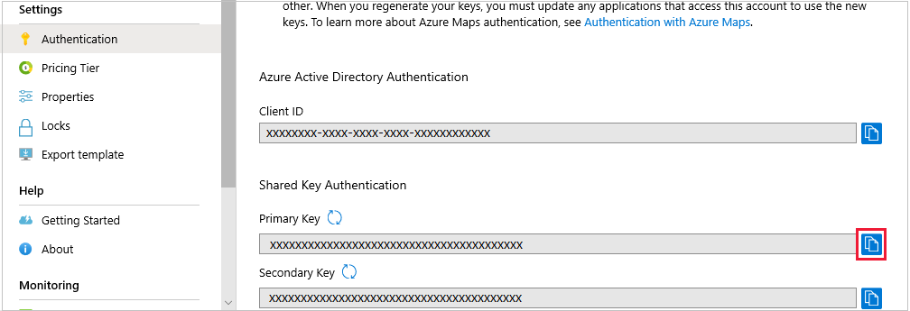

In this unit, first you create an Azure Maps account. Then, navigate the Azure portal to extract a string called the _Primary Key_. This string is needed to verify you've an account, when writing the code section of this module.

## Create an Azure Maps account

1. Right click on [Azure portal](https://portal.azure.com/learn.docs.microsoft.com?azure-portal=true), and select **Open in new window**.

1. Click **+ Create a resource**. Type "Maps" into the search bar, and select **Azure Maps**.

1. Click **Create**.

    

1. In the **Create Azure Maps Account** screen, select the **Concierge Subscription** and the resource group for the sandbox, which begins with **learn-**.

1. For the **Name**, enter something appropriate, "MyAzureMaps", or similar.

    

1. Leave **Pricing tier** at its default value. It's free anyway! Read, and select the checkbox covering the Licence and Privacy Statement.

1. Click **Create**.

1. It might take a few seconds for the resource to be deployed. When you get the deployment message, click **Go to resource**.

1. On the home page of the resource, notice the left menu. You should be on the **Overview** page.

1. Look down the left menu, find **Settings**, then the **Authentication** entry.

### Extract the Primary Key

1. Click on **Authentication**, in the left menu.

1. You will notice some strings, including the **Primary Key**, are displayed. Use the icon to the far right of the string to copy the key to the clipboard.

    

1. Paste the string into a text file. This key is the only authentication you need to connect an app to your Maps resource.

1. It is now OK to close the Azure portal.

Before we build the app to use this key, let's go over some of the features Azure Maps has for route finding.
