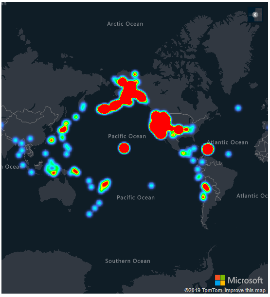
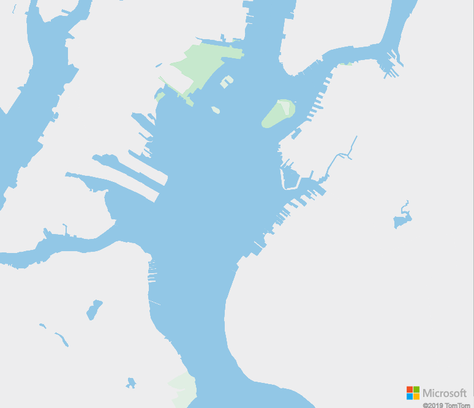
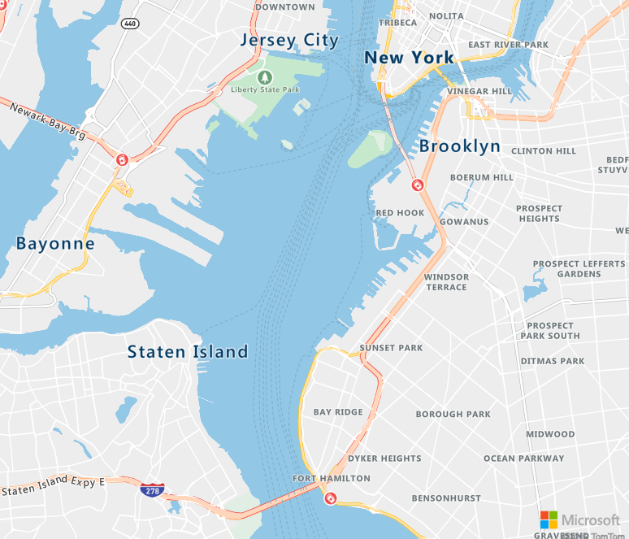
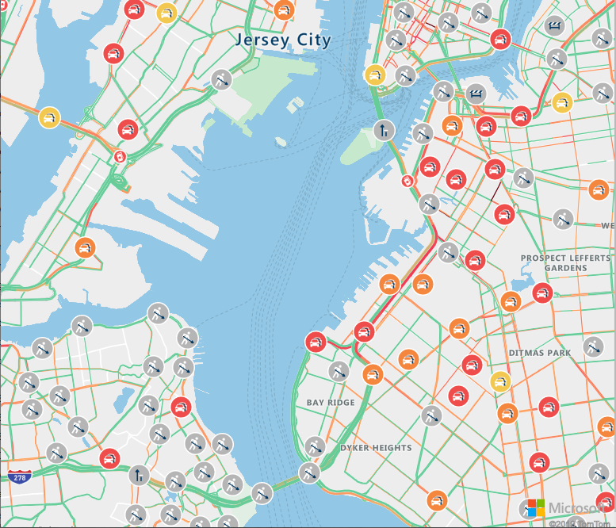

In this unit, we have a broad look at the features and applications of Azure Maps.

## Introduction to Azure Maps

We dive extensively into the route finding features of Azure Maps in this module. However, there are many other uses that have nothing to do with roads and travel. Route finding is one of the more complex features, as it involves extensive knowledge of current road conditions, road quality, ferry schedules, road regulations, and a mass of other data. A more simple use of the maps is to use it largely as background, to display data relevant to any particular location on the map. One example is earthquake data. The following image is known as a _heat map_, and it shows the number of significant earthquakes over a certain time period. There's a _heat gradient_, typically from violet, through blue, green, to yellow, orange then red. The more, and stronger, the earthquakes, the higher the _heat_.

[](../media/azure-maps-earthquake.png#lightbox)

The aptly named _ring of fire_ is obvious.

A key feature of Azure Maps is the ability to zoom in and out, from a view of the entire world, to a view of just a few streets.

Let's look next at how a complex map presentation is constructed.

### Layered maps

Azure Maps are constructed in layers. You can choose which layers to display. Let's illustrate layering with an example, an area of New York.

The base layer contains the outline of terrain, complete with parks.

[](../media/ny-base.png#lightbox)

Let's add the transit layer to the base. The transit layer adds all known roads, major and minor. If you look closely, you can see it has also added ferry routes. Rail lines are also added.

[](../media/ny-base-transit.png#lightbox)

On top of transit, we add the labels layer. Now it's starting to look like a map.

[](../media/ny-base-transit-labels.png#lightbox)

We could stop at the labels layer. An additional layer is called the _flow_ layer. This layer shows all the traffic hazards. No shortage of hazards in New York!

[](../media/ny-base-transit-labels-flow.png#lightbox)

When we program with calls to Azure Maps, we can add our own layers. An obvious layer to add would be the best route found from A to B. We could add weather layers, and layers containing spatial data, if need be. There obviously comes a point when you've too many layers. Notice how the flow layer above obscures some of the labels layer. Layers have a priority, so you can determine what information gets obscured.

### Route finding

Routing information is available for nearly all countries in the world. However, routing with current traffic information is only available for a few, and routing specifically for trucks, fewer still. In North America, for the USA, Canada, and Mexico, all levels of routing are available.

To calculate a traffic route from A to B obviously takes detailed data: every junction, one-way street, bridge clearance, road gradient, needs to be known. In addition, accurate information is needed on the vehicle. This information includes the physical: length, width, height, weight. Also, engine efficiency data: fuel consumption, acceleration efficiency, uphill efficiency, and so on. Different engine data is needed for an electric vehicle.

A mass of physical data, and engine efficiency data, can be specified using the Azure Maps API. However, decent defaults are available. And, as we're only having some fun at this stage, the `fuelEnergyDensityInMJoulesPerLiter` setting does not interest us much right now!

In our sample app, we specify three vehicles, a bicycle, a car, and a truck. We set the width, height, and length for all three. For the truck, we add a fourth variable, the load. The load neatly brings hazardous materials into the picture!

### Hazardous materials

A fun feature of the app we're going to build, is the ability to set a hazardous material classification for our truck.

There are nine classifications of hazardous materials, agreed upon by the  _United Nations Committee of Experts on the Transport of Dangerous Goods_. These nine classes are summarized in the following table, along with the US hazard class. These classifications apply to all forms of transport - road, rail, sea, air, and inland waterways. The numerical order of the classes _does not_ indicate a greater or lesser degree of danger.

| Classification | Description |
| -------------- | ----------- |
| USHazmatClass1 | Explosives |
| USHazmatClass2 | Gases |
| USHazmatClass3 | Flammable or combustible liquid |
| USHazmatClass4 | Flammable solid, spontaneously combustible, dangerous when wet |
| USHazmatClass5 | Oxidizer and organic peroxide |
| USHazmatClass6 | Toxic, infectious, or inhalation hazard |
| USHazmatClass7 | Radioactive |
| USHazmatClass8 | Corrosive |
| USHazmatClass9 | Miscellaneous |

With the given classification, certain roads can't be used. The first three do have a significant effect on a route. For example, many tunnels are closed to explosive, or inflammable, cargo. When you test your app, you can hone in on routes, and see how the truck routes diverge from car routes, or trucks carrying other content, when hazardous cargo is involved. Road restrictions are most likely to be found in heavily populated areas, for obvious reasons.

### Azure Maps units

Azure Maps uses the metric system as its base for calculations. For example, the length, width and height of vehicles is specified in meters. Also, fuel consumption is stored as litres, and used in constants such as `currentFuelInLitres`, `constantSpeedConsumptionInLitersPerHundredkm`, and `fuelEnergyDensityInMJoulesPerLiter`. We don't go into engine fuel consumption models in this module, but you can tweak these parameters to diverge from the default consumption model.

Say you wanted your user to see miles, or US, or Imperial, gallons, for example. You would need to multiply the values returned by Azure Maps by appropriate constants.

## Azure Maps and Azure IoT

Azure IoT, the "Internet of Things", provides cloud resources to read telemetry data from thousands of remote devices, and store, and process the data with cloud back-end services. The telemetry data might be temperature, velocity, humidity, acceleration, pressure, and so on. But telemetry also includes location data: latitude, longitude, and, optionally, altitude. Because of the value of knowing the location of moving devices, one popular use of Azure IoT is fleet management. Location telemetry is where Azure IoT, and Azure Maps, meet up.

In addition to fleet management, other popular location-based scenarios include asset tracking, and smart city applications. You can imagine that if you managed a group of smart buildings, all with temperature, humidity, and security sensors, that seeing the exact map location of each device might be valuable, and reassuring. Perhaps the map with the device locations would be part of an IoT dashboard. The other elements of the dashboard might show incoming telemetry, and provide some commands to send to the devices.

IoT is all about remote devices sending data to a single cloud service, known as an IoT Hub, for storage and processing. Check out the Learn modules that provide introductory material on IoT, and one that combines Azure Maps and IoT, in the **Summary** section of this module.

## Making calls to Azure Maps using JavaScript

In the discussion above, you'll remember that the map view can be zoomed in to great detail, or zoomed out to see the whole world. We need some control over the view. This control is done by setting a _start_ and _end_ point for a route, and calling a _camera_ function in Azure Maps. These points specify a bounding box for the region that needs to be shown by default. The user can change the zoom, but the first view will show the whole route.

Also mentioned above is the concept of layers. In our app, we add a layer to show the route, with certain colors and line thicknesses for the three vehicles. So, all three routes can be displayed at the same time. Some graphic icons are added, to a second layer, to show the start, end, and intermediary points of the route.

The same start and end points are used to set up _coordinates_. The coordinates are the basis of the main call of our app. A `routeURL` object is created, and a call to `calculateRouteDirections` can be made. Note there's a timeout value in milliseconds. It can take quite a few seconds to calculate the best bicycle route from Seattle to Miami! And you may want to bail on your route finding if it's taking too long.

The following code is a snippet from the source code in the next unit. It shows the all important call, and how it returns the `directions`.

```javascript
    ...
    routeURL.calculateRouteDirections(atlas.service.Aborter.timeout(milliseconds), coordinates, {
                    travelMode: mode,
                    vehicleWidth: vWidth,
                    vehicleHeight: vHeight,
                    vehicleLength: vLength,
                    vehicleLoadType: vLoad
                }).then((directions) => {

                    // Get data features from the response.
                    var data = directions.geojson.getFeatures();
    ...
```

Time to stop beating around the bush, let's build this thing!
