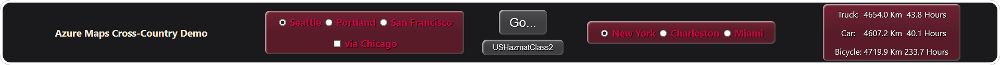

In this unit, we code our app. In stages, to make it a little more understandable.

1. Using a tool like Visual Studio Code, create a new HTML file, and paste in the following code. The layout is a standard base for an Azure Maps HTML page.

   ```javascript
       <!DOCTYPE html>
       <html>

           <head>
               <title>Map Route</title>
               <meta charset="utf-8">
               <meta name="viewport" content="width=device-width, initial-scale=1, shrink-to-fit=no">

               <!-- Add references to the Azure Maps Map control JavaScript and CSS files. -->
               <link rel="stylesheet" href="https://atlas.microsoft.com/sdk/javascript/mapcontrol/2/atlas.min.css" type="text/css">
               <script src="https://atlas.microsoft.com/sdk/javascript/mapcontrol/2/atlas.min.js"></script>

               <!-- Add a reference to the Azure Maps Services Module JavaScript file. -->
               <script src="https://atlas.microsoft.com/sdk/javascript/mapcontrol/2/atlas-service.min.js"></script>


                   ADD JavaScript CODE IN HERE


                   ADD HTML STYLE CODE IN HERE

           </head>


               ADD HTML BODY CODE IN HERE


       </html>
   ```

1. Let's start with the ADD HTML STYLE CODE HERE. We're adding styles to construct the app banner:

   [](../media/azure-maps-banner.png#lightbox)

1. Copy the next section, and replace the ADD HTML STYLE CODE with it.

   ```html
   <style>
     html,
     body {
       width: 100%;
       height: 100%;
       padding: 0;
       margin: 0;
       font-family: 'Segoe UI', Tahoma, Geneva, Verdana, sans-serif;
     }

     #myMap {
       width: 100%;
       height: 75%;
     }

     .tclass {
       border: 5px solid white;
       border-radius: 20px;
       background-color: #1a1a1d;
       width: 100%;
     }

     label {
       font-size: 14pt;
       font-weight: bold;
       color: #c3073f;
     }

     .whitetext {
       color: antiquewhite;
     }

     .styled,
     .styledButtonL,
     .styledButtonS {
       border: 0;
       line-height: 2;
       padding: 0 20px;
       text-align: center;
       color: white;
       text-shadow: 1px 1px 1px #000;
       border-radius: 8px;
       background-image: linear-gradient(to top, rgba(0, 0, 0, 0.2), rgba(0, 0, 0, 0.2), rgba(0, 0, 0, 0));
       box-shadow: inset 2px 2px 3px rgba(255, 255, 255, 0.6), inset -2px -2px 3px #4e4e50;
     }

     .styled {
       font-size: 12pt;
       background-color: #6f2232;
     }

     .styledButtonS {
       font-size: 11pt;
       background-color: #4e4e50;
       margin-top: 10px;
     }

     .styledButtonL {
       font-size: 18pt;
       background-color: #4e4e50;
     }

     .styledButtonL:hover,
     .styledButtonS:hover {
       background-color: #6e6e70;
     }

     .styledButtonLX:hover {
       background-color: #c3073f;
     }
   </style>
   ```

1. Next, replace the ADD HTML BODY CODE IN HERE, with the following code:

   ```html
   <body onload="InitMap()">
     <form>
       <table class="tclass">
         <tr>
           <td align="center">
             <h3 class="whitetext">Azure Maps Cross-Country Demo</h3>
           </td>
           <td width="400px" align="center">
             <table class="styled">
               <tr>
                 <td>
                   <input type="radio" name="rad1" id="west1" checked="checked" />
                   <label for="west1">Seattle</label>
                   <input type="radio" name="rad1" id="west2" />
                   <label for="west2">Portland</label>
                   <input type="radio" name="rad1" id="west3" />
                   <label for="west3">San Francisco</label>
                 </td>
               </tr>
               <tr>
                 <td>
                   <input type="checkbox" class="styledButtonS" id="viaChicago" onclick="checkMidpoint()" />
                   <label for="viaChicago">via Chicago</label>
                 </td>
               </tr>
             </table>
           </td>

           <td width="200px" align="center">
             <input type="button" class="styledButtonL" value="Go..." id="go" onclick="GetMap()" />
             <input type="button" class="styledButtonS" value="USHazmatClass2" id="hazmat" onclick="Hazmat()" />
           </td>

           <td align="center" width="400px">
             <table class="styled">
               <tr>
                 <td>
                   <input type="radio" name="rad2" id="east1" checked="checked" />
                   <label for="east1">New York</label>
                   <input type="radio" name="rad2" id="east2" />
                   <label for="east2">Charleston</label>
                   <input type="radio" name="rad2" id="east3" />
                   <label for="east3">Miami</label>
                 </td>
               </tr>
             </table>
           </td>

           <td width="400px" align="center">
             <table class="styled">
               <tr>
                 <td>Truck:</td>
                 <td id="truckkm"></td>
                 <td id="truckh"></td>
               </tr>
               <tr>
                 <td>Car:</td>
                 <td id="carkm"></td>
                 <td id="carh"></td>
               </tr>
               <tr>
                 <td>Bicycle:</td>
                 <td id="bicyclekm"></td>
                 <td id="bicycleh"></td>
               </tr>
             </table>
           </td>
         </tr>
       </table>
       <hr />
     </form>

     <div id="myMap"></div>
   </body>
   ```

1. Finally, the section that does the heavy lifting. Replace ADD JavaScript CODE IN HERE with the following code:

   ```javascript
           <script>
               // Global variables.
               var map, datasource, routeURL;
               var viaMidpoint = false;

               // Function to cycle through the hazardous material truck classes.
               function Hazmat() {
                   var currentHazmat = document.getElementById('hazmat').value;
                   var p = currentHazmat.length;
                   var n = parseInt(currentHazmat.charAt(p - 1));
                   if (n == 9) {
                       n = 0;
                   }
                   ++n;
                   document.getElementById("hazmat").value = currentHazmat.substr(0, p - 1) + n.toString();
               }

               // Check to see if the Chicago midpoint as been selected.
               function checkMidpoint(){
                   viaMidpoint = document.getElementById("viaChicago").checked;
               }

               // InitMap is called one time, when the <body> html is loaded.
               function InitMap() {

                   // Instantiate a map object.
                   map = new atlas.Map("myMap", {

                       // Add your Azure Maps subscription key to the map SDK.
                       authOptions: {
                           authType: 'subscriptionKey',
                           subscriptionKey: '<YOUR AZURE MAPS PRIMARY KEY>'
                       }
                   });

                   // Use SubscriptionKeyCredential with a subscription key.
                   var subscriptionKeyCredential = new atlas.service.SubscriptionKeyCredential(atlas.getSubscriptionKey());

                   // Use subscriptionKeyCredential to create a pipeline.
                   var pipeline = atlas.service.MapsURL.newPipeline(subscriptionKeyCredential);

                   // Construct the RouteURL object.
                   routeURL = new atlas.service.RouteURL(pipeline);

                   // Wait until the map resources are ready before adding to them.
                   map.events.add('ready', function () {

                       // Create a data source and add it to the map.
                       datasource = new atlas.source.DataSource();
                       map.sources.add(datasource);
                   });
               }

               // GetMap is called each time the user clicks the "Go..." button.
               function GetMap() {

                   // Add a layer for rendering the route lines, and have it render under the map 'labels' layer.
                   map.layers.add(new atlas.layer.LineLayer(datasource, null, {
                       strokeColor: ['get', 'strokeColor'],
                       strokeWidth: ['get', 'strokeWidth'],
                       lineJoin: 'round',
                       lineCap: 'round'
                   }), 'labels');

                   // Add a layer for rendering point data.
                   map.layers.add(new atlas.layer.SymbolLayer(datasource, null, {
                       iconOptions: {
                           image: ['get', 'icon'],
                           allowOverlap: true
                       },
                       textOptions: {
                           textField: ['get', 'title'],
                           offset: [0, 1.2]
                       },

                       // Only render Point or MultiPoints in this layer.
                       filter: ['any', ['==', ['geometry-type'], 'Point'], ['==', ['geometry-type'], 'MultiPoint']]
                   }));

                   // Add Traffic Flow to the Map (adds a "flow" layer).
                   map.setTraffic({
                       incidents: false,
                       flow: "relative"
                   });

                   // Create the GeoJSON objects which represent the start and end point of the route.
                   var westTitle = "none";
                   var westLat = 0;
                   var westLon = 0;

                   if (document.getElementById("west1").checked == true) {
                       westTitle = "Seattle";
                       westLat = 47.60357;
                       westLon = -122.32945;
                   } else

                       if (document.getElementById("west2").checked == true) {
                           westTitle = "Portland";
                           westLat = 45.5051;
                           westLon = -122.6750;
                       } else

                           if (document.getElementById("west3").checked == true) {
                               westTitle = "San Francisco";
                               westLat = 37.7749;
                               westLon = -122.4194;
                           }

                   var eastTitle = "none";
                   var eastLat = 0;
                   var eastLon = 0;

                   if (document.getElementById("east1").checked == true) {
                       eastTitle = "New York";
                       eastLat = 40.7128;
                       eastLon = -74.0060;
                   } else

                       if (document.getElementById("east2").checked == true) {
                           eastTitle = "Charleston";
                           eastLat = 32.7765;
                           eastLon = -79.9311;
                       } else

                           if (document.getElementById("east3").checked == true) {
                               eastTitle = "Miami";
                               eastLat = 25.7617;
                               eastLon = -80.1918;
                           }

                   // Icon options are:
                   // marker-black, marker-blue, marker-darkblue, marker-red, marker-yellow,
                   // pin-blue, pin-darkblue, pin-red, pin-round-blue, pin-round-darkblue, pin-round-red.
                   var startPoint = new atlas.data.Feature(new atlas.data.Point([westLon, westLat]), {
                       title: westTitle,
                       icon: 'pin-round-blue'
                   });

                   var midPoint = new atlas.data.Feature(new atlas.data.Point([-87.6298, 41.8781]), {
                       title: 'Chicago',
                       icon: 'pin-red'
                   });

                   var endPoint = new atlas.data.Feature(new atlas.data.Point([eastLon, eastLat]), {
                       title: eastTitle,
                       icon: 'pin-blue'
                   });

                   // Add the data to the data source. This adds the pin icons.
                   // The first call to datasource uses setShapes, to remove all previous route geometry.
                   datasource.setShapes([startPoint, midPoint, endPoint]);

                   // Fit the map window to the bounding box defined by the start and end positions.
                   // Add more points to the bounding box data, if there are mid points in the route.
                   map.setCamera({
                       bounds: atlas.data.BoundingBox.fromData([startPoint, midPoint, endPoint]),
                       padding: 100
                   });

                   // Points input to the routeURL. Minimum of two (start and end points).
                   var coordinates = [[startPoint.geometry.coordinates[0], startPoint.geometry.coordinates[1]]];
                   if (viaMidpoint)
                   {
                       coordinates.push([midPoint.geometry.coordinates[0],midPoint.geometry.coordinates[1]]);
                   }
                   coordinates.push([endPoint.geometry.coordinates[0],endPoint.geometry.coordinates[1]]);

                   // Define an internal function to find a route, and update the UI.
                   function GetRoute(milliseconds, mode, vWidth, vHeight, vLength, vLoad, strokeClr, strokeWidth, index, docKm, docH) {

                       document.getElementById(docKm).textContent = "searching...";
                       document.getElementById(docH).textContent = "";

                       // Mode can be one of: bicycle, bus, car, motorcycle, pedestrian, taxi, truck, van.
                       // Vehicle dimensions are in meters.
                       // Load type is only considered for trucks.
                       routeURL.calculateRouteDirections(atlas.service.Aborter.timeout(milliseconds), coordinates, {
                           travelMode: mode,
                           vehicleWidth: vWidth,
                           vehicleHeight: vHeight,
                           vehicleLength: vLength,
                           vehicleLoadType: vLoad
                       }).then((directions) => {

                           // Get data features from the response.
                           var data = directions.geojson.getFeatures();

                           // Get the route line, and add some style properties to it.
                           var routeLine = data.features[0];
                           routeLine.properties.strokeColor = strokeClr;
                           routeLine.properties.strokeWidth = strokeWidth;

                           // Add the route line to the data source.
                           datasource.add(routeLine, index);

                           // Calculate travel distance and times.
                           var km = directions.routes[0].summary.lengthInMeters / 1000;
                           var hours = directions.routes[0].summary.travelTimeInSeconds / 3600;
                           document.getElementById(docKm).textContent = km.toFixed(1) + " Km";
                           document.getElementById(docH).textContent = hours.toFixed(1) + " Hours";
                       }, reason => {

                           document.getElementById(docKm).textContent = "";
                           document.getElementById(docH).textContent = "No route found";
                       });
                   }

                   // Truck load types: USHazmatClass1 through 9, otherHazmatHarmfulToWater, otherHazmatGeneral, and otherHazmatExplosive.
                   // Make a search route request for a truck.
                   GetRoute(20000, "truck", 3, 3, 10, document.getElementById("hazmat").value, '#2272B9', 9, 0, "truckkm", "truckh");

                   // Make a search route request for a car.
                   GetRoute(20000, "car", 2, 2, 5, null, '#B76DAB', 4, 1, "carkm", "carh");

                   // Make a search route request for a bicycle.
                   GetRoute(20000, "bicycle", 1, 2, 2, null, '#053305', 3, 2, "bicyclekm", "bicycleh");
               }
           </script>
   ```

1. Replace the `<YOUR AZURE MAPS PRIMARY KEY>` string, with the Primary Key you saved off in an earlier unit. You don't need to make any other code changes.

1. Take a few minutes, and read through the comments in the JavaScript section. Note how much of the theory we were talking about in previous units has made its way into the code.

1. Save off the HTML file to your **Documents** folder, giving it a suitable name - "Cross country app", or something similar.

That's all the coding. The next unit puts it to the test.
