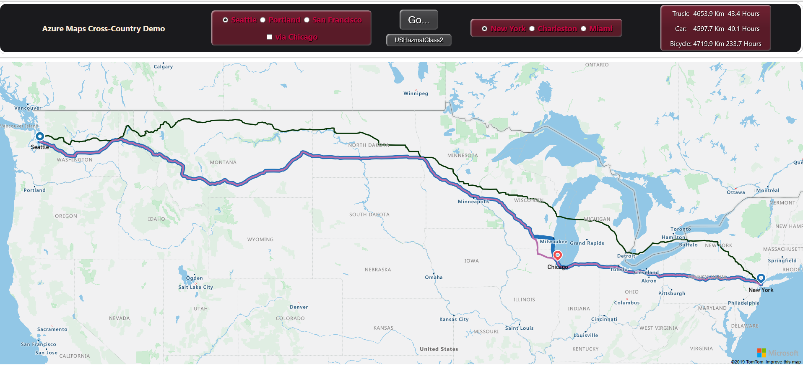
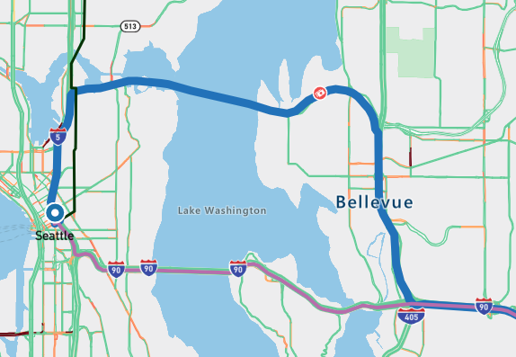
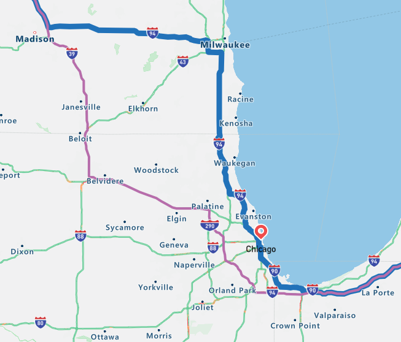
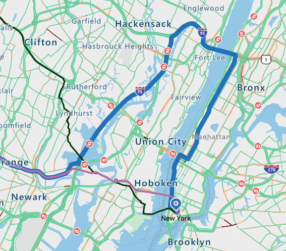
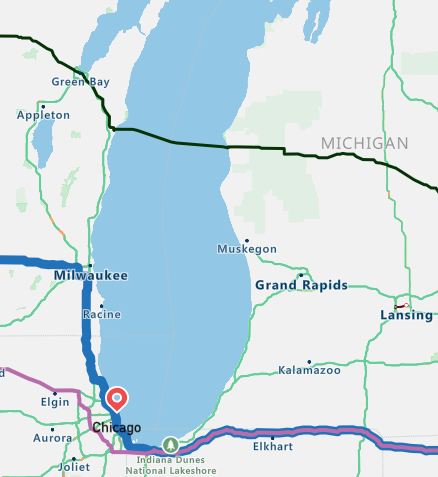

Running a new app for the first time is always an exiting moment!

## Test the cross country app

1. Locate the HTML file in your **Documents** folder. Double-click on it, or open it in a browser.

1. Do you get a view of the world, with the app banner? If not, go back and carefully check you completed the previous unit correctly.

1. Without further ado, click **Go**. You should see the truck and car route appear quickly.

1. Wait a few seconds, and the green bicycle route appears.

    [](../media/azure-maps-test-1.png#lightbox)

1. If you get the image above, good work! It's all plain sailing from now on.

1. You will notice that the car route in purple, and the truck route in blue, are nearly identical, but diverge by around 50 kilometers. So where are the extra kilometers?

1. Start at Seattle, and you will notice straightaway a divergence in routes, our hazardous materials are not allowed to cross the I-90 bridge. Follow the route along, zooming out a bit on the long cross-country sections, and try to locate the three areas where the routes diverge.

1. Did you locate the following areas?

    | Seattle | Chicago | New York |
    | ------- | ------- | -------- |
    | [](../media/azure-maps-hazardous-seattle.png#lightbox) | [](../media/azure-maps-hazardous-chicago.png#lightbox) | [](../media/azure-maps-hazardous-newyork.png#lightbox) |

1. Now, go back to Chicago, and zoom out a bit. Are you able to see the bicycle route took the ferry! There's obviously some intelligence in the route finding algorithms.

    [](../media/azure-maps-bicycle-ferry.png#lightbox)

1. Change the hazardous class for the truck to **USHazmatClass9**, and click **Go** again. You won't notice any difference in the truck route. However, now change the class to **USHazmatClass1** - explosives - and click **Go**. Notice the small increase in travel kilometers. Go back to Chicago, and look closely at the area around Hammond, and run the two hazardous routes again. Notice that the **USHazmatClass1** truck has to take a slightly longer route.

1. Try going from San Francisco to Miami. Notice that there's a significant divergence in route between **USHazmatClass1**, and **USHazmatClass9**. The less hazardous truck can save a few kilometers by going a different route for most of the trip.

1. Now, check the **via Chicago** box, and again run San Francisco to Miami. All routes now take a number of seconds to calculate.

1. Try some Portland to Charleston routes, with and without visiting Chicago on the way.

## Optionally, customize the app

1. Consider adding your favorite location to the app. You'll need to find the latitude and longitude of your location. Replace one of the existing lat/lon locations in the code, with your new values. Then, find and replace all instances of the name you've replaced, with your new name. Then run the code.

    Find `west1` in the script code, and replace the `westTitle`, `westLat`, and `westLon` values.

    ```javascript
        if (document.getElementById("west1").checked == true) {
                                westTitle = "Your location";
                                westLat = your latitude;
                                westLon = your longitude;
                            } else
    ```

1. Try replacing a city in the USA, with locations elsewhere in North America. Or, add several locations on another continent.

Hopefully, you've thoroughly tested your route finding app. Now, to return to the more formal side of this module, let's summarize what we have done, and finish with a knowledge check.
